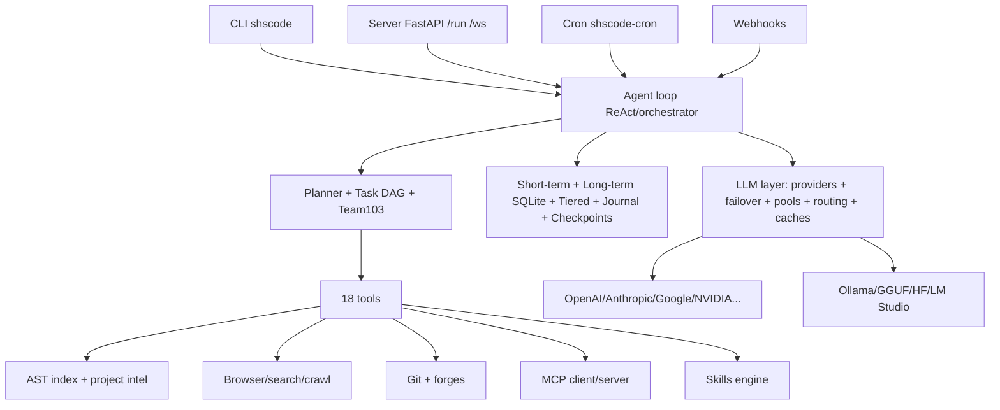

<p align="center">
  
</p>

<h1 align="center">SHS-Code</h1>
<h3 align="center">Persistent Autonomous AI Coding Agent — by SHS Lab</h3>
<p align="center">Plan · Implement · Verify — with memory, tools, skills, MCP, and Team103 multi-agent execution.</p>

<p align="center">
  <a href="https://github.com/shslab-org/shs-code"></a>
  =3.11" />
  
  
  
</p>

> **📚 Full documentation lives in a separate repository.**
>
> The complete guides — **full documentation, installation guide, beginner guide, CLI reference, configuration, models, providers, tools, skills, MCP, memory, single agent, autonomous, multi-agent, Team103, architecture, troubleshooting, and more** — are maintained at:
>
> **👉 https://github.com/shslab-org/SHS-Code-Docs**
>
> This README is the official product homepage. The Docs repo is the complete manual. Start here, go deep there.

**Code repository:** https://github.com/shslab-org/shs-code · **Version:** `4.0.0` · **Python:** `>=3.11` · **Package:** `shscode` (import package `app`) · **License:** Modified MIT (see `LICENSE`)

---

## Table of Contents

- [1. SHS-Code](#1-shs-code)
- [2. What is SHS-Code?](#2-what-is-shs-code)
- [3. Why SHS-Code?](#3-why-shs-code)
- [4. Core philosophy](#4-core-philosophy)
- [5. What SHS-Code can do](#5-what-shs-code-can-do)
- [6. Feature overview](#6-feature-overview)
- [7. Architecture overview](#7-architecture-overview)
- [8. Single-agent mode](#8-single-agent-mode)
- [9. Autonomous mode](#9-autonomous-mode)
- [10. Multi-agent mode](#10-multi-agent-mode)
- [11. Team103](#11-team103)
- [12. PM / Architect / Engineer / QA](#12-pm--architect--engineer--qa)
- [13. Worker pool](#13-worker-pool)
- [14. Task DAG](#14-task-dag)
- [15. Dependency waves](#15-dependency-waves)
- [16. AIMD concurrency](#16-aimd-concurrency)
- [17. Conflict serialization](#17-conflict-serialization)
- [18. Work stealing](#18-work-stealing)
- [19. Checkpoints](#19-checkpoints)
- [20. Retry / recovery](#20-retry--recovery)
- [21. Verification](#21-verification)
- [22. Continuous QA](#22-continuous-qa)
- [23. Memory](#23-memory)
- [24. Context management](#24-context-management)
- [25. Tools](#25-tools)
- [26. Terminal](#26-terminal)
- [27. File operations](#27-file-operations)
- [28. Code intelligence](#28-code-intelligence)
- [29. Project intelligence](#29-project-intelligence)
- [30. Browser](#30-browser)
- [31. Web search](#31-web-search)
- [32. Git](#32-git)
- [33. GitHub](#33-github)
- [34. Other integrations](#34-other-integrations)
- [35. Skills](#35-skills)
- [36. Built-in skills](#36-built-in-skills)
- [37. Custom skills](#37-custom-skills)
- [38. Skill levels](#38-skill-levels)
- [39. MCP](#39-mcp)
- [40. MCP client](#40-mcp-client)
- [41. MCP server](#41-mcp-server)
- [42. Models](#42-models)
- [43. Providers](#43-providers)
- [44. Model switching](#44-model-switching)
- [45. Provider switching](#45-provider-switching)
- [46. Failover](#46-failover)
- [47. Credential pools](#47-credential-pools)
- [48. Smart routing](#48-smart-routing)
- [49. Local / offline models](#49-local--offline-models)
- [50. Ollama](#50-ollama)
- [51. GGUF](#51-gguf)
- [52. Hugging Face](#52-hugging-face)
- [53. Sessions](#53-sessions)
- [54. Resume](#54-resume)
- [55. Doctor](#55-doctor)
- [56. Diagnostics](#56-diagnostics)
- [57. Configuration](#57-configuration)
- [58. Environment variables](#58-environment-variables)
- [59. Installation](#59-installation)
- [60. Quickstart](#60-quickstart)
- [61. First coding task](#61-first-coding-task)
- [62. First autonomous task](#62-first-autonomous-task)
- [63. First multi-agent task](#63-first-multi-agent-task)
- [64. Team103 usage](#64-team103-usage)
- [65. Troubleshooting](#65-troubleshooting)
- [66. Security](#66-security)
- [67. Development](#67-development)
- [68. Contributing](#68-contributing)
- [69. Full documentation](#69-full-documentation)
- [70. Contact](#70-contact)

---

## 1. SHS-Code

**SHS-Code** is the persistent autonomous AI coding agent by **SHS Lab (Sazzad Hussain Shobuj)** — https://github.com/shslab-org/shs-code.

> Single product, single version: **`4.0.0`** (source of truth: `app/__init__.py::__version__` and `pyproject.toml`). Python `>=3.11`. Distribution name `shscode`; import package `app`.

SHS-Code plans, implements, and verifies software tasks through tools — and remembers work across sessions.

---

## 2. What is SHS-Code?

SHS-Code is a **tool-using coding agent** with:

- an interactive CLI (`shscode` / `SHSCode`), one-shot task mode, and background execution,
- a FastAPI server with REST + WebSocket + webchat/canvas UIs (`shscode-server` / `python -m app.server`, default port `8765`),
- a provider/model layer supporting cloud APIs and local/offline models,
- persistent memory (short-term, long-term SQLite, tiered cache, journal, checkpoints),
- 18 agent tools, 29 built-in skills, 4 skill levels, MCP client + server,
- code/project intelligence over a persistent incremental index,
- browser + web search + URL extraction,
- Git + GitHub/GitLab/Azure DevOps/Bitbucket/Forgejo integrations,
- messaging channels, cron scheduling, and webhooks,
- single-agent, autonomous, and multi-agent (Team103) execution.

To start SHS-Code, install the package, configure one provider key, and run `shscode`.

---

## 3. Why SHS-Code?

Most chat assistants answer. SHS-Code **executes**:

| Problem | SHS-Code provides |
|---|---|---|
| One-shot answers lose context | Persistent sessions, journal, checkpoints, and long-term memory |
| Manual file edits | `str_replace_editor`, `bash`, `python_execute`, verification gates |
| Large-repo blindness | Incremental AST/symbol index, semantic + structural search, project profiles |
| Model outages | Failover chains, credential pools, health tracking, smart routing, local models |
| Solo-agent bottleneck | Team103: PM → Architect → Engineers → QA over a task DAG |
| Glue code for automation | Server API, cron, webhooks, messaging channels, MCP |

---

## 4. Core philosophy

- **Plan → Implement → Verify.** Every task decomposes, executes through tools, and verifies before completion.
- **Persistence first.** Sessions, journal (`~/.shscode/state/journal.db`), checkpoints (`~/.shscode/state/checkpoints/`), and memory (`workspace/.memory/long_term.db`) survive restarts.
- **Evidence over claims.** Project intelligence, doctor checks, and verification read real state — never documentation claims.
- **Safe autonomy.** Security analyzers, confirmation thresholds, secret redaction, and sandboxes gate risky actions.
- **Provider freedom.** Universal OpenAI-compatible endpoints plus native OpenAI/Anthropic/Google/Mistral/Bedrock/Ollama/GGUF/Hugging Face, with live switching and failover.

---

## 5. What SHS-Code can do

To use SHS-Code, pick any of these:

- Build, fix, refactor, test, and document code in your repo.
- Research a codebase (`code_search`, `project_intel`) and explain architecture.
- Browse the web, search, and extract clean page text.
- Manage Git branches, diffs, commits, and forge issues/PRs.
- Run scheduled tasks (cron) and react to webhooks.
- Chat from terminal, server webchat, canvas, or messaging channels.
- Extend behavior with custom skills and MCP servers.
- Run solo or as a Team103 multi-agent crew with QA gates.
- Switch models/providers live without losing context.
- Work fully offline with Ollama / LM Studio / GGUF / Hugging Face (with optional deps).

---

## 6. Feature overview

| Area | What SHS-Code provides |
|---|---|
| Execution | Single-agent, autonomous, multi-agent, Team103, worker pool, task DAG |
| Reliability | Checkpoints, retries, recovery, verification, continuous QA, loop detection |
| Knowledge | Tiered memory, context condenser, skills (4 levels), MCP |
| Understanding | AST index, semantic search, project profiles, environment detection |
| Action | 18 tools: shell, Python/Node, editor, browser, search, verify |
| Models | Universal + OpenAI/Anthropic/Google/Mistral/Bedrock/Ollama/GGUF/HF, failover, pools, routing |
| Ops | Sessions/resume, doctor/diagnostics, cron, webhooks, SSH/sandbox, channels |
| Interfaces | CLI, server REST/WS, webchat/canvas, `shscode-*` console scripts |

---

## 7. Architecture overview



Key paths: `app/agent/` (loop), `app/planner.py`, `app/task_dag.py`, `app/team103/`, `app/tool/`, `app/skills/`, `app/mcp/`, `app/memory/`, `app/context/`, `app/intelligence/`, `app/llm/`, `app/v4/`, `app/server/`, `app/config.py`, `app/state.py`, `app/verification.py`, `app/recovery.py`.

---

## 8. Single-agent mode

To run a single agent, use the interactive shell or one-shot prompt:

```bash
shscode
shscode "add retry with backoff to app/llm/retry.py and add tests"
python main.py "fix failing tests in tests/test_memory_layers.py"
```

SHS-Code provides a ReAct-style loop: read goal → inspect project (`project_intel`, `code_search`) → plan (`planning`, `task_dag`) → edit (`str_replace_editor`, `bash`, `python_execute`) → verify (`verify`, tests) → record (journal + memory). Slash commands (`/plan`, `/mode`, `/model`, `/doctor`, `/sessions`) steer the run without restarting.

---

## 9. Autonomous mode

To run long-running autonomous execution, select the `autonomous` mode:

```bash
shscode "migrate the auth module to async with full test coverage"
```

Inside the shell:

```text
/mode autonomous
```

The `autonomous` agent profile (see `app/modes.py`) provides a high step budget, planning on, thorough verification, and minimal pauses. It continues through many steps, detects stuck loops, asks via `ask_human` only when truly blocked, and checkpoints progress so `/pause`, `/bg`, and resume always work. Use it for migrations, large refactors, and multi-file features.

---

## 10. Multi-agent mode

To run multiple agents, use the multi-agent pipeline or delegation:

```bash
python run_multi_agent.py --mode build "implement user profiles API with tests"
python run_multi_agent.py --mode plan "design sharding for the journal"
shscode-multi --help
```

SHS-Code supports two multi-agent paths: (1) the `run_multi_agent.py` build/plan pipeline (`app/multi_agent.py:run_cli`), and (2) in-task `delegate` subagents plus `task_dag` parallel execution. For full PM/Architect/Engineer/QA orchestration, use Team103 below.


## 11. Team103

Team103 is the multi-agent crew in `app/team103/scheduler.py`. To use it, give SHS-Code a large goal — the PM decomposes it, the Architect plans waves, Engineers implement in parallel, and QA gates the merge.


SHS-Code provides dynamic concurrency (AIMD), file-conflict serialization, work-stealing within waves, checkpoints, retries, and a final QA gate. It is designed for multi-file features where solo execution would bottleneck.

---

## 12. PM / Architect / Engineer / QA

Roles are defined in `app/v4/roles.py`:

- **PM** — objective, acceptance criteria, decomposition, priority. `decompose_goal(goal, max_tasks=12)` produces `TaskSpec` items with title, files, priority, risk, subsystem, complexity, role hint, dependencies, and acceptance.
- **Architect** — architecture, dependency graph, DAG, assignment, conflicts. Builds topological waves and a conflict plan.
- **Engineer** — implementation, investigation, testing, local verification. Specializations: `backend`, `frontend`, `testing`, `documentation`, `devops`, `security`, `performance`, `database`.
- **QA** — integration, regression, correctness, completion gate. `qa.final_gate(confidence, conflicts, failed)` decides pass/fail.

To use roles, run a Team103 or multi-agent task — SHS-Code assigns each `TaskSpec` a role hint and a task-specific context slice automatically.

---

## 13. Worker pool

SHS-Code provides two pools:

- **Parallel executor** (`[parallel_executor]` in `config.toml`): `max_workers = 4`, `timeout_s = 300` per task. Used for parallel tool/DAG work.
- **Team103 scheduler pool**: starts at `start_concurrency`, capped by `max_workers` and `max_concurrency`, adjusted live by AIMD.

To configure, edit `config.toml`:

```toml
[parallel_executor]
max_workers = 4
timeout_s   = 300
```

---

## 14. Task DAG

The task DAG (`app/task_dag.py`, `task_dag` tool) models work as nodes with dependencies. To use it, ask SHS-Code to plan:

```text
/plan implement auth refresh tokens with tests
```

SHS-Code creates nodes, links `depends_on` edges, schedules dependency waves, tracks state in the journal, and merges results. The `task_dag` tool exposes the graph to the agent; `app/v4/async_dag.py` provides async execution with observability.

---

## 15. Dependency waves

Waves are computed by `_waves()` in `app/team103/scheduler.py`: topological grouping by `depends_on` titles, fallback to priority order. Within a wave tasks run in parallel; across waves they run serially (A → D). Example: Wave A (schema + API contract) → Wave B (endpoints + UI) → Wave C (tests + docs). To inspect waves, run a Team103 task — SHS-Code logs `N waves` with role assignments.

---

## 16. AIMD concurrency

AIMD (Additive Increase / Multiplicative Decrease) lives in `app/team103/scheduler.py::_AIMD`. The scheduler waits until active tasks drop below the current AIMD limit, increases the limit additively on success, and decreases it multiplicatively on failure/timeout. Bounds: `start_concurrency` → `min(max_concurrency, max_workers)`. To benefit, run large Team103 batches — SHS-Code throttles automatically under errors and ramps back up when healthy.

---

## 17. Conflict serialization

When two tasks touch the same files, the Architect emits a conflict plan (`conflicts: Dict[str, List[str]]`). SHS-Code serializes file-conflicting tasks instead of running them concurrently, preventing clobbered edits. Non-conflicting tasks still run in parallel. The final merge reports `merged_files` and remaining `conflicts` for QA review.

---

## 18. Work stealing

Within a wave, Engineers execute via `asyncio.gather` — idle workers pick up pending tasks in the same wave (work-stealing via gather). If a worker fails, its siblings continue; retries and QA catch gaps. To use it, run any Team103 or parallel DAG task — no configuration needed.

---

## 19. Checkpoints

Checkpoints persist memory snapshots so work survives crashes:

- Location: `~/.shscode/state/checkpoints/<task_id>.json`
- Writes: temp file + atomic `os.replace` — a crash cannot corrupt the previous checkpoint.
- Journal: `~/.shscode/state/journal.db` (SQLite, WAL) stores tasks + event log.

To resume after interruption, use `--continue`, `--session ID`, or `/resume` — SHS-Code restores from the latest checkpoint and journal.

---

## 20. Retry / recovery

SHS-Code provides layered recovery (`app/recovery.py`, `app/llm/retry.py`, `app/v4/recovery.py`):

- **LLM retries**: `max_retries` (built-in default `15` in `app/config.py`; shipped `config.toml` sample sets `6`), backoff with rate-limit waits that leave state untouched.
- **Tool/task retries**: timeout → retry → checkpoint → resume.
- **Journal recovery**: `tests/test_journal_recovery.py` verifies task state survives restarts.
- **Team103**: per-task timeout/retry/checkpoint with QA final gate.

To configure LLM retries, set `max_retries` under `[llm]` in `config.toml` or `~/.shscode/config.yaml` (shipped sample: `max_tokens = 8192`, `max_retries = 6`, `timeout = 1800`).

---

## 21. Verification

Verification (`app/verification.py`, `verify` tool) runs project-aware checks before SHS-Code claims completion: `python -m compileall`, `pytest`, plus risk-aware gates. To verify any task:

```text
/verify
```

Or via tool: `verify` with build/test/lint/typecheck kinds. SHS-Code records pass/fail per command with extracted errors and suggested fixes. "Code generated" never equals "task completed" — verification must pass.

---

## 22. Continuous QA

Continuous QA (`app/v4/cont_qa.py`) checks quality during execution — not just at the end. Combined with `risk_verify.py` (risk-aware verification), it escalates high-risk changes (auth, secrets, migrations, deletions) to stricter gates while letting low-risk edits flow. The Team103 QA final gate (`qa.final_gate`) blocks merges with low confidence, unresolved conflicts, or failed tasks.

---

## 23. Memory

SHS-Code provides four memory layers:

| Layer | What it is | Where it lives | How to use |
|---|---|---|---|
| **Short-term** | In-loop message history, snapshots, context refresh | In process (`app/memory/short_term.py`) | Automatic; `/compress` condenses |
| **Long-term** | SQLite + FTS5 full-text search, embeddings placeholder | `workspace/.memory/long_term.db` (honours `SHSCODE_WORKSPACE`) | `memory` tool; `cross_session_search` |
| **Tiered** | LRU cache (cap 512) over DB + markdown | `app/v4/memory_tiers.py`, `intel_memory.py` | Automatic acceleration |
| **Journal/worklog** | Tasks + event log, checkpoints | `~/.shscode/state/journal.db`, `checkpoints/` | `/tasks`, `/resume`, sessions |

To store a fact: `memory` tool. To recall across sessions: `cross_session_search`. Limitations: long-term search is FTS5 + LIKE (no vector DB by default); embeddings are placeholder bytes.

---

## 24. Context management

Context is managed by `app/context/` + `app/compaction.py` + `app/v4/context_mgmt.py`:

- **Condenser**: `condenser_type = "rolling"` (also `noop`, `llm_summarizing`), triggers at `max_events = 200`, budget `max_tokens = 80000`.
- **Compaction**: `/compress` summarizes history into a snapshot; `ShortTermMemory.snapshot()/restore()` preserves continuity.
- **View properties**: deduplication, observation uniqueness, tool-call matching, loop atomicity.

To configure, edit `[context]` in `config.toml`. To compress manually, run `/compress` or `/clear` + `/new`.

---

## 25. Tools

SHS-Code provides **18 agent tools** (`app/tool/`):

| Tool | Purpose |
|---|---|
| `bash` | Shell execution |
| `python_execute` | Isolated Python subprocess |
| `node_execute` | Isolated Node.js subprocess |
| `str_replace_editor` | View/create/edit files |
| `code_search` | Indexed code search (8 modes) |
| `project_intel` | Project summary/architecture/entry/env/git |
| `browser_use` | Playwright browser control |
| `web_search` | DuckDuckGo → Bing fallback search |
| `crawl` | Clean text extraction from URLs |
| `memory` | Persistent memory read/write |
| `cross_session_search` | Full-text search across past sessions |
| `task_dag` | Persisted task graph |
| `delegate` | Spawn isolated subagent |
| `skill_manager` | Create/patch/delete/list skills |
| `verify` | Build/test verification |
| `ask_human` | Request user clarification |
| `terminate` | Signal task completion |
| `image_generate` | Generate images (FAL.ai or mock) |

planning.py, data_viz.py and platform_control.py exist as tool modules in app/tool/ but are not exposed in the default agent tool collection.

To list tools in the shell: `/tools`. Every tool emits an OpenAI-compatible schema for the model.


## 26. Terminal

To run shell commands, SHS-Code provides the `bash` tool plus isolated runners:

- **`bash`** — persistent shell, full system access. Used for git, pytest, builds, file ops.
- **`python_execute`** — isolated Python subprocess (any imports, filesystem, network permitted). Use `print()` for output.
- **`node_execute`** — isolated Node.js subprocess.

All three run until completion with optional timeouts. To use them, just ask — SHS-Code selects the right runner. Example: `python_execute` for data scripts, `bash` for `pytest tests/ -q`.

---

## 27. File operations

To read, create, and edit files, SHS-Code provides `str_replace_editor` (view / create / str_replace / insert / undo_edit). It is the primary editing tool — precise string replacement with undo support. Complementary tools: `bash` (moves/copies), `project_intel` (locate files), `code_search` filename mode. To edit, tell SHS-Code the file and change — it views first, edits, then verifies.

---

## 28. Code intelligence

Code intelligence (`app/intelligence/`, `code_search` tool) indexes the project once into a persistent incremental index — no repeated full scans.

| Mode | What it answers |
|---|---|
| `semantic` | Concept search, e.g. "where is authentication handled" — expands to related symbols, ranks files |
| `symbol` | Find class/function/method by name (`class Journal`) |
| `text` | Substring search |
| `regex` | Line regex |
| `filename` | Find files by name |
| `import` | Who imports module X |
| `usages` | Where symbol S is referenced |
| `callers` | Files importing from a given file |

To use it, ask SHS-Code to find code — it prefers `code_search` over `bash grep`. Results are context-aware cached (`app/v4/semantic_cache.py`). To force reindex: `project_intel` action `refresh`.

---

## 29. Project intelligence

Project intelligence (`project_intel` tool, `app/intelligence/`) inspects real state:

- **`summary`** — project type, languages, frameworks, build/test/run commands.
- **`architecture`** — symbol weight by directory + most-imported modules.
- **`entry`** — entry points + important files + test frameworks + commands.
- **`env`** — tools, runtimes, versions available.
- **`git`** — branch, dirty files, conflicts, recent commits.
- **`refresh`** — incremental reindex.

To use it: `/project` in the shell, or ask "summarize this project". All output comes from real inspection — never from documentation claims.

---

## 30. Browser

To browse the web, SHS-Code provides `browser_use` (Playwright) + `crawl` (clean extraction) + `app/v4/browser_pool.py`:

```toml
[browser]
headless           = true
disable_security   = false
max_content_length = 10000
```

To use it, ask "fetch that URL" or "click through the docs". SHS-Code navigates, clicks, types, screenshots, extracts text, and executes page JS. Browser features require the optional `browser` extra (`playwright`, `crawl4ai`). Headless by default; pooling reuses contexts for speed.

---

## 31. Web search

To search the web, SHS-Code provides `web_search` (DuckDuckGo → Bing fallback) + `crawl` (aiohttp + HTML stripping fallback when `crawl4ai` is absent):

```toml
[search]
engines     = ["duckduckgo", "bing"]
max_results = 10
```

To use it: `/search <query>` or "research X". Search requires the optional `search` extra (`duckduckgo-search`). Results return titles, URLs, and snippets; `crawl` then extracts clean readable text (up to `max_length`, default 8000 chars).

---

## 32. Git

To use Git, SHS-Code provides local git intelligence (`app/git_intel.py`, `project_intel` action `git`) plus the `bash` tool:

- Branch, dirty files, conflicts, recent commits, diffs, snapshots.
- `/git` in the shell for a status snapshot.
- Commits, branches, merges, and conflict inspection via shell.

SHS-Code reads real repo state before every change and verifies after. It never rewrites history unless explicitly asked.

---

## 33. GitHub

To work with GitHub (and other forges), SHS-Code provides `app/git_providers/`:

| Forge | Module | Token env var |
|---|---|---|
| GitHub | `github/` | `GITHUB_TOKEN` |
| GitLab | `gitlab/` | `GITLAB_TOKEN` (+ `GITLAB_URL`) |
| Azure DevOps | `azure_devops/` | `AZURE_DEVOPS_TOKEN` (+ org) |
| Bitbucket | `bitbucket/` | username + app password |
| Forgejo | `forgejo/` | `FORGEJO_TOKEN` (+ URL) |

Base features (`base.py`): repos, single repo, issues, PRs, rate-limit handling, retry with backoff, sync + async APIs. `suggested_tasks.py` proposes work from forge state. Tokens come from env vars or `~/.shscode/connectors` — never hardcoded. Requires optional `github`/`gitlab` extras (`PyGithub`, `python-gitlab`).

---

## 34. Other integrations

SHS-Code provides additional integrations — most are **optional** (require extras or external services):

- **Messaging channels** (`shscode-channels`, `app/messaging/`): `discord`, `telegram`, `slack`, `email`, `webchat`, `whatsapp`, `teams`, `google_chat`, `irc`, `matrix`, `signal`, `twitch`. Configure via connectors; deliver cron/webhook output to `platform:channel`.
- **Project tools** (`app/integrations/`): `jira.py`, `linear.py`, `slack.py`, `templates.py` (Jinja2), `webhook_handler.py`, `resolver.py`.
- **Connectors** (`app/connectors.py`): token registry at `~/.shscode/connectors` with masking; `apply_to_git_providers` wires tokens automatically.
- **Cron** (`shscode-cron`): standard 5-field expressions, `--add/--list/--remove/--trigger/--run`, webhook + channel delivery.
- **Webhooks** (`shscode-webhook`): HMAC-verified inbound hooks that trigger prompts; `webhook_router.py` + `webhooks.py`.
- **SSH** (`app/ssh_server.py`, `app/ssh/`): remote gateway control — **disabled by default** (`[ssh] enabled = false`, port 2222). Requires `asyncssh` extra. Label: optional / operator-managed.
- **Sandbox** (`app/sandbox/`): `docker` (default), `ssh`, `openshell` backends via `SANDBOX_BACKEND` (no `local` backend). **Disabled by default** (`[sandbox] enabled = false`). Docker requires a working Docker daemon — label: environment-dependent.
- **Voice** (`app/voice/`): wake word (requires `PICOVOICE_API_KEY`), TTS via OpenAI (`OPENAI_API_KEY`) or ElevenLabs (`ELEVENLABS_API_KEY`). Requires `voice` extra. Label: optional.
- **Gmail** (`docs/features/gmail.md`): Google OAuth (`GOOGLE_CLIENT_ID/SECRET`, token at `~/.shscode/gmail_token.json`). Requires `gmail` extra. Label: optional.
- **File store** (`[file_store]`): `local`, `s3`, `gcs`, `memory`. S3/GCS require `s3`/`gcs` extras + `S3_BUCKET`/`GCS_BUCKET`. Label: optional.
- **Canvas/nodes** (`app/canvas/`, `app/nodes/`), **webchat**, **companion apps** (`companion` extra: `pystray`, `rumps`). Labels: companion apps are platform-dependent.
- **Docker** (`Dockerfile`, `docker-compose.yml`): CLI agent + server profiles, healthchecks. Requires Docker.

---

## 35. Skills

Skills are reusable Markdown workflows (`app/skills/skill_engine.py`). To use them, SHS-Code loads relevant skills automatically (`get_relevant(goal, max_skills=3)`) and suggests new ones after repeated tool calls (`should_suggest_skill`).

To manage skills in the shell: `/skills`, `/skill <name>`. Via tool: `skill_manager` (create / patch / delete / list). Skill files use frontmatter (`name`, `description`) + Markdown body. Disabled skills persist in `~/.shscode/skills_state.json`. Built-in skills are immutable — `remove`/`delete` only apply to user/project/installed skills.

---

## 36. Built-in skills

SHS-Code ships **29 built-in skills** (verified via `SkillEngine.list_skills()`; doctor reports `29 skill(s) loaded`):

`android-development`, `api-development`, `automation`, `browser-automation`, `c`, `code_review`, `cpp`, `csharp`, `data_analysis`, `database-engineering`, `debugging`, `deep_research`, `devops_deploy`, `documentation`, `git`, `github_workflow`, `java`, `javascript`, `kotlin`, `linux`, `mlops_training`, `php`, `python`, `security-engineering`, `sql`, `testing`, `typescript`, `ui-ux`, `web-development`

Source files live in `app/skills/builtin/*.md` (29 files on disk, 29 loaded). Coverage: languages (Python, JavaScript, TypeScript, Java, Kotlin, C, C++, C#, PHP, SQL), engineering (web, API, database, security, DevOps, MLOps, testing, debugging, documentation, automation, data analysis, research, browser automation, Git, GitHub, Linux, UI/UX, Android).

---

## 37. Custom skills

To create a custom skill, use any of these:

```bash
# Inside SHS-Code (agent tool)
/skill create <name> <description>
```

```python
from app.skills.skill_engine import get_skill_engine
e = get_skill_engine()
e.create(name="my-workflow", description="How I deploy", content="# steps...")
e.patch(name="my-workflow", content="updated body")
e.install(source="./my-skill.md")   # installs to ~/.shscode/skills/installed/
e.remove(name="my-workflow")
```

Skill file format:

```markdown
---
name: my-workflow
description: How I deploy
---
# steps...
```

Created skills default to `level="user"`. Project skills live in `<repo>/.shscode/skills/*.md` and travel with the repo.

---

## 38. Skill levels

| Level | Location | Purpose |
|---|---|---|
| `builtin` | `app/skills/builtin/` | Shipped with SHS-Code, immutable |
| `user` | Skills dir (`~/.shscode/skills/`, honours `SHSCODE_HOME`, override via `SKILLS_DIR`) | Personal reusable workflows |
| `project` | `<cwd>/.shscode/skills/` | Repo-specific workflows, shared via git |
| `installed` | `<skills_dir>/installed/` | Third-party skills added via `install()` |

To inspect levels: `skill_manager list`. SHS-Code loads builtin → user/installed → project, so project skills override for the current repo.


## 39. MCP

MCP (Model Context Protocol) connects SHS-Code to external tool servers over JSON-RPC (`app/mcp/`). SHS-Code provides **both sides**:

- **MCP client** — SHS-Code calls tools on external MCP servers.
- **MCP server** — external clients call SHS-Code's tools.

Architecture: `app/mcp/client.py` (stdio/SSE transports, `initialize` handshake, `tools/list`, `tools/call`) ↔ external servers; `app/mcp/server.py` (FastAPI + CORS via `SHSCODE_ALLOWED_ORIGINS`) ↔ external clients; `app/agent/mcp.py` bridges MCP tools into the agent loop. To inspect: `/mcp` in the shell. With no servers configured, doctor reports `mcp: no MCP servers configured` — that is the normal default.

---

## 40. MCP client

To call external MCP servers, use the MCP agent entry:

```bash
python run_mcp.py --connection stdio --interactive
python run_mcp.py --connection sse --server-url http://localhost:8001 --prompt "list files"
python run_mcp.py --help
```

The client performs the `initialize` handshake (non-fatal on homemade servers), lists tools, and routes agent tool calls to the server over stdio pipes or SSE. Timeouts and pipe-buffer guards prevent deadlocks. To add a server, configure it per the Docs repo MCP guide — SHS-Code discovers tools automatically.

---

## 41. MCP server

To expose SHS-Code's tools to external clients, run the MCP server:

```bash
python run_mcp_server.py --host 0.0.0.0 --port 8001
python run_mcp_server.py --help
```

External MCP clients connect, handshake, list SHS-Code tools, and invoke them. CORS is configurable via env (`SHSCODE_ALLOWED_ORIGINS`); without `SHSCODE_API_KEY` the server warns that endpoints are unauthenticated — set `SHSCODE_API_KEY` in production.

---

## 42. Models

To configure the reasoning model, set `model` under `[llm]` or export `LLM_MODEL`:

```toml
[llm]
provider = "universal"
model    = "openai/gpt-oss-20b"
base_url = "https://integrate.api.nvidia.com/v1"
```

```bash
export LLM_MODEL="openai/gpt-oss-20b"
shscode --model "openai/gpt-oss-20b" "explain this repo"
```

Built-in defaults are `provider = "mock"`, `model = "gpt-4o"` (safe for immediate use without keys). The shipped `config.toml` points at NVIDIA NIM (`openai/gpt-oss-20b`). Registry defaults per provider (`app/providers.py`): OpenAI (`gpt-4o`, `gpt-4o-mini`, `gpt-4-turbo`, `o3-mini`, `o1`), Anthropic (`claude-sonnet-4-20250514`, ...), Ollama (`llama3.2:3b`, `qwen2.5-coder:7b`, `deepseek-r1:8b`). To list live: `/models` in the shell.

---

## 43. Providers

SHS-Code supports these providers (verified in `app/config.py`, `app/llm/`, `app/providers.py`, `config.toml`):

| Provider value | Backend | Key env var |
|---|---|---|
| `mock` | Built-in safe default, no network | none |
| `openai` | OpenAI API | `OPENAI_API_KEY` |
| `anthropic` | Anthropic API | `ANTHROPIC_API_KEY` |
| `google` / `gemini` | Google Generative AI | `GOOGLE_API_KEY` |
| `mistral` | Mistral (`mistral` extra) | `MISTRAL_API_KEY` |
| `bedrock` | AWS Bedrock (`bedrock` extra) | `AWS_ACCESS_KEY_ID` + `AWS_SECRET_ACCESS_KEY` |
| `ollama` | Local Ollama (`ollama` extra) | none (local endpoint) |
| `lmstudio` | Local LM Studio (OpenAI-compatible) | none |
| `openai-compat` / `universal` | Any OpenAI-compatible endpoint (NVIDIA NIM, vLLM, Together, Groq...) | `LLM_API_KEY` (+ `LLM_BASE_URL`) |
| `gguf` | Direct GGUF via `llama-cpp-python` (fully offline) | none |
| `huggingface` / `hf` | Hugging Face Inference API/Spaces | `HF_TOKEN` (where required) |

Provider files in `providers/` (`7llm.toml`, `ollama.toml`, `ollama-cloud.toml`, `openrouter.toml`, `opencode.toml`, `pollinations.toml`) are registry samples. To list live: `/providers`. Unknown/empty providers without keys coerce to `mock` — valid providers are never silently downgraded.

---

## 44. Model switching

To switch models **live** without losing context, memory, files, or task progress:

```text
/model openai/gpt-oss-20b
/models
```

Or via CLI/env: `shscode --model <name>`, `LLM_MODEL=<name>`, `LLM_MODEL_OVERRIDE=<name>`. The LLM layer (`app/llm/llm.py:switch`) updates the model, resets per-provider rate limiters correctly, and keeps the session intact. Auto-detection also applies: `OPENAI_API_KEY` → `openai`, `ANTHROPIC_API_KEY` → `anthropic`, `LLM_BASE_URL` → universal endpoint.

---

## 45. Provider switching

To switch providers live:

```text
/provider anthropic
/providers
```

Switching updates the backend, re-resolves keys (`OPENAI_API_KEY`, `ANTHROPIC_API_KEY`, `MISTRAL_API_KEY`, `GOOGLE_API_KEY`, `LLM_API_KEY`, `NVIDIA_API_KEY`), and records health/telemetry per provider. CLI flag `--model` and env `LLM_MODEL` win over config file. If `LLM_BASE_URL` points at a non-OpenAI endpoint without a model set, SHS-Code errors with a clear hint instead of guessing.

---

## 46. Failover

Failover (`app/llm/fallback.py`, `[llm.fallback]` in `config.toml`) retries failed requests on backup models:

```toml
[llm.fallback]
enabled             = false
chain               = ["gpt-4o", "claude-3-5-sonnet"]
cooldown_s          = 60.0
cooldown_multiplier = 2.0
max_cooldown_s      = 600.0
```

Triggers: `rate_limit`, `service_unavailable`, `context_window`, `quota`. Cooldowns back off exponentially per failure. `app/llm/profile_rotation.py` adds cross-provider failover (e.g. OpenAI → Anthropic → Ollama) with priority ordering. **Disabled by default** — to enable, set `enabled = true` and define `chain`.

---

## 47. Credential pools

Credential pools (`app/llm/credential_pool.py`) rotate multiple keys for one provider:

- `Credential`: availability flag, `mark_exhausted(cooldown_s)`, `mark_success()`.
- `CredentialPool`: `from_env(env_keys)`, `get()`, `mark_exhausted()`, `mark_success()`, `size()`, `available_count()`.
- `LLMConfig.extra_api_keys: list[str]` holds the pool; per-request failover draws the next healthy key.

To use pools, populate `extra_api_keys` (config or env). Exhausted keys cool down automatically; successes restore them. Combined with health tracking, pools survive single-key rate limits without failing the task.

---

## 48. Smart routing

Smart routing (`app/v4/model_router.py`, `app/llm/offline_router.py`, `app/provider_health.py`) picks the best backend per request:

- **Health tracking**: per-provider/model call counts, errors, rate-limit events (🟡), failures (🔴).
- **Rate limiter**: rolling-window pacing (`[llm.rate_limit]`, `rpm = 0` = provider default; NVIDIA NIM auto-detects 40 RPM; otherwise unlimited — no artificial throttling).
- **Offline router**: local-first routing to Ollama / LM Studio / text-gen-webui / GGUF / Hugging Face when cloud is unavailable or configured.
- **Streaming**: backpressure buffer (`buffer_size = 4096`, `chunk_timeout = 30`).

To inspect: `/status`, `/usage`, `/providers`. Routing is automatic — configure providers once and SHS-Code adapts.

---

## 49. Local / offline models

To work fully offline, SHS-Code routes to local backends (`app/llm/offline_router.py`). No API key needed; fully private. Supported: Ollama, LM Studio, text-generation-webui (OpenAI-compatible), Hugging Face Inference/Spaces, direct GGUF. To use, set `provider` to the local backend and `model`/`base_url` to the local endpoint. Local backends need their own runtimes installed (Ollama daemon, `llama-cpp-python`, etc.) — SHS-Code does not bundle model weights.

---

## 50. Ollama

To use Ollama (local daemon, default `http://localhost:11434`):

```toml
[llm]
provider = "ollama"
model    = "qwen2.5-coder:7b"
```

Registry defaults: `llama3.2:3b`, `qwen2.5-coder:7b`, `deepseek-r1:8b`. Requires the `ollama` extra (`ollama>=0.2.0`) and a running `ollama serve` with pulled models (`ollama pull qwen2.5-coder:7b`). Sample: `providers/ollama.toml`, `providers/ollama-cloud.toml`. Label: local — speed and quality depend on the machine.

---

## 51. GGUF

To run GGUF weights directly (fully offline, no internet), SHS-Code loads them via `llama-cpp-python` (`GGUFRouter` in `app/llm/offline_router.py`):

- Config: `provider = "gguf"`, `model` = path to the `.gguf` file.
- Native tool calling is unavailable — SHS-Code parses tool calls from text (`_parse_tool_calls_from_text`).
- Install: `pip install llama-cpp-python` (not bundled; build can require a compiler).

Label: advanced / optional — for air-gapped or GPU-less inference where Ollama is unsuitable.

---

## 52. Hugging Face

To use Hugging Face (Inference API / Spaces):

```toml
[llm]
provider = "huggingface"
model    = "<org>/<model>"
```

SHS-Code routes through the offline router to HF endpoints. Set `HF_TOKEN` where the endpoint requires auth. Requires network (unless using a local Spaces runtime) and the relevant client libs. Label: optional — endpoint availability and quotas follow Hugging Face's terms.


## 53. Sessions

Sessions persist conversation history, tool calls, and task state. To manage them:

```bash
shscode --session <ID> "continue prior work"
shscode --continue
shscode-sessions list
shscode-sessions history <ID>
shscode-sessions send <ID> -m "message"
shscode-sessions spawn -p "new task goal"
shscode-sessions export <ID>
shscode-sessions delete <ID>
```

In-shell: `/sessions`, `/new`, `/bg` (background + resume). Storage: session DB + journal (`~/.shscode/state/journal.db`). `send` injects a message into a live session; `spawn` creates a session and runs a task. To continue the most recent session in the workspace, use `--continue`.

---

## 54. Resume

To resume interrupted work, SHS-Code restores sessions, journal tasks, checkpoints, and memory:

```bash
shscode --continue
shscode --session <ID>
```

```text
/resume <task-id>
/tasks
/task <task-id>
/pause
/stop
/continue
```

Checkpoints (`~/.shscode/state/checkpoints/<task_id>.json`, atomic writes) plus the journal make pre-interruption state resumable. Rate-limit waits leave state untouched by design. To pause a run and resume later, use `/pause` then `/resume` or `--continue`.

---

## 55. Doctor

Doctor (`/doctor`, `app/doctor.py`) checks the installation and reports pass/fail per area:

```text
/doctor
```

Checks: Python version, core dependencies, provider/model resolution, state files + journal, skills loaded (29), MCP servers, git, filesystem writability (`~/.shscode`), connectors, rate limiter. Example healthy output:

```text
[PASS] python: 3.12.14
[PASS] dependencies: all core deps present
[PASS] provider: provider=universal model=bailu-2.8-free
[PASS] journal: journal OK
[PASS] skills: 29 skill(s) loaded
All systems healthy. SHS Code is ready.
```

To use it, run `/doctor` first whenever something looks wrong — it pinpoints the layer.

---

## 56. Diagnostics

Beyond doctor, SHS-Code provides:

- `/status` — active session, model/provider, step count.
- `/log`, `/debug` — log detail; file log via `[logging]`, terminal via `console_level = "WARNING"` (set `INFO`/`DEBUG` for more).
- `/usage` — token/call telemetry (`app/llm/metrics.py`, `token_tracker.py`).
- `/env`, `/project`, `/git` — environment, project profile, git snapshot.
- `SHSCODE_REDACT=true` — redact API keys from all log output (recommended for production).
- Secret redaction (`app/llm/secret_redaction.py`) masks keys automatically.

To diagnose, run `/doctor` → `/status` → `/log`. Logs live under `logs/` in the repo and `~/.shscode/`.

---

## 57. Configuration

Configuration loads in priority order (highest first) — verified in `app/config.py`:

1. Environment variables
2. `~/.shscode/profiles/<SHSCODE_PROFILE>/.env`
3. `~/.shscode/profiles/<SHSCODE_PROFILE>/config.yaml`
4. `~/.shscode/.env`
5. `~/.shscode/config.yaml`
6. `./config.toml` (legacy; the shipped sample/reference)
7. Built-in defaults (MockLLM — safe for immediate use)

To configure, copy the sample and edit:

```bash
cp config.toml ~/.shscode/config.yaml   # then edit (YAML syntax)
```

Or edit `config.toml` in the repo for project-local defaults. Key sections: `[llm]`, `[llm.rate_limit]`, `[llm.streaming]`, `[llm.fallback]`, `[browser]`, `[search]`, `[sandbox]`, `[runflow]`, `[logging]`, `workspace_dir`, `max_steps`, `[ssh]`, `[security]`, `[hooks]`, `[context]`, `[conversation]`, `[observability]`, `[secrets]`, `[file_store]`, `[git_providers]`, `[integrations]`, `[parallel_executor]`, `[migrations]`. Profiles: `SHSCODE_PROFILE=<name>` loads `~/.shscode/profiles/<name>/`; `/profile` and `--profile` select it. Full key reference: Docs repo configuration guide + `CONFIG.md`.

---

## 58. Environment variables

Exact names verified in `app/config.py` / `app/env.py` / `app/server/main.py` / `.env.example`. Canonical prefix: `SHSCODE_*` (legacy `MANUSCLAW_*` mapped automatically).

| Variable | Purpose |
|---|---|
| `LLM_API_KEY` | API key for universal/OpenAI-compatible endpoints |
| `LLM_MODEL` / `LLM_MODEL_OVERRIDE` | Model override (CLI `--model` wins) |
| `LLM_BASE_URL` | Custom endpoint URL (NVIDIA NIM, vLLM, Together, Groq...) |
| `OPENAI_API_KEY` | OpenAI key (also auto-selects `openai` provider) |
| `ANTHROPIC_API_KEY` | Anthropic key (auto-selects `anthropic`) |
| `MISTRAL_API_KEY` | Mistral key (auto-selects `mistral`) |
| `GOOGLE_API_KEY` | Google/Gemini key (auto-selects `google`) |
| `NVIDIA_API_KEY` | NVIDIA NIM key (with `LLM_BASE_URL`) |
| `AWS_ACCESS_KEY_ID` / `AWS_SECRET_ACCESS_KEY` | Bedrock (auto-selects `bedrock`) |
| `GITHUB_TOKEN` / `GITLAB_TOKEN` / `GITLAB_URL` / `AZURE_DEVOPS_TOKEN` / `FORGEJO_TOKEN` | Forge tokens |
| `SHSCODE_PROFILE` / `PROFILE` | Config profile name |
| `SHSCODE_HOME` / `SHSCODE_WORKSPACE` / `SHSCODE_API_KEY` | Home dir / workspace / server auth |
| `SHSCODE_REDACT` | Redact keys from logs (`true` recommended) |
| `SHSCODE_SSH_ENABLED/PORT/HOST` | SSH gateway (default off) |
| `SANDBOX_BACKEND` | `docker` / `ssh` / `openshell` (default `docker`) |
| `DATABASE_URL` / `S3_BUCKET` / `GCS_BUCKET` | Migrations / file stores |
| `APP_ENV` | `dev` / `prod` / `test` |
| `FAL_KEY` | Image generation |
| `OPENAI_API_KEY` (TTS) / `ELEVENLABS_API_KEY` / `PICOVOICE_API_KEY` | Voice features |

Provider examples use placeholder keys only (`sk-...`, `...`). Never commit real keys — use `~/.shscode/.env` (untracked) or env vars.

---

## 59. Installation

**Requirements:** Python `>=3.11`, git. pip / venv. Optional: Docker (sandbox/server), Node.js (node tools), Ollama (local models).

```bash
# one-shot installer (venv + deps + shscode command)
bash install.sh

# or from source
git clone https://github.com/shslab-org/shs-code
cd shs-code
python3 -m venv .venv && source .venv/bin/activate
pip install -e .
# extras as needed:
pip install -e ".[server]"     # FastAPI + uvicorn
pip install -e ".[browser]"    # playwright + crawl4ai
pip install -e ".[search]"     # duckduckgo-search
pip install -e ".[ollama]"     # local Ollama client
pip install -e ".[cron]"       # croniter
pip install -e ".[all]"        # everything standard
```

Console scripts (installed with the package): `shscode` / `SHSCode` (CLI), `shscode-server`, `shscode-cron`, `shscode-multi`, `shscode-sessions`, `shscode-channels`, `shscode-webhook`. Module entries: `python -m app` and `python -m app.server` work; `python -m shscode` intentionally does not (no such import package — distribution `shscode`, import package `app`).

Platform extras: `pip install -e ".[voice]"`, `".[ssh]"`, `".[gmail]"`, `".[matrix]"`, `".[companion]"`, `".[s3]"`, `".[gcs]"`, or `".[all-plus]"`. Windows: `install.ps1`. Termux/Android: `setup-termux.sh` — **community-supported, label: experimental** (verify on-device; some native deps may not build). Docker: `Dockerfile` + `docker-compose.yml` (CLI + server profiles).

---

## 60. Quickstart

To start SHS-Code in under two minutes:

```bash
shscode
```

```bash
export LLM_API_KEY="sk-..."
export LLM_MODEL="openai/gpt-oss-20b"
export LLM_BASE_URL="https://integrate.api.nvidia.com/v1"
shscode "summarize this project and suggest three improvements"
```

Or with OpenAI:

```bash
export OPENAI_API_KEY="sk-..."
shscode "add tests for app/task_dag.py"
```

To check health first: `/doctor`. To pick a model live: `/models`, `/model <name>`. Full walkthrough: Docs repo beginner + installation guides.

---

## 61. First coding task

To run the first coding task:

```bash
shscode "add a --dry-run flag to run_server.py with tests"
```

SHS-Code will: inspect the project (`project_intel`), locate the file (`code_search`), plan (`planning`), edit (`str_replace_editor`), run tests (`verify` / `pytest`), and report. To review: `git diff`, `git status`. To verify manually: `python3 -m pytest tests/ -q -o addopts="" -p no:cacheprovider`. Keep tasks small first; grow to multi-file features once comfortable.

---

## 62. First autonomous task

To run the first autonomous task:

```bash
shscode "refactor app/messaging/ adapters to share retry logic; keep all tests green"
```

```text
/mode autonomous
```

SHS-Code plans the full refactor, works through files with checkpoints, runs verification, and pauses only for genuine blocks (`ask_human`). To monitor: `/status`, `/tasks`. To pause/resume: `/pause`, `/bg`, `shscode --continue`. Use autonomous mode for migrations and large refactors — not for one-line fixes.

---

## 63. First multi-agent task

To run the first multi-agent task:

```bash
python run_multi_agent.py --mode build "implement session export to Markdown with tests"
```

SHS-Code decomposes the goal, assigns role-specialized workers, executes dependency waves in parallel, serializes file conflicts, and QA-gates the merge. To plan without building: `--mode plan`. To continue a session: `--session <ID>`. For the full crew experience, use a Team103-scale goal (multi-file feature).

---

## 64. Team103 usage

To use Team103, give SHS-Code a large multi-file goal — scheduling is automatic (`app/team103/scheduler.py`):

```bash
shscode "build user notification preferences: API + DB migration + UI + tests + docs"
```

What happens: PM decomposes (≤12 `TaskSpec`s) → Architect builds DAG waves + conflict plan + role assignments + context slices → Engineers implement wave-by-wave with AIMD concurrency and work-stealing → QA final-gates → results merge (`merged_files`, `conflicts`, confidence). To tune: `[parallel_executor]` (`max_workers`, `timeout_s`). Team103 shines on 5+ file features; for single-file edits the solo agent is faster.


## 65. Troubleshooting

To troubleshoot, start with doctor, then narrow:

| Symptom | What to do |
|---|---|
| Model errors / no key | `/doctor`; check `OPENAI_API_KEY` / `LLM_API_KEY` / `LLM_BASE_URL`; `/providers`, `/models` |
| Wrong provider selected | `/status`; `/provider <name>`; check `LLM_MODEL`, `LLM_BASE_URL` without model |
| Empty tool results | `project_intel refresh`; check `workspace_dir`; verify index |
| Session lost | `shscode-sessions list`; `shscode --continue`; check `~/.shscode/state/journal.db` |
| Skills missing | `/skills`; check `SKILLS_DIR`, `~/.shscode/skills_state.json` |
| MCP empty | Normal default — `/mcp`; configure servers per Docs MCP guide |
| Rate limits | `/usage`; lower RPM in `[llm.rate_limit]`; enable `[llm.fallback]`; add `extra_api_keys` |
| Server unauthenticated warning | Set `SHSCODE_API_KEY` in production |
| Sandbox failures | Check Docker daemon / `SANDBOX_BACKEND`; sandbox is disabled by default |
| Noisy logs | Set `console_level = "WARNING"`; `SHSCODE_REDACT=true` |

If doctor passes but a task fails, run `/status` → `/log` → `/verify` and re-ask with the error output. Full guide: Docs repo troubleshooting.

---

## 66. Security

SHS-Code provides defense in depth (`app/security/`, `[security]`, secrets store):

```toml
[security]
enabled = true
analyzers = ["pattern", "rails"]
confirmation_threshold = "medium"   # "never" | "low" | "medium" | "high"
```

- **Analyzers**: `pattern`, `rails`, `llm`, `ensemble` — scan risky actions before execution.
- **Confirmation**: `confirm_risky` (default) vs `never_confirm` in `[conversation] confirmation_mode`. High-risk ops pause for approval.
- **Secrets**: `[secrets] backend = "file"`, `encryption_enabled = true`; keys via env vars, never in repo. `SHSCODE_REDACT=true` redacts keys from logs; `secret_redaction.py` masks automatically.
- **Server auth**: optional `SHSCODE_API_KEY`; webhooks HMAC-verified; CORS via `SHSCODE_ALLOWED_ORIGINS`.
- **Sandbox**: untrusted code runs in Docker/SSH/openshell backends when enabled (default off).
- **SSH gateway**: disabled by default; enable only operator-managed with keys.

To report a vulnerability, see `SECURITY.md` — do not open public issues for sensitive reports.

---

## 67. Development

To develop SHS-Code, use Python `>=3.11` and pytest:

```bash
git clone https://github.com/shslab-org/shs-code
cd shs-code
python3 -m venv .venv && source .venv/bin/activate
pip install -e ".[all]"
python3 -m pytest tests/ -q -o addopts="" -p no:cacheprovider
python3 -m pytest tests/v4/ -q -o addopts="" -p no:cacheprovider
```

Layout: `app/` (product), `app/agent/`, `app/tool/`, `app/skills/`, `app/mcp/`, `app/memory/`, `app/llm/`, `app/v4/`, `app/server/`, `app/team103/`, `tests/` (42 files) + `tests/v4/` (5 files), `docs/`, `providers/`, `scripts/`, `demo/`, `workspace/`. Entry points: `main.py`, `run_server.py`, `run_multi_agent.py`, `run_flow.py`, `run_mcp.py`, `run_mcp_server.py`. Version source of truth: `app/__init__.py::__version__` (`4.0.0`) — every surface must import from there. Notes: `IMPLEMENTATION_NOTES.md`, `SHS_CODE_IMPLEMENTATION_STATE.md`, `docs/ARCHITECTURE.md`, `docs/CONFIG.md`.

---

## 68. Contributing

To contribute, see `CONTRIBUTING.md` and `CODE_OF_CONDUCT.md`:

1. Fork https://github.com/shslab-org/shs-code and create a feature branch.
2. Keep version at `4.0.0` — do not bump without maintainer approval.
3. Add/extend tests under `tests/`; run pytest before pushing.
4. Update docs (`docs/`) for user-facing changes.
5. Open a PR with evidence: commands run, tests, doctor output.

By contributing you agree to the Modified MIT License terms (see `LICENSE`).

---

## 69. Full documentation

The complete manual lives in the separate documentation repository:

**👉 https://github.com/shslab-org/SHS-Code-Docs**

It covers: full documentation, installation guide, beginner guide, CLI reference, configuration, models, providers, tools, skills, MCP, memory, single agent, autonomous, multi-agent, Team103, architecture, troubleshooting, and more. In-repo references: `docs/` (`ARCHITECTURE.md`, `CONFIG.md`, `FEATURES.md`, `PROVIDERS.md`, `features/`, `v4/`), `CONFIG.md` equivalents, `providers/README.md`, `docs/skills/`, `IMPLEMENTATION_NOTES.md`.

---

## 70. Contact

- **Author**: SHS Lab — Sazzad Hussain Shobuj
- **Code**: https://github.com/shslab-org/shs-code
- **Docs**: https://github.com/shslab-org/SHS-Code-Docs
- **Issues / PRs**: use the code repository issue tracker
- **Security reports**: see `SECURITY.md` (private channel, no public issues)
- **Community**: see `docs/` and the Docs repo for channels and guides

---

<p align="center"><b>SHS-Code 4.0.0 — Persistent Autonomous AI Coding Agent · SHS Lab</b><br/>Plan · Implement · Verify — with memory, tools, skills, MCP, and Team103.</p>
