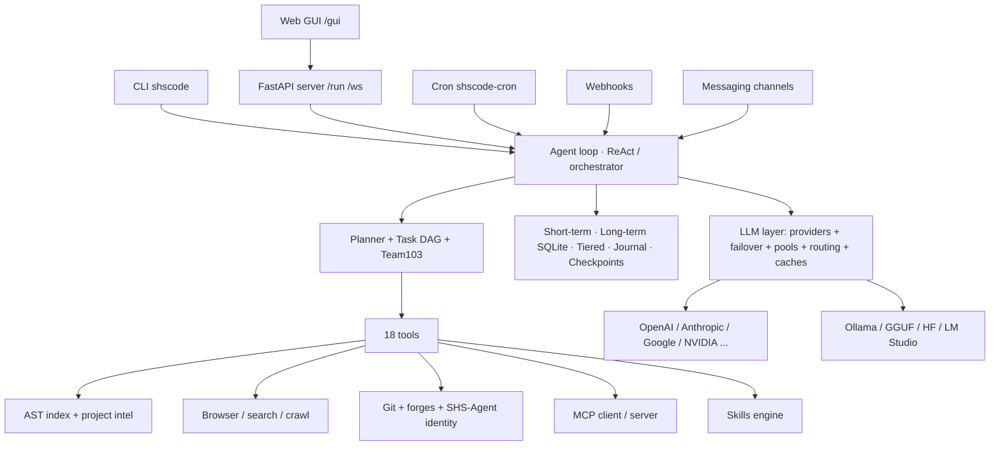
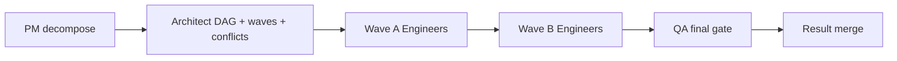

<p align="center">
  
</p>

<h1 align="center">⚡ SHS-Code</h1>
<h3 align="center">Persistent Autonomous AI Coding Agent — by SHS Lab</h3>
<p align="center"><em>Plan · Implement · Verify</em> — with memory, tools, skills, MCP, streaming, GUI, and Team103 multi-agent execution.</p>

<p align="center">
  <a href="https://github.com/shslab-org/shs-code"></a>
  =3.11" />
  
  
  
  
  
</p>

---

> ## 📚 Full Documentation
> The complete manual — **installation, beginner guide, CLI reference, configuration, models, providers, tools, skills, MCP, memory, autonomous, multi-agent, Team103, architecture, troubleshooting** — lives in a separate repository:
>
> ### 👉 **[github.com/shslab-org/SHS-Code-Docs](https://github.com/shslab-org/SHS-Code-Docs)**
>
> This README is the product homepage. The Docs repo is the complete manual.

> ### 🛡️ Attribution & Forks — Please Read
> SHS-Code attributes its own commits to the **[SHS-Agent](https://github.com/SHS-Agent)** automation identity (§ SHS-Agent Identity). If you would prefer **not** to credit SHS-Agent in your commits/PRs, you are free to **fork SHS-Code and remove that attribution** from your fork — see [§ Fork & Customize](#-fork--customize). The license permits it; the choice is yours.

**Code repository:** [github.com/shslab-org/shs-code](https://github.com/shslab-org/shs-code) · **Version:** `4.4.0` · **Python:** `>=3.11` · **Distribution:** `shscode` · **Import package:** `app` · **License:** Modified MIT (see `LICENSE`)

---

## 📑 Table of Contents

<details open>
<summary><b>Click to expand / collapse</b></summary>

| # | Section | # | Section |
|---|---|---|---|
| 1 | [What is SHS-Code?](#-what-is-shs-code) | 17 | [Sessions](#-sessions) |
| 2 | [Why SHS-Code?](#-why-shs-code) | 18 | [Diagnostics](#-diagnostics) |
| 3 | [Core Philosophy](#-core-philosophy) | 19 | [Configuration](#-configuration) |
| 4 | [Feature Overview](#-feature-overview) | 20 | [Environment Variables](#-environment-variables) |
| 5 | [Architecture](#-architecture) | 21 | [Installation](#-installation) |
| 6 | [Execution Modes](#-execution-modes) | 22 | [Quickstart](#-quickstart) |
| 7 | [Team103 Deep Dive](#-team103-deep-dive) | 23 | [GUI](#-gui) |
| 8 | [Reliability & Integrity](#-reliability--integrity) | 24 | [Troubleshooting](#-troubleshooting) |
| 9 | [Memory & Context](#-memory--context) | 25 | [Security](#-security) |
| 10 | [Tools](#-tools) | 26 | [Development](#-development) |
| 11 | [Git & GitHub](#-git--github) | 27 | [Contributing](#-contributing) |
| 12 | [Integrations](#-integrations) | 28 | [Provider Verification](#-provider-verification) |
| 13 | [Skills](#-skills) | 29 | [Full Documentation](#-full-documentation) |
| 14 | [MCP](#-mcp) | 30 | [Contact](#-contact) |
| 15 | [Models & Providers](#-models--providers) | 31 | [Fork & Customize](#-fork--customize) |
| 16 | [Token Streaming](#-token-streaming) | | |

</details>

---

# 🎯 What is SHS-Code?

**SHS-Code** is the persistent autonomous AI coding agent by **SHS Lab (Sazzad Hussain Shobuj)**. It *plans*, *implements*, and *verifies* software tasks through tools — and it **remembers** work across sessions.

SHS-Code is a **tool-using coding agent** with:

| 🧩 Layer | 💡 What it delivers |
|---|---|
| **Interfaces** | Interactive CLI (`shscode` / `SHSCode`), one-shot task mode, background execution, **full web GUI** at `/gui`, FastAPI server with REST + WebSocket + webchat/canvas |
| **Reasoning** | Single-agent ReAct loop, autonomous long-horizon mode, multi-agent pipeline, **Team103** crew |
| **Model layer** | Cloud APIs + local/offline models, real SSE token streaming, failover chains, credential pools, smart routing |
| **Memory** | Short-term in-loop, long-term SQLite + FTS5, tiered LRU cache, journal, checkpoints |
| **Tools** | 18 agent tools (shell, Python/Node, editor, browser, search, verify, and more) |
| **Skills** | 29 built-in skills across 4 levels (builtin / user / project / installed) |
| **MCP** | Both client **and** server — call external tool servers, or expose SHS-Code's tools |
| **Intelligence** | Persistent incremental AST/symbol index, semantic + structural code search, project profiles |
| **Forge ops** | Git + GitHub/GitLab/Azure DevOps/Bitbucket/Forgejo with the **SHS-Agent** automation identity |
| **Automation** | Cron, webhooks, messaging channels, SSH gateway, sandboxed execution |

> 💡 **To start:** install the package, configure one provider key, then run `shscode` (CLI) or `shscode-server` and open `/gui` (GUI).

---

# 💡 Why SHS-Code?

Most chat assistants *answer*. SHS-Code **executes**.

| ❌ Problem | ✅ SHS-Code provides |
|---|---|
| One-shot answers lose context | Persistent sessions, journal, checkpoints, long-term memory |
| Manual file edits | `str_replace_editor`, `bash`, `python_execute`, verification gates |
| Large-repo blindness | Incremental AST/symbol index, semantic + structural search, project profiles |
| Model outages | Failover chains, credential pools, health tracking, smart routing, local models |
| Solo-agent bottleneck | Team103: PM → Architect → Engineers → QA over a task DAG |
| Glue code for automation | Server API, cron, webhooks, messaging channels, MCP |
| Silent partial completions | Explicit finish reasons + `partial` state — never fake "done" |
| Lost long tasks | Detached daemon runs that survive disconnects + `--attach` streaming |

---

# 🧭 Core Philosophy

> **Plan → Implement → Verify.**
> Every task decomposes, executes through tools, and verifies before completion.

> **Persistence first.**
> Sessions, journal (`~/.shscode/state/journal.db`), checkpoints (`~/.shscode/state/checkpoints/`), and memory (`workspace/.memory/long_term.db`) survive restarts.

> **Evidence over claims.**
> Project intelligence, doctor checks, and verification read *real state* — never documentation claims.

> **Safe autonomy.**
> Security analyzers, confirmation thresholds, secret redaction, and sandboxes gate risky actions.

> **Provider freedom.**
> Universal OpenAI-compatible endpoints plus native OpenAI / Anthropic / Google / Mistral / Bedrock / Ollama / GGUF / Hugging Face, with live switching and failover.

> **Honest completions.**
> A task is never marked completed when it was skipped, abandoned, or unverified. `partial` is a first-class state.

> **Attribution by default.**
> Work SHS-Code performs is credited to the **SHS-Agent** identity. Humans keep their own identity; SHS-Code's work is clearly its own. (Fork-friendly — see § Fork & Customize.)

---

# 🚀 Feature Overview

| 🏗️ Area | 🎁 What SHS-Code provides |
|---|---|
| **Execution** | Single-agent, autonomous, multi-agent, Team103, worker pool, task DAG, dependency waves, work stealing |
| **Reliability** | Checkpoints, retries, recovery, verification, continuous QA, loop detection, task lifecycle integrity |
| **Knowledge** | Tiered memory, context condenser, skills (4 levels), MCP client + server |
| **Understanding** | AST index, semantic search, project profiles, environment detection, code/project intelligence |
| **Action** | 18 tools: shell, Python/Node runners, editor, browser, web search, crawl, verify, and more |
| **Models** | Universal + OpenAI / Anthropic / Google / Mistral / Bedrock / Ollama / GGUF / HF, failover, credential pools, smart routing |
| **Streaming** | Real SSE token deltas (Universal client + WebSocket to GUI + CLI live line) |
| **Ops** | Sessions / resume, detached runs, doctor / diagnostics, cron, webhooks, SSH / sandbox, messaging channels |
| **Forge** | GitHub / GitLab / Azure DevOps / Bitbucket / Forgejo + SHS-Agent identity |
| **Interfaces** | CLI + full web GUI (dashboard, chat, tasks, Team103, workspace, terminal, git, GitHub, QA, sessions, logs, memory, settings, help) |
| **Extensibility** | Custom skills, project skills, MCP servers, plugin-style providers, connectors |
| **Distribution** | Console scripts (`shscode`, `shscode-server`, `shscode-cron`, `shscode-multi`, `shscode-sessions`, `shscode-channels`, `shscode-webhook`), Docker, `install.sh` / `install.ps1` |

---

# 🏛️ Architecture


```mermaid
flowchart TB
  CLI[CLI shscode] --> Agent[Agent loop · ReAct / orchestrator]
  GUI[Web GUI /gui] --> Server[FastAPI server /run /ws]
  Server --> Agent
  Cron[Cron shscode-cron] --> Agent
  Webhook[Webhooks] --> Agent
  Channels[Messaging channels] --> Agent

  Agent --> Planner[Planner + Task DAG + Team103]
  Planner --> Tools[18 tools]
  Tools --> CodeIntel[AST index + project intel]
  Tools --> Browser[Browser / search / crawl]
  Tools --> Git[Git + forges + SHS-Agent identity]
  Tools --> MCP[MCP client / server]
  Tools --> Skills[Skills engine]

  Agent --> Memory[Short-term · Long-term SQLite · Tiered · Journal · Checkpoints]
  Agent --> LLM[LLM layer: providers + failover + pools + routing + caches]
  LLM --> Cloud[OpenAI / Anthropic / Google / NVIDIA ...]
  LLM --> Local[Ollama / GGUF / HF / LM Studio]
```

**Key paths**

```
app/agent/        agent loop
app/planner.py    plan construction
app/task_dag.py   task graph
app/team103/      multi-agent scheduler
app/tool/         the 18 tools
app/skills/       skills engine + builtins
app/mcp/          MCP client + server
app/memory/       short/long/tiered memory
app/context/      context management
app/intelligence/ AST index + project intel
app/llm/          provider layer, retry, failover
app/v4/           v4 subsystems (roles, cont_qa, memory tiers, router…)
app/server/       FastAPI server + GUI static assets
app/config.py     configuration loader
app/state.py      runtime state
app/verification.py  verification engine
app/recovery.py   recovery engine
```

---

# 🎛️ Execution Modes

SHS-Code ships **four execution shapes**, each tuned for a different kind of work.

---

## 🧍 Single-Agent Mode

Use the interactive shell or one-shot prompt for focused, single-file, single-feature work.

```bash
# Interactive shell
shscode

# One-shot task
shscode "add retry with backoff to app/llm/retry.py and add tests"

# Via module entry
python main.py "fix failing tests in tests/test_memory_layers.py"
```

**What happens under the hood — a ReAct-style loop:**

1. **Read goal** → set acceptance criteria
2. **Inspect** project (`project_intel`, `code_search`)
3. **Plan** (`planning`, `task_dag`)
4. **Edit** (`str_replace_editor`, `bash`, `python_execute`)
5. **Verify** (`verify`, tests)
6. **Record** (journal + memory)

**Steer the run without restarting** with slash commands:
`/plan` · `/mode` · `/model` · `/doctor` · `/sessions` · `/tools` · `/compress` · `/pause` · `/resume` · and more.

---

## 🛰️ Autonomous Mode

For migrations, large refactors, and multi-file features that need many steps.

```bash
shscode "migrate the auth module to async with full test coverage"
```

Inside the shell:

```text
/mode autonomous
```

**The `autonomous` profile** (`app/modes.py`) provides:

- 🧠 High step budget, planning **on**, thorough verification
- ⏸️ Minimal pauses — runs many steps without asking
- 🌀 Loop detection to break out of stuck cycles
- 🙋 `ask_human` only when *truly* blocked
- 💾 Continuous checkpoints → `/pause`, `/bg`, `--continue` always work

Use it for **migrations**, **large refactors**, **multi-file features**. Not for one-line fixes.

---

## 🧑‍🤝‍🧑 Multi-Agent Mode

Two multi-agent paths ship with SHS-Code:

```bash
python run_multi_agent.py --mode build "implement user profiles API with tests"
python run_multi_agent.py --mode plan  "design sharding for the journal"
shscode-multi --help
```

| Path | What it is | Where it lives |
|---|---|---|
| **Build / plan pipeline** | Full PM-style pipeline with role delegation | `app/multi_agent.py::run_cli` |
| **In-task delegation** | `delegate` subagents + `task_dag` parallel execution | `app/tool/delegate.py`, `app/task_dag.py` |
| **Team103** | Full PM → Architect → Engineers → QA crew | `app/team103/scheduler.py` |

---

## 🏁 Team103

Team103 is the full multi-agent crew. Give SHS-Code a *large* goal and let it orchestrate.

**Entry points**

```bash
shscode "build user notification preferences: API + DB migration + UI + tests + docs"
```

```text
/team103 <goal>
```

```http
POST /team103 { "goal": "…" }
```

> ### 🧠 Honest Architecture Note
> Team103 is **1 PM + 1 Architect + up to 100 lightweight coroutine engineer workers sharing one LLM engine + 1 QA gate** — *NOT* 103 independent LLM instances.
>
> - **PM / Architect decomposition** is heuristic (regex-based planning + role specialization).
> - **Engineers** are real journaled `SHSCode` agent runs.
> - This is honest by design — the throughput gain comes from parallel I/O, journaling, and work-stealing, not from magic multi-model swarms.


```mermaid
flowchart LR
  PM[PM decompose] --> Arch[Architect DAG + waves + conflicts]
  Arch --> W1[Wave A Engineers]
  W1 --> W2[Wave B Engineers]
  W2 --> QA[QA final gate]
  QA --> Merge[Result merge]
```

Team103 provides dynamic concurrency (**AIMD**), file-conflict serialization, work-stealing within waves, checkpoints, retries, and a **final QA gate** that fails on:

- 🚫 Empty changed files
- 🚫 Missing files
- 🚫 Low aggregate confidence (worker confidence is keyed off each worker's **actual finish reason**, not a hardcoded value)

Team103 shines on **5+ file features**. For single-file edits, the solo agent is faster.

---

# 🏁 Team103 Deep Dive

## 🎭 PM / Architect / Engineer / QA

Roles are defined in `app/v4/roles.py`.

| 🎭 Role | 📋 Responsibility | 🔧 Key API |
|---|---|---|
| **PM** | Objective, acceptance criteria, decomposition, priority | `decompose_goal(goal, max_tasks=12)` → `TaskSpec` items |
| **Architect** | Architecture, dependency graph, DAG, assignment, conflicts | Topological waves + conflict plan |
| **Engineer** | Implementation, investigation, testing, local verification | Specializations: `backend`, `frontend`, `testing`, `documentation`, `devops`, `security`, `performance`, `database` |
| **QA** | Integration, regression, correctness, completion gate | `qa.final_gate(confidence, conflicts, failed)` |

Each `TaskSpec` carries: **title, files, priority, risk, subsystem, complexity, role hint, dependencies, acceptance**. SHS-Code assigns a role hint and a task-specific context slice automatically.

---

## 👷 Worker Pool

SHS-Code provides **two pools**:

| Pool | Where | Defaults |
|---|---|---|
| **Parallel executor** | `[parallel_executor]` in `config.toml` | `max_workers = 4`, `timeout_s = 300` |
| **Team103 scheduler** | `app/team103/scheduler.py` | starts at `start_concurrency`, capped by `max_workers`/`max_concurrency`, adjusted live by AIMD |

```toml
[parallel_executor]
max_workers = 4
timeout_s   = 300
```

---

## 🕸️ Task DAG

The task DAG (`app/task_dag.py`, `task_dag` tool) models work as nodes with dependencies.

```text
/plan implement auth refresh tokens with tests
```

SHS-Code:

- Creates nodes
- Links `depends_on` edges
- Schedules dependency waves
- Tracks state in the journal
- Merges results

The `task_dag` tool exposes the graph to the agent; `app/v4/async_dag.py` provides async execution with observability.

---

## 🌊 Dependency Waves

Waves are computed by `_waves()` in `app/team103/scheduler.py`:

- **Topological grouping** by `depends_on` titles
- **Fallback** to priority order
- **Within a wave**: tasks run in parallel
- **Across waves**: tasks run serially (A → D)

**Example:**

```
Wave A: schema + API contract
Wave B: endpoints + UI
Wave C: tests + docs
```

To inspect waves, run a Team103 task — SHS-Code logs `N waves` with role assignments.

---

## 📈 AIMD Concurrency

**AIMD** = *Additive Increase / Multiplicative Decrease*. Lives in `app/team103/scheduler.py::_AIMD`.

- The scheduler waits until active tasks drop below the AIMD limit
- **Increases** the limit additively on success
- **Decreases** it multiplicatively on failure / timeout
- Bounds: `start_concurrency` → `min(max_concurrency, max_workers)`

You don't configure this — run a large Team103 batch and SHS-Code throttles automatically under errors, then ramps back up when healthy.

---

## 🔒 Conflict Serialization

When two tasks touch the same files, the Architect emits a conflict plan (`conflicts: Dict[str, List[str]]`).

- **File-conflicting tasks** → serialized (never run concurrently → no clobbered edits)
- **Non-conflicting tasks** → still run in parallel
- **Final merge** reports `merged_files` and any remaining `conflicts` for QA review

---

## 🤝 Work Stealing

Within a wave, Engineers execute via `asyncio.gather` — idle workers pick up pending tasks in the same wave.

- **A failing worker** does *not* stop its siblings
- **Retries + QA** catch gaps
- **No configuration** — it's built in

---

# 🛡️ Reliability & Integrity

## 💾 Checkpoints

- **Location:** `~/.shscode/state/checkpoints/<task_id>.json`
- **Writes:** temp file + atomic `os.replace` — a crash cannot corrupt the previous checkpoint
- **Journal:** `~/.shscode/state/journal.db` (SQLite, WAL) stores tasks + event log

Resume after interruption:

```bash
shscode --continue
shscode --session <ID>
```

```text
/resume <task-id>
/tasks
/task <task-id>
```

---

## ♻️ Retry / Recovery

SHS-Code provides **layered recovery** (`app/recovery.py`, `app/llm/retry.py`, `app/v4/recovery.py`):

| Layer | Behavior |
|---|---|
| **LLM retries** | `max_retries` (built-in default `15` in `app/config.py`; shipped sample sets `6`), backoff with rate-limit waits that leave state untouched |
| **Tool / task retries** | timeout → retry → checkpoint → resume |
| **Journal recovery** | `tests/test_journal_recovery.py` verifies task state survives restarts |
| **Team103** | per-task timeout / retry / checkpoint + QA final gate |

Configure under `[llm]`:

```toml
[llm]
max_tokens  = 8192
max_retries = 6
timeout     = 1800
```

---

## ✅ Verification

Verification (`app/verification.py`, `verify` tool) runs **project-aware checks** before SHS-Code claims completion:

- `python -m compileall`
- `pytest`
- Risk-aware gates

```text
/verify
```

Or via tool: `verify` with `build` / `test` / `lint` / `typecheck` kinds.

> ⚠️ **"Code generated" never equals "task completed."** Verification must pass.

---

## 🔁 Continuous QA

Continuous QA (`app/v4/cont_qa.py`) checks quality **during** execution — not just at the end.

Combined with `risk_verify.py` (risk-aware verification):

- **High-risk** changes (auth, secrets, migrations, deletions) → **stricter gates**
- **Low-risk** edits → flow through

The Team103 QA final gate (`qa.final_gate`) blocks merges with low confidence, unresolved conflicts, or failed tasks.

---

## 🧾 Task Lifecycle Integrity

SHS-Code **never** claims a task completed when it was skipped, abandoned, or unverified. Every run tracks an explicit **finish reason**:

| 🏷️ Reason | Meaning | Journal status |
|---|---|---|
| `final_answer` | Text answer stood (plan finished / no plan) | ✅ `completed` |
| `terminate` | `terminate` tool accepted (plan gate passed) | ✅ `completed` |
| `done_pattern` | Keyword "done" match (gated: only when the persisted plan has **no** unfinished steps) | ✅ `completed` |
| `max_steps` | Step budget exhausted mid-work | 🟡 **`partial`** |
| `token_budget` | Token budget + grace exhausted | 🟡 **`partial`** |
| `error` / `permission_denied` | Run failed | ❌ `failed` / `blocked` |

The **`partial` state** is the honest middle ground: work stopped without a verified final answer — the task is explicitly **NOT completed**, `/resume` can continue it from the checkpoint, and the user-facing response says so plainly.

**Dependency handling is strict:** a DAG node can only be marked completed when every dependency reached `completed` or was **explicitly skipped** (the old code silently auto-completed active dependencies — removed).

The plan gate nudges the model to finish or explicitly skip remaining steps before a final answer is accepted; keyword "done" claims with unfinished plan steps no longer end runs.

> 🎯 **The user-facing response channel carries only the final answer.**
> Raw tool outputs, retry diagnostics, and terminate markers stay in `agent.last_run_step_outputs` (GUI/debug consumers), never in the assistant message.

---

## 🎚️ max_steps Architecture — User-Controlled, Never Silently Replaced

Your step budget is yours.

**Where you can set it:**

- CLI: `--max-steps 150`
- GUI Agent panel: **"Steps"** box, per run
- GUI Settings panel: **"Agent Step Budget"**, persisted
- Env var: `SHSCODE_MAX_STEPS`
- Config: `max_steps` at the top of any config layer

**Schema-placement validation:**

The loader performs **strict schema-placement validation**. A top-level setting found inside any section is a hard `ConfigError` telling you exactly where to move it. Unknown keys only *warn* (`SHSCODE_CONFIG_PERMISSIVE=1` downgrades for legacy files).

*(Historical bug: `max_steps` inside `[logging]` used to be silently ignored — the loader now refuses to accept it there.)*

**Every surface shows the effective value and its source:**

- CLI `/config`
- Run-start log line
- `GET /config`

So the runtime can never silently disagree with what you configured.

---

## 🛰️ Detached Runs — Survive the Terminal

Long-running tasks no longer die with the session that started them.

```bash
SHSCode --detach "<task>"       # double-forked, setsid-detached daemon
SHSCode --runs                  # list registry
SHSCode --attach <id>           # stream output live
```

- **Registry entry**: `~/.shscode/runs/<id>/run.json` + `output.log`
- **Survives**: terminal close, SSH disconnect, process-tree cleanup
- **GUI parity**: Agent panel **"detached"** checkbox + `POST /run {"detach": true}`
- **Sessions panel** shows the detached-run registry with live process liveness

**Graceful signal handling:** `SIGTERM` / `SIGHUP` now cancel runs *gracefully* — state is checkpointed, the session closes as `interrupted`, and `SHSCode --continue` (or `/resume`) picks it up cleanly.

---

## 🔁 Resume — Everything Restored

SHS-Code restores **sessions, journal tasks, checkpoints, and memory**:

```bash
shscode --continue
shscode --session <ID>
```

```text
/resume <task-id>
/tasks
/task <task-id>
/pause
/stop
/continue
```

Checkpoints (atomic writes) plus the journal make pre-interruption state resumable. **Rate-limit waits leave state untouched by design.**

> 🔧 **Resumed-session tool-call fix:** strict OpenAI-compatible providers reject any request whose history contains an assistant `tool_calls` block without matching `tool` results (HTTP 400) — and a cancelled-mid-tool run could produce exactly that. Every producer path now appends the tool result, and `sanitize_tool_history()` enforces the protocol invariant at the LLM request boundary no matter how the memory was produced. Tool failures record structured diagnostics (tool, exception class, args, `tool_call_id`) plus a `tool_failure_diagnostic` activity event.

---

# 🧠 Memory & Context

## 💭 Memory — Four Layers

| Layer | What it is | Where it lives | How to use |
|---|---|---|---|
| **Short-term** | In-loop message history, snapshots, context refresh | In process (`app/memory/short_term.py`) | Automatic; `/compress` condenses |
| **Long-term** | SQLite + FTS5 full-text search, embeddings placeholder | `workspace/.memory/long_term.db` (honours `SHSCODE_WORKSPACE`) | `memory` tool; `cross_session_search` |
| **Tiered** | LRU cache (cap 512) over DB + markdown | `app/v4/memory_tiers.py`, `intel_memory.py` | Automatic acceleration |
| **Journal / worklog** | Tasks + event log, checkpoints | `~/.shscode/state/journal.db`, `checkpoints/` | `/tasks`, `/resume`, sessions |

- **Store a fact:** `memory` tool
- **Recall across sessions:** `cross_session_search`
- **Limitations (honest):** long-term search is FTS5 + LIKE (no vector DB by default); embeddings are placeholder bytes

---

## 🧵 Context Management

Context is managed by `app/context/` + `app/compaction.py` + `app/v4/context_mgmt.py`:

| Component | Detail |
|---|---|
| **Condenser** | `condenser_type = "rolling"` (also `noop`, `llm_summarizing`) |
| **Triggers** | `max_events = 200` |
| **Budget** | `max_tokens = 80000` |
| **Compaction** | `/compress` summarizes history into a snapshot; `ShortTermMemory.snapshot()/restore()` preserves continuity |
| **View properties** | Deduplication, observation uniqueness, tool-call matching, loop atomicity |

Configure under `[context]` in `config.toml`. Manual: `/compress` or `/clear` + `/new`.

---

# 🧰 Tools

SHS-Code provides **18 agent tools** (`app/tool/`):

| 🛠️ Tool | 🎯 Purpose |
|---|---|
| `bash` | Shell execution |
| `python_execute` | Isolated Python subprocess |
| `node_execute` | Isolated Node.js subprocess |
| `str_replace_editor` | View / create / edit files |
| `code_search` | Indexed code search (8 modes) |
| `project_intel` | Project summary / architecture / entry / env / git |
| `browser_use` | Playwright browser control |
| `web_search` | DuckDuckGo → Bing fallback search |
| `crawl` | Clean text extraction from URLs |
| `memory` | Persistent memory read/write |
| `cross_session_search` | Full-text search across past sessions |
| `task_dag` | Persisted task graph |
| `delegate` | Spawn isolated subagent |
| `skill_manager` | Create / patch / delete / list skills |
| `verify` | Build / test verification |
| `ask_human` | Request user clarification |
| `terminate` | Signal task completion |
| `image_generate` | Generate images (FAL.ai or mock) |

> 📌 `planning.py`, `data_viz.py`, and `platform_control.py` exist as tool modules in `app/tool/` but are **not exposed** in the default agent tool collection.

List tools in the shell: `/tools`. Every tool emits an OpenAI-compatible schema for the model.

---

## 🖥️ Terminal

Three execution runners:

| Runner | Description |
|---|---|
| **`bash`** | Persistent shell, full system access. Used for git, pytest, builds, file ops. |
| **`python_execute`** | Isolated Python subprocess (any imports, filesystem, network permitted). Use `print()` for output. |
| **`node_execute`** | Isolated Node.js subprocess. |

All three run to completion with optional timeouts. Just ask — SHS-Code picks the right runner.

**Examples:**

```python
# python_execute — data script
```

```bash
# bash — test suite
pytest tests/ -q
```

---

## 📝 File Operations

Primary editing tool: **`str_replace_editor`** — `view` / `create` / `str_replace` / `insert` / `undo_edit`.

Precise string replacement with **undo support**.

Complementary tools:

- `bash` (moves / copies)
- `project_intel` (locate files)
- `code_search` filename mode

To edit, tell SHS-Code the file and change — it views first, edits, then verifies.

---

## 🔍 Code Intelligence

Code intelligence (`app/intelligence/`, `code_search` tool) indexes the project once into a **persistent incremental index** — no repeated full scans.

| Mode | What it answers |
|---|---|
| `semantic` | Concept search, e.g. *"where is authentication handled"* — expands to related symbols, ranks files |
| `symbol` | Find class / function / method by name (`class Journal`) |
| `text` | Substring search |
| `regex` | Line regex |
| `filename` | Find files by name |
| `import` | Who imports module X |
| `usages` | Where symbol S is referenced |
| `callers` | Files importing from a given file |

SHS-Code prefers `code_search` over `bash grep`. Results are context-aware cached (`app/v4/semantic_cache.py`).

**Force reindex:** `project_intel` action `refresh`.

---

## 🧭 Project Intelligence

`project_intel` tool + `app/intelligence/` inspects **real state**:

| Action | Output |
|---|---|
| `summary` | Project type, languages, frameworks, build/test/run commands |
| `architecture` | Symbol weight by directory + most-imported modules |
| `entry` | Entry points + important files + test frameworks + commands |
| `env` | Tools, runtimes, versions available |
| `git` | Branch, dirty files, conflicts, recent commits |
| `refresh` | Incremental reindex |

Use it with `/project` in the shell, or ask *"summarize this project"*.

> 🔎 **All output comes from real inspection — never from documentation claims.**

---

## 🌐 Browser

`browser_use` (Playwright) + `crawl` (clean extraction) + `app/v4/browser_pool.py`:

```toml
[browser]
headless           = true
disable_security   = false
max_content_length = 10000
```

Capabilities:

- Navigate, click, type
- Screenshots
- Extract text
- Execute page JS

**Requires the optional `browser` extra** (`playwright`, `crawl4ai`). Headless by default; pooling reuses contexts for speed.

---

## 🔎 Web Search

`web_search` (DuckDuckGo → Bing fallback) + `crawl` (aiohttp + HTML stripping fallback when `crawl4ai` is absent):

```toml
[search]
engines     = ["duckduckgo", "bing"]
max_results = 10
```

Use it: `/search <query>` or *"research X"*.

**Requires the optional `search` extra** (`duckduckgo-search`). Results return titles, URLs, and snippets; `crawl` then extracts clean readable text (up to `max_length`, default **8000 chars**).

---

# 🐙 Git & GitHub

## 🌿 Git (Local)

Local git intelligence via `app/git_intel.py` + `project_intel` action `git`, plus the `bash` tool.

| Capability | Where |
|---|---|
| Branch, dirty files, conflicts, recent commits, diffs, snapshots | `git_intel` |
| Shell status snapshot | `/git` |
| Commits, branches, merges, conflict inspection | via shell |

SHS-Code reads **real repo state** before every change and verifies after. It **never rewrites history** unless explicitly asked.

---

## 🐙 GitHub (and Other Forges)

`app/git_providers/` supports five forges:

| 🔧 Forge | 📦 Module | 🔑 Token env var |
|---|---|---|
| **GitHub** | `github/` | `SHSCODE_GITHUB_TOKEN` or `GITHUB_TOKEN` |
| **GitLab** | `gitlab/` | `GITLAB_TOKEN` (+ `GITLAB_URL`) |
| **Azure DevOps** | `azure_devops/` | `AZURE_DEVOPS_TOKEN` (+ org) |
| **Bitbucket** | `bitbucket/` | username + app password |
| **Forgejo** | `forgejo/` | `FORGEJO_TOKEN` (+ URL) |

**Base features** (`base.py`): repos, single repo, issues, PRs, rate-limit handling, retry with backoff, sync + async APIs. `suggested_tasks.py` proposes work from forge state. Tokens come from env vars or `~/.shscode/connectors` — **never hardcoded**.

**Requires** optional `github` / `gitlab` extras (`PyGithub`, `python-gitlab`).

**GitHubProvider facade** (`app/git_providers/github_provider.py`):

- Local git operations (clone / branch / commit / push / pull / stash / diff / log)
- API operations (PRs, issues, reviews)
- Agent-attributed commits
- One-shot authenticated push URLs — **tokens are never stored in remote URLs**

**CLI surface:**

```text
/github status|commit|branch|push|pull|stash|diff|log|prs|issues|pr
```

Also exposed in the **GUI GitHub panel**.

---

## 🛡️ SHS-Agent GitHub Identity

GitHub work performed by SHS-Code is attributed to the dedicated automation identity **[SHS-Agent](https://github.com/SHS-Agent)** — a personal user account created specifically for SHS-Code — rather than pretending the human user did everything.

### Mechanisms (priority order)

| Priority | Mechanism | Env vars / config |
|---|---|---|
| 1️⃣ | **GitHub App installation token** (official bot identity) | `SHSCODE_GITHUB_APP_ID`, `SHSCODE_GITHUB_APP_PRIVATE_KEY_PATH` (or `…_PRIVATE_KEY`), `SHSCODE_GITHUB_APP_INSTALLATION_ID` — SHS-Code mints the RS256 JWT and exchanges it for short-lived installation tokens (cached, auto-refreshed). **Requires** the `github-app` extra. |
| 2️⃣ | **Personal access token** | `SHSCODE_GITHUB_TOKEN` (preferred) or `GITHUB_TOKEN`, or a token in `~/.shscode/connectors` |

### The Attribution Trailer

Every commit made through the GitHubProvider (CLI `/github commit`, GUI Git panel, GUI terminal, autonomous `git commit`) carries:

```
Generated with SHS-Code

Co-Authored-By: SHS-Agent <337454460+SHS-Agent@users.noreply.github.com>
```

### Author, Committer, and Contributor

Attribution follows GitHub's actual model:

- The commit's **author and committer themselves** are the SHS-Agent identity (not just a trailer)
- GitHub resolves every commit to **[github.com/SHS-Agent](https://github.com/SHS-Agent)**
- Because the account is a **user** account, GitHub credits it in the repository's **Contributors** section

The email is GitHub's reserved, unspoofable `<id>+<login>` noreply form for that exact account.

### Non-Bypassable

The attribution is **mechanically enforced**:

- A **git shim** (`~/.shscode/shims/git`, first on the PATH of every SHS-Code child process) strips `--author` / `--reset-author` from `git commit` and forces the identity env vars
- **Prompt-level, flag-level, and env-level bypass attempts are all defeated**
- All opt-outs (including the old `SHSCODE_AGENT_IDENTITY=0`) are **removed**

> 🔒 **Your own shells outside SHS-Code and your git configuration are never touched.**

### "Sab Jagah" Rule

Every commit made by SHS-Code — CLI or GUI, `/github commit`, the GUI GitHub panel, the terminal panel, or an autonomous agent's `git commit` in bash — is attributed to the agent profile `SHS-Agent <337454460+SHS-Agent@users.noreply.github.com>` as **author, committer, and co-author**, with the `Generated with SHS-Code` footer.

- `GitHubProvider.commit()` forces the identity via per-command `-c` overrides (your global git config is never touched)
- CLI / server startup export `GIT_AUTHOR_*` / `GIT_COMMITTER_*` so child-process git operations inherit the same attribution
- Attribution for SHS-Code's own work is **mandatory** by default

> 🍴 **Don't want SHS-Agent credited?** Fork SHS-Code and remove it — see [§ Fork & Customize](#-fork--customize).

---

# 🔌 Integrations

Most integrations are **optional** (require extras or external services). Each row is labeled.

## 💬 Messaging Channels

`shscode-channels` + `app/messaging/`:

```
discord · telegram · slack · email · webchat · whatsapp
teams · google_chat · irc · matrix · signal · twitch
```

Configure via connectors; deliver cron/webhook output to `platform:channel`.

### Real Protocols (No Stubs Remain)

| Channel | Protocol |
|---|---|
| **Discord** | Real Gateway websocket protocol (HELLO → heartbeat → IDENTIFY → MESSAGE_CREATE, RESUME across reconnects) |
| **Slack** | Real Socket Mode (`apps.connections.open`, envelope ACKs, bot/subtype filtering) |
| **Teams** | Bot Framework OAuth2 client-credentials flow with cached access token + activity send |
| **Google Chat** | Signs a proper RS256 service-account JWT via `cryptography` + interpolates space into send URL |
| **Email** | IMAP polling (UNSEEN → RFC822 → parse → dispatch → mark seen) |

**Inbound webhook routes:** `/messaging/webhooks/{whatsapp,teams,google-chat}` plus `GET /messaging/channels` for configuration status.

---

## ⏰ Cron

`shscode-cron`:

```bash
shscode-cron --add "<5-field cron>" "<prompt>"
shscode-cron --list
shscode-cron --remove <id>
shscode-cron --trigger <id>
shscode-cron --run
```

Standard 5-field expressions. Webhook + channel delivery.

---

## 🪝 Webhooks

`shscode-webhook`:

- HMAC-verified inbound hooks that trigger prompts
- `webhook_router.py` + `webhooks.py`

---

## 🔐 SSH Gateway

`app/ssh_server.py`, `app/ssh/`:

- **Disabled by default** (`[ssh] enabled = false`, port `2222`)
- Requires `asyncssh` extra
- Label: *optional / operator-managed*

---

## 📦 Sandbox

`app/sandbox/`:

- Backends: `docker` (default), `ssh`, `openshell` via `SANDBOX_BACKEND`
- **No `local` backend**
- **Disabled by default** (`[sandbox] enabled = false`)
- Docker requires a working Docker daemon — label: *environment-dependent*

---

## 🎙️ Voice

`app/voice/`:

- **Wake word** → requires `PICOVOICE_API_KEY`
- **TTS** → OpenAI (`OPENAI_API_KEY`) or ElevenLabs (`ELEVENLABS_API_KEY`)
- Requires `voice` extra
- Label: *optional*

---

## 📧 Gmail

`docs/features/gmail.md`:

- Google OAuth (`GOOGLE_CLIENT_ID` / `GOOGLE_CLIENT_SECRET`, token at `~/.shscode/gmail_token.json`)
- Requires `gmail` extra
- Label: *optional*

---

## 🗄️ File Store

`[file_store]` backends: `local`, `s3`, `gcs`, `memory`.

- S3 / GCS require `s3` / `gcs` extras + `S3_BUCKET` / `GCS_BUCKET`
- Label: *optional*

---

## 🎨 Canvas / Nodes / Webchat

- `app/canvas/`, `app/nodes/`
- Webchat surfaces
- Companion apps (`companion` extra: `pystray`, `rumps`) — *platform-dependent*

---

## 🐳 Docker

`Dockerfile`, `docker-compose.yml`:

- CLI agent + server profiles
- Healthchecks
- Requires Docker

---

## 🧰 Project Tools

`app/integrations/`:

- `jira.py`
- `linear.py`
- `slack.py`
- `templates.py` (Jinja2)
- `webhook_handler.py`
- `resolver.py`

## 🔗 Connectors

`app/connectors.py`:

- Token registry at `~/.shscode/connectors` with masking
- `apply_to_git_providers` wires tokens automatically

---

# 🎓 Skills

Skills are reusable Markdown workflows (`app/skills/skill_engine.py`).

- **Auto-loaded:** `get_relevant(goal, max_skills=3)`
- **Auto-suggested:** `should_suggest_skill` (after repeated tool calls)
- **Manage in shell:** `/skills`, `/skill <name>`
- **Manage via tool:** `skill_manager` (`create` / `patch` / `delete` / `list`)
- **Format:** frontmatter (`name`, `description`) + Markdown body
- **Disabled skills persist in** `~/.shscode/skills_state.json`
- Built-in skills are **immutable** — `remove` / `delete` only apply to user / project / installed skills

---

## 📚 Built-in Skills (29)

Verified via `SkillEngine.list_skills()`. Doctor reports `29 skill(s) loaded`.

```
android-development   api-development       automation
browser-automation    c                     code_review
cpp                   csharp                data_analysis
database-engineering  debugging             deep_research
devops_deploy         documentation         git
github_workflow       java                  javascript
kotlin                linux                 mlops_training
php                   python                security-engineering
sql                   testing               typescript
ui-ux                 web-development
```

Source files live in `app/skills/builtin/*.md` (29 files on disk, 29 loaded).

**Coverage:**

- **Languages:** Python, JavaScript, TypeScript, Java, Kotlin, C, C++, C#, PHP, SQL
- **Engineering:** Web, API, Database, Security, DevOps, MLOps, Testing, Debugging, Documentation, Automation, Data Analysis, Research, Browser Automation, Git, GitHub, Linux, UI/UX, Android

---

## ✍️ Custom Skills

**Create inside SHS-Code:**

```text
/skill create <name> <description>
```

**Create programmatically:**

```python
from app.skills.skill_engine import get_skill_engine
e = get_skill_engine()
e.create(name="my-workflow", description="How I deploy", content="# steps...")
e.patch(name="my-workflow", content="updated body")
e.install(source="./my-skill.md")   # → ~/.shscode/skills/installed/
e.remove(name="my-workflow")
```

**Skill file format:**

```markdown
---
name: my-workflow
description: How I deploy
---
# steps...
```

Created skills default to `level="user"`. Project skills live in `<repo>/.shscode/skills/*.md` and travel with the repo.

---

## 🪜 Skill Levels

| Level | Location | Purpose |
|---|---|---|
| `builtin` | `app/skills/builtin/` | Shipped with SHS-Code, immutable |
| `user` | Skills dir (`~/.shscode/skills/`, honours `SHSCODE_HOME`, override via `SKILLS_DIR`) | Personal reusable workflows |
| `project` | `<cwd>/.shscode/skills/` | Repo-specific workflows, shared via git |
| `installed` | `<skills_dir>/installed/` | Third-party skills added via `install()` |

Inspect levels: `skill_manager list`. Load order: `builtin → user/installed → project` — so **project skills override** for the current repo.

---

# 🔗 MCP (Model Context Protocol)

MCP connects SHS-Code to external tool servers over JSON-RPC (`app/mcp/`). SHS-Code provides **both sides**:

| Side | What it does |
|---|---|
| 🎯 **MCP client** | SHS-Code calls tools on external MCP servers |
| 🌐 **MCP server** | External clients call SHS-Code's tools |

**Architecture:**

- `app/mcp/client.py` — stdio / SSE transports, `initialize` handshake, `tools/list`, `tools/call`
- `app/mcp/server.py` — FastAPI + CORS via `SHSCODE_ALLOWED_ORIGINS`
- `app/agent/mcp.py` — bridges MCP tools into the agent loop

Inspect: `/mcp` in the shell.

> ℹ️ With no servers configured, doctor reports `mcp: no MCP servers configured` — that is the **normal default**.

---

## 🎯 MCP Client

Call external MCP servers:

```bash
python run_mcp.py --connection stdio --interactive
python run_mcp.py --connection sse --server-url http://localhost:8001 --prompt "list files"
python run_mcp.py --help
```

The client performs the `initialize` handshake (non-fatal on homemade servers), lists tools, and routes agent tool calls to the server over stdio pipes or SSE. Timeouts and pipe-buffer guards prevent deadlocks.

To add a server, configure it per the Docs repo MCP guide — SHS-Code discovers tools automatically.

---

## 🌐 MCP Server

Expose SHS-Code's tools to external clients:

```bash
python run_mcp_server.py --host 0.0.0.0 --port 8001
python run_mcp_server.py --help
```

External MCP clients connect, handshake, list SHS-Code tools, and invoke them.

- **CORS** configurable via env (`SHSCODE_ALLOWED_ORIGINS`)
- Without `SHSCODE_API_KEY` the server **warns** that endpoints are unauthenticated — **set `SHSCODE_API_KEY` in production**

---

# 🤖 Models & Providers

## 🧠 Models

Configure the reasoning model via `[llm]` or `LLM_MODEL`:

```toml
[llm]
provider = "universal"
model    = "openai/gpt-oss-20b"
base_url = "https://integrate.api.nvidia.com/v1"
```

```bash
export LLM_MODEL="openai/gpt-oss-20b"
shscode --model "openai/gpt-oss-20b" "explain this repo"
```

**Built-in defaults:** `provider = "mock"`, `model = "gpt-4o"` — *safe for immediate use without keys*. The shipped `config.toml` points at NVIDIA NIM (`openai/gpt-oss-20b`).

**Registry defaults per provider** (`app/providers.py`):

| Provider | Default models |
|---|---|
| OpenAI | `gpt-4o`, `gpt-4o-mini`, `gpt-4-turbo`, `o3-mini`, `o1` |
| Anthropic | `claude-sonnet-4-20250514`, … |
| Ollama | `llama3.2:3b`, `qwen2.5-coder:7b`, `deepseek-r1:8b` |

List live: `/models` in the shell.

---

## 🔌 Providers

Verified in `app/config.py`, `app/llm/`, `app/providers.py`, `config.toml`.

| Provider value | Backend | Key env var |
|---|---|---|
| `mock` | Built-in safe default, no network | none |
| `openai` | OpenAI API | `OPENAI_API_KEY` |
| `anthropic` | Anthropic API | `ANTHROPIC_API_KEY` |
| `google` / `gemini` | Google Generative AI | `GOOGLE_API_KEY` |
| `mistral` | Mistral (`mistral` extra) | `MISTRAL_API_KEY` |
| `bedrock` | AWS Bedrock (`bedrock` extra) | `AWS_ACCESS_KEY_ID` + `AWS_SECRET_ACCESS_KEY` |
| `ollama` | Local Ollama (`ollama` extra) | none (local endpoint) |
| `lmstudio` | Local LM Studio (OpenAI-compatible) | none |
| `openai-compat` / `universal` | Any OpenAI-compatible endpoint (NVIDIA NIM, vLLM, Together, Groq…) | `LLM_API_KEY` (+ `LLM_BASE_URL`) |
| `gguf` | Direct GGUF via `llama-cpp-python` (fully offline) | none |
| `huggingface` / `hf` | Hugging Face Inference API / Spaces | `HF_TOKEN` (where required) |

**Provider files in `providers/`** (`7llm.toml`, `ollama.toml`, `ollama-cloud.toml`, `openrouter.toml`, `opencode.toml`, `pollinations.toml`) are registry samples.

List live: `/providers`. Unknown / empty providers **without keys** coerce to `mock` — valid providers are **never silently downgraded**.

---

## 🔀 Model Switching

Switch models **live** without losing context, memory, files, or task progress:

```text
/model openai/gpt-oss-20b
/models
```

Via CLI / env: `shscode --model <name>`, `LLM_MODEL=<name>`, `LLM_MODEL_OVERRIDE=<name>`.

The LLM layer (`app/llm/llm.py:switch`) updates the model, **resets per-provider rate limiters correctly**, and keeps the session intact.

**Auto-detection:**

- `OPENAI_API_KEY` → `openai`
- `ANTHROPIC_API_KEY` → `anthropic`
- `LLM_BASE_URL` → universal endpoint

---

## 🔁 Provider Switching

```text
/provider anthropic
/providers
```

Switching updates the backend, re-resolves keys (`OPENAI_API_KEY`, `ANTHROPIC_API_KEY`, `MISTRAL_API_KEY`, `GOOGLE_API_KEY`, `LLM_API_KEY`, `NVIDIA_API_KEY`), and records health/telemetry per provider.

**Precedence:** CLI `--model` and env `LLM_MODEL` win over config file.

If `LLM_BASE_URL` points at a non-OpenAI endpoint **without a model set**, SHS-Code errors with a clear hint instead of guessing.

---

## 🛟 Failover

Failover (`app/llm/fallback.py`, `[llm.fallback]` in `config.toml`) retries failed requests on backup models:

```toml
[llm.fallback]
enabled             = false
chain               = ["gpt-4o", "claude-3-5-sonnet"]
cooldown_s          = 60.0
cooldown_multiplier = 2.0
max_cooldown_s      = 600.0
```

**Triggers:** `rate_limit`, `service_unavailable`, `context_window`, `quota`. Cooldowns back off exponentially per failure.

`app/llm/profile_rotation.py` adds cross-provider failover (e.g. **OpenAI → Anthropic → Ollama**) with priority ordering.

> ⚠️ **Disabled by default** — to enable, set `enabled = true` and define `chain`.

---

## 🗝️ Credential Pools

`app/llm/credential_pool.py` rotates multiple keys for one provider.

| Class | What it does |
|---|---|
| `Credential` | Availability flag, `mark_exhausted(cooldown_s)`, `mark_success()` |
| `CredentialPool` | `from_env(env_keys)`, `get()`, `mark_exhausted()`, `mark_success()`, `size()`, `available_count()` |
| `LLMConfig.extra_api_keys` | Holds the pool; per-request failover draws the next healthy key |

Exhausted keys cool down automatically; successes restore them. Combined with health tracking, pools survive single-key rate limits **without failing the task**.

---

## 🧭 Smart Routing

`app/v4/model_router.py`, `app/llm/offline_router.py`, `app/provider_health.py` pick the best backend per request:

| Component | Detail |
|---|---|
| **Health tracking** | Per-provider / model call counts, errors, rate-limit events 🟡, failures 🔴 |
| **Rate limiter** | Rolling-window pacing (`[llm.rate_limit]`, `rpm = 0` = provider default; NVIDIA NIM auto-detects 40 RPM; otherwise unlimited — no artificial throttling) |
| **Offline router** | Local-first routing to Ollama / LM Studio / text-gen-webui / GGUF / Hugging Face when cloud is unavailable or configured |
| **Streaming** | Backpressure buffer (`buffer_size = 4096`, `chunk_timeout = 30`) |

Inspect: `/status`, `/usage`, `/providers`. Routing is automatic — configure providers once and SHS-Code adapts.

---

## 🏠 Local / Offline Models

Fully offline, fully private. No API key needed.

Supported: **Ollama**, **LM Studio**, **text-generation-webui** (OpenAI-compatible), **Hugging Face Inference / Spaces**, **direct GGUF**.

To use: set `provider` to the local backend and `model` / `base_url` to the local endpoint.

> ⚠️ Local backends need their own runtimes installed (Ollama daemon, `llama-cpp-python`, etc.) — **SHS-Code does not bundle model weights**.

---

## 🦙 Ollama

Local daemon, default `http://localhost:11434`:

```toml
[llm]
provider = "ollama"
model    = "qwen2.5-coder:7b"
```

Registry defaults: `llama3.2:3b`, `qwen2.5-coder:7b`, `deepseek-r1:8b`.

Requires the `ollama` extra (`ollama>=0.2.0`) and a running `ollama serve` with pulled models:

```bash
ollama pull qwen2.5-coder:7b
```

Samples: `providers/ollama.toml`, `providers/ollama-cloud.toml`. *Speed and quality depend on the machine.*

---

## 🧱 GGUF

Run GGUF weights **directly** — fully offline, no internet:

- Loader: `llama-cpp-python` (`GGUFRouter` in `app/llm/offline_router.py`)
- Config: `provider = "gguf"`, `model` = path to the `.gguf` file
- **Native tool calling is unavailable** — SHS-Code parses tool calls from text (`_parse_tool_calls_from_text`)
- Install: `pip install llama-cpp-python` (not bundled; build can require a compiler)

*For air-gapped or GPU-less inference where Ollama is unsuitable.*

---

## 🤗 Hugging Face

```toml
[llm]
provider = "huggingface"
model    = "<org>/<model>"
```

SHS-Code routes through the offline router to HF endpoints. Set `HF_TOKEN` where the endpoint requires auth. Requires network (unless using a local Spaces runtime) and the relevant client libs.

*Endpoint availability and quotas follow Hugging Face's terms.*

---

# 🌊 Token Streaming

The universal OpenAI-compatible client streams **real SSE token deltas**:

| Layer | How it works |
|---|---|
| **Client** | `UniversalClient.chat(..., on_delta=…)` — `stream: true` request, incremental content callbacks, tool-call fragments accumulated across chunks (id/name/arguments, indexed) |
| **Response shape** | Final response identical in shape to the non-streaming call (retries / token accounting unchanged) |
| **Fallback** | Backends that reject streaming fall back transparently |
| **Agent loop** | Forwards content deltas to the ActivityBus (`llm_delta`) |
| **CLI** | Renders deltas as a growing live line (without duplicating the final answer) |
| **Server** | Bridges deltas to WebSocket clients as structured `{event: "llm_delta", text}` frames for the GUI |

> 🔒 **Tool-call argument fragments are never streamed** — only conversational content reaches the user channel.

---

# 💾 Sessions

Sessions persist **conversation history, tool calls, and task state**.

```bash
shscode --session <ID> "continue prior work"
shscode --continue
shscode-sessions list
shscode-sessions history <ID>
shscode-sessions send <ID> -m "message"
shscode-sessions spawn -p "new task goal"
shscode-sessions export <ID>
shscode-sessions delete <ID>
```

**In-shell:** `/sessions`, `/new`, `/bg` (background + resume).

**Storage:** session DB + journal (`~/.shscode/state/journal.db`).

- `send` injects a message into a live session
- `spawn` creates a session and runs a task
- `--continue` resumes the most recent session in the workspace

---

# 🩺 Diagnostics

## 👨‍⚕️ Doctor

`/doctor`, `app/doctor.py`:

```text
/doctor
```

**Checks:** Python version, core dependencies, provider / model resolution, state files + journal, skills loaded (29), MCP servers, git, filesystem writability (`~/.shscode`), connectors, rate limiter.

**Example healthy output:**

```text
[PASS] python: 3.12.14
[PASS] dependencies: all core deps present
[PASS] provider: provider=universal model=bailu-2.8-free
[PASS] journal: journal OK
[PASS] skills: 29 skill(s) loaded
All systems healthy. SHS Code is ready.
```

**Run `/doctor` first whenever something looks wrong** — it pinpoints the layer.

---

## 📊 Other Diagnostics

| Command | What it shows |
|---|---|
| `/status` | Active session, model / provider, step count |
| `/log`, `/debug` | Log detail; file log via `[logging]`, terminal via `console_level = "WARNING"` (set `INFO` / `DEBUG` for more) |
| `/usage` | Token / call telemetry (`app/llm/metrics.py`, `token_tracker.py`) |
| `/env`, `/project`, `/git` | Environment, project profile, git snapshot |
| `SHSCODE_REDACT=true` | Redact API keys from all log output (recommended for production) |
| Secret redaction | `app/llm/secret_redaction.py` masks keys automatically |

**Diagnose in order:** `/doctor` → `/status` → `/log`. Logs live under `logs/` in the repo and `~/.shscode/`.

---

# ⚙️ Configuration

Configuration loads in **priority order (highest first)** — verified in `app/config.py`:

1. 🌍 Environment variables
2. 📁 `~/.shscode/profiles/<SHSCODE_PROFILE>/.env`
3. 📁 `~/.shscode/profiles/<SHSCODE_PROFILE>/config.yaml`
4. 📁 `~/.shscode/.env`
5. 📁 `~/.shscode/config.yaml`
6. 📁 `./config.toml` (legacy; the shipped sample / reference)
7. 🏭 Built-in defaults (MockLLM — safe for immediate use)

**To configure:**

```bash
cp config.toml ~/.shscode/config.yaml   # then edit (YAML syntax)
```

Or edit `config.toml` in the repo for project-local defaults.

**Key sections:**

`[llm]` · `[llm.rate_limit]` · `[llm.streaming]` · `[llm.fallback]` · `[browser]` · `[search]` · `[sandbox]` · `[runflow]` · `[logging]` · `workspace_dir` · `max_steps` · `[ssh]` · `[security]` · `[hooks]` · `[context]` · `[conversation]` · `[observability]` · `[secrets]` · `[file_store]` · `[git_providers]` · `[integrations]` · `[parallel_executor]` · `[migrations]`

**Profiles:** `SHSCODE_PROFILE=<name>` loads `~/.shscode/profiles/<name>/`; `/profile` and `--profile` select it.

> 📖 Full key reference: Docs repo configuration guide + `CONFIG.md`.

---

# 🌍 Environment Variables

Exact names verified in `app/config.py` / `app/env.py` / `app/server/main.py` / `.env.example`. **Canonical prefix:** `SHSCODE_*` (legacy `MANUSCLAW_*` mapped automatically).

| Variable | Purpose |
|---|---|
| `LLM_API_KEY` | API key for universal / OpenAI-compatible endpoints |
| `LLM_MODEL` / `LLM_MODEL_OVERRIDE` | Model override (CLI `--model` wins) |
| `LLM_BASE_URL` | Custom endpoint URL (NVIDIA NIM, vLLM, Together, Groq…) |
| `OPENAI_API_KEY` | OpenAI key (also auto-selects `openai` provider) |
| `ANTHROPIC_API_KEY` | Anthropic key (auto-selects `anthropic`) |
| `MISTRAL_API_KEY` | Mistral key (auto-selects `mistral`) |
| `GOOGLE_API_KEY` | Google / Gemini key (auto-selects `google`) |
| `NVIDIA_API_KEY` | NVIDIA NIM key (with `LLM_BASE_URL`) |
| `AWS_ACCESS_KEY_ID` / `AWS_SECRET_ACCESS_KEY` | Bedrock (auto-selects `bedrock`) |
| `GITHUB_TOKEN` / `GITLAB_TOKEN` / `GITLAB_URL` / `AZURE_DEVOPS_TOKEN` / `FORGEJO_TOKEN` | Forge tokens |
| `SHSCODE_PROFILE` / `PROFILE` | Config profile name |
| `SHSCODE_HOME` / `SHSCODE_WORKSPACE` / `SHSCODE_API_KEY` | Home dir / workspace / server auth |
| `SHSCODE_REDACT` | Redact keys from logs (`true` recommended) |
| `SHSCODE_SSH_ENABLED` / `_PORT` / `_HOST` | SSH gateway (default off) |
| `SANDBOX_BACKEND` | `docker` / `ssh` / `openshell` (default `docker`) |
| `DATABASE_URL` / `S3_BUCKET` / `GCS_BUCKET` | Migrations / file stores |
| `APP_ENV` | `dev` / `prod` / `test` |
| `FAL_KEY` | Image generation |
| `OPENAI_API_KEY` (TTS) / `ELEVENLABS_API_KEY` / `PICOVOICE_API_KEY` | Voice features |
| `SHSCODE_MAX_STEPS` | Agent step budget (overrides config) |
| `SHSCODE_CONFIG_PERMISSIVE` | `1` downgrades config schema errors to warnings |
| `SHSCODE_ALLOWED_ORIGINS` | CORS for MCP / server |
| `SHSCODE_GITHUB_APP_ID` / `_PRIVATE_KEY_PATH` / `_INSTALLATION_ID` | GitHub App identity |

> 🔑 Provider examples use **placeholder keys only** (`sk-...`). Never commit real keys — use `~/.shscode/.env` (untracked) or env vars.

---

# 📦 Installation

**Requirements:** Python `>=3.11`, git, pip / venv.

**Optional:** Docker (sandbox / server), Node.js (node tools), Ollama (local models).

## 🚀 One-shot installer

```bash
bash install.sh
```

## 🧰 From source

```bash
git clone https://github.com/shslab-org/shs-code
cd shs-code
python3 -m venv .venv && source .venv/bin/activate
pip install -e .
```

## 🎁 Extras

```bash
pip install -e ".[server]"     # FastAPI + uvicorn
pip install -e ".[browser]"    # playwright + crawl4ai
pip install -e ".[search]"     # duckduckgo-search
pip install -e ".[ollama]"     # local Ollama client
pip install -e ".[cron]"       # croniter
pip install -e ".[github-app]" # GitHub App identity
pip install -e ".[all]"        # everything standard
pip install -e ".[all-plus]"   # all platform extras
```

**Platform extras:** `.[voice]`, `.[ssh]`, `.[gmail]`, `.[matrix]`, `.[companion]`, `.[s3]`, `.[gcs]`.

## 🧩 Console Scripts (installed with package)

| Command | Purpose |
|---|---|
| `shscode` / `SHSCode` | CLI |
| `shscode-server` | FastAPI server + GUI |
| `shscode-cron` | Cron scheduler |
| `shscode-multi` | Multi-agent entry |
| `shscode-sessions` | Session manager |
| `shscode-channels` | Messaging channels |
| `shscode-webhook` | Webhook receiver |

**Module entries:** `python -m app`, `python -m app.server`.

> ⚠️ `python -m shscode` intentionally **does not work** — distribution is `shscode`, import package is `app`.

## 🖥️ Platform Notes

| Platform | Notes |
|---|---|
| **Windows** | Use `install.ps1` |
| **Termux / Android** | `setup-termux.sh` — *community-supported, experimental* (some native deps may not build) |
| **Docker** | `Dockerfile` + `docker-compose.yml` (CLI + server profiles) |

---

# ⚡ Quickstart

**Start SHS-Code in under two minutes.**

```bash
shscode
```

Or with a cloud provider:

```bash
export LLM_API_KEY="sk-..."
export LLM_MODEL="openai/gpt-oss-20b"
export LLM_BASE_URL="https://integrate.api.nvidia.com/v1"
shscode "summarize this project and suggest three improvements"
```

Or with OpenAI:

```bash
export OPENAI_API_KEY="sk-..."
shscode "add tests for app/task_dag.py"
```

**Check health first:** `/doctor`.
**Pick a model live:** `/models`, `/model <name>`.

---

## 🧑‍💻 First Coding Task

```bash
shscode "add a --dry-run flag to run_server.py with tests"
```

**SHS-Code will:**

1. Inspect the project (`project_intel`)
2. Locate the file (`code_search`)
3. Plan (`planning`)
4. Edit (`str_replace_editor`)
5. Run tests (`verify` / `pytest`)
6. Report

**Review:** `git diff`, `git status`.

**Verify manually:**

```bash
python3 -m pytest tests/ -q -o addopts="" -p no:cacheprovider
```

> 💡 *Keep tasks small first; grow to multi-file features once comfortable.*

---

## 🛰️ First Autonomous Task

```bash
shscode "refactor app/messaging/ adapters to share retry logic; keep all tests green"
```

```text
/mode autonomous
```

SHS-Code plans the full refactor, works through files with checkpoints, runs verification, and pauses only for genuine blocks (`ask_human`).

**Monitor:** `/status`, `/tasks`.
**Pause / resume:** `/pause`, `/bg`, `shscode --continue`.

> ⚠️ Use autonomous mode for **migrations** and **large refactors** — not for one-line fixes.

---

## 🧑‍🤝‍🧑 First Multi-Agent Task

```bash
python run_multi_agent.py --mode build "implement session export to Markdown with tests"
```

SHS-Code decomposes the goal, assigns role-specialized workers, executes dependency waves in parallel, serializes file conflicts, and QA-gates the merge.

- **Plan without building:** `--mode plan`
- **Continue a session:** `--session <ID>`
- **Full crew experience:** use a Team103-scale goal (multi-file feature)

---

## 🏁 Team103 Usage

Give SHS-Code a *large* multi-file goal — scheduling is automatic:

```bash
shscode "build user notification preferences: API + DB migration + UI + tests + docs"
```

**What happens:**

1. **PM** decomposes (≤12 `TaskSpec`s)
2. **Architect** builds DAG waves + conflict plan + role assignments + context slices
3. **Engineers** implement wave-by-wave with AIMD concurrency and work-stealing
4. **QA** final-gates
5. **Results merge** (`merged_files`, `conflicts`, confidence)

**To tune:** `[parallel_executor]` (`max_workers`, `timeout_s`).

> 🎯 **Team103 shines on 5+ file features. For single-file edits, the solo agent is faster.**

---

# 🖥️ GUI

The full web GUI ships with the package.

```bash
shscode-server              # default port 8765
# then open http://localhost:8765/gui
# (append ?api_key=… when SHSCODE_API_KEY is set)
```

The GUI is a single-page app (`app/server/static/gui.html`) that sits **directly on the same Python runtime as the CLI** — no separate backend, no duplicated business logic, no terminal-scraping:

```
GUI  →  REST + structured WebSocket events  →  SHS-Code runtime
```

## 🧭 Panels (Full CLI Parity)

| Panel | What it shows / does |
|---|---|
| **📊 Dashboard** | Provider / model / version, GitHub identity, local git state, recent journal tasks, sessions |
| **💬 Agent** | Chat with **LIVE token streaming**, structured activity feed (internal events — separated from user messages by design), run progress (step / tool count / finish reason), cancellation, session continuation |
| **🗂️ Tasks** | Journal task lifecycle list + **visual task DAG** (wave layout, per-state coloring) + journal event tail |
| **🏁 Team103** | Goal runner via `POST /team103` with the honest architecture description |
| **📁 Workspace** | Expandable file tree + file viewer (path-confined to the server workspace) |
| **⌨️ Terminal** | Command execution in the server workspace |
| **🌿 Git** | Status / branch / commit / push / pull / stash / diff / log — commits carry the SHS-Agent trailer |
| **🐙 GitHub** | Agent identity card, PR creation, PR / issue lists |
| **✅ QA** | `VerificationEngine` runner (the same engine the agent uses) |
| **🗂️ Sessions** | List + message browser with final / interim separation + one-click continue |
| **📜 Logs** | Live tail (auto-refresh) — separate from the conversation |
| **🧠 Memory** | `MEMORY.md` / `USER.md` / long-term memory entries |
| **⚙️ Settings** | Effective config (secrets masked) + model / provider switch |
| **❓ Help / Guide** | Plain-language quick-start, panel reference, status legend, shortcuts, troubleshooting — a condensed `docs/GUI_GUIDE.md` inside the GUI |

> 🔗 **CLI and GUI share the same state:** a session started from the CLI can be continued in the GUI (Sessions → Continue), and both read the same journal, session DB, memory, and git state.

---

## 🔍 Workspace Diff Viewer

The Workspace panel gains a **Changes** tab next to **Files**.

| Feature | Detail |
|---|---|
| **File list** | Every changed file with a status badge: **M** modified, **A** added, **D** deleted, **N** new/untracked |
| **Per-file stats** | +adds / −dels |
| **Click a file** | Renders a line-numbered, colorized unified diff (🟩 green = added, 🟥 red = removed, 🟦 blue = hunk header) |
| **Three modes** | *Working tree* (unstaged), *Staged*, *vs HEAD* (everything) |
| **Tab badge** | Number of changed files |
| **Served by** | `GET /workspace/diff` — untracked files synthesized as new-file diffs; non-repo folders degrade gracefully |

---

## 🧭 Collapsible Navigation

The sidebar slides out of the way for full-width content.

**Three ways to toggle:**

- ☰ Top-bar button
- `☰ MENU` edge tab that appears while hidden
- <kbd>Ctrl</kbd> / <kbd>Cmd</kbd> + <kbd>B</kbd>

**Details:**

- 🎞️ Animated transition
- 💾 Preference persists (`localStorage`)
- 📱 On small screens (≤820px) the sidebar becomes an overlay drawer:
  - Closed by default
  - <kbd>Esc</kbd> / backdrop closes
  - Auto-closes after picking a panel
- 🧪 Pinned by `tests/test_gui_nav_v410.py`

---

## 📖 GUI Guide

Two user-facing additions:

1. **Beginner-friendly GUI guide** — `docs/GUI_GUIDE.md` (15 chapters, plain language, **zero programming knowledge assumed**)
2. **In-app Help / Guide panel** (14th panel) with quick-start, panel reference, status legend, shortcuts, and troubleshooting

Also mirrored to the Docs repo.

> 🐛 **Fixed in passing:** the QA panel badge compared against Python `True` (`rep.ok === True` — always `unknown` in JS); now a real boolean comparison.

---

## 🧪 CI

`.github/workflows/tests.yml` runs the full pytest suite on **Python 3.11 + 3.12** for every push / PR to `main`.

The Pylint workflow matrix was fixed in passing — it still targeted 3.8–3.10 while the package requires **≥3.11**, so it could never even install.

---

# 🛠️ Troubleshooting

**Start with doctor, then narrow:**

| 😵 Symptom | 🩹 What to do |
|---|---|
| Model errors / no key | `/doctor`; check `OPENAI_API_KEY` / `LLM_API_KEY` / `LLM_BASE_URL`; `/providers`, `/models` |
| Wrong provider selected | `/status`; `/provider <name>`; check `LLM_MODEL`, `LLM_BASE_URL` without model |
| Empty tool results | `project_intel refresh`; check `workspace_dir`; verify index |
| Session lost | `shscode-sessions list`; `shscode --continue`; check `~/.shscode/state/journal.db` |
| Skills missing | `/skills`; check `SKILLS_DIR`, `~/.shscode/skills_state.json` |
| MCP empty | Normal default — `/mcp`; configure servers per Docs MCP guide |
| Rate limits | `/usage`; lower RPM in `[llm.rate_limit]`; enable `[llm.fallback]`; add `extra_api_keys` |
| Server unauthenticated warning | Set `SHSCODE_API_KEY` in production |
| Sandbox failures | Check Docker daemon / `SANDBOX_BACKEND`; sandbox is disabled by default |
| Noisy logs | Set `console_level = "WARNING"`; `SHSCODE_REDACT=true` |
| Config key ignored | Check schema placement — top-level keys inside a section hard-error. `SHSCODE_CONFIG_PERMISSIVE=1` downgrades |
| Long task killed | Use `SHSCode --detach` + `--attach` |

> 🔁 If doctor passes but a task fails: run `/status` → `/log` → `/verify` and re-ask with the error output.

Full guide: **Docs repo troubleshooting**.

---

# 🔒 Security

SHS-Code provides **defense in depth** (`app/security/`, `[security]`, secrets store).

```toml
[security]
enabled = true
analyzers = ["pattern", "rails"]
confirmation_threshold = "medium"   # "never" | "low" | "medium" | "high"
```

| Layer | Detail |
|---|---|
| **Analyzers** | `pattern`, `rails`, `llm`, `ensemble` — scan risky actions before execution |
| **Confirmation** | `confirm_risky` (default) vs `never_confirm` in `[conversation] confirmation_mode`. High-risk ops pause for approval |
| **Secrets** | `[secrets] backend = "file"`, `encryption_enabled = true`; keys via env vars, never in repo |
| **Redaction** | `SHSCODE_REDACT=true` redacts keys from logs; `secret_redaction.py` masks automatically |
| **Server auth** | Optional `SHSCODE_API_KEY`; webhooks HMAC-verified; CORS via `SHSCODE_ALLOWED_ORIGINS` |
| **Sandbox** | Untrusted code runs in Docker / SSH / openshell backends when enabled (default off) |
| **SSH gateway** | Disabled by default; enable only operator-managed with keys |

> 🚨 To report a vulnerability, see `SECURITY.md` — **do not open public issues** for sensitive reports.

---

# 👨‍💻 Development

**Requirements:** Python `>=3.11`, pytest.

```bash
git clone https://github.com/shslab-org/shs-code
cd shs-code
python3 -m venv .venv && source .venv/bin/activate
pip install -e ".[all]"
python3 -m pytest tests/    -q -o addopts="" -p no:cacheprovider
python3 -m pytest tests/v4/ -q -o addopts="" -p no:cacheprovider
```

## 📁 Layout

```
app/                product code
app/agent/          agent loop
app/tool/           18 tools
app/skills/         skills engine + builtins
app/mcp/            MCP client + server
app/memory/         memory layers
app/llm/            provider layer
app/v4/             v4 subsystems
app/server/         FastAPI + GUI
app/team103/        multi-agent scheduler

tests/              42 files
tests/v4/           5 files

docs/               documentation
providers/          registry samples
scripts/            helpers
demo/               demos
workspace/          default workspace
```

**Entry points:** `main.py`, `run_server.py`, `run_multi_agent.py`, `run_flow.py`, `run_mcp.py`, `run_mcp_server.py`.

> 🔖 **Version source of truth:** `app/__init__.py::__version__` — every surface must import from there.

**Notes:** `IMPLEMENTATION_NOTES.md`, `SHS_CODE_IMPLEMENTATION_STATE.md`, `docs/ARCHITECTURE.md`, `docs/CONFIG.md`.

---

# 🤝 Contributing

See `CONTRIBUTING.md` and `CODE_OF_CONDUCT.md`.

1. 🍴 Fork [github.com/shslab-org/shs-code](https://github.com/shslab-org/shs-code) and create a feature branch.
2. 🔖 Keep the version consistent — do not bump without maintainer approval.
3. 🧪 Add / extend tests under `tests/`; run pytest before pushing.
4. 📝 Update docs (`docs/`) for user-facing changes.
5. 🚀 Open a PR with evidence: commands run, tests, doctor output.

By contributing you agree to the **Modified MIT License** terms (see `LICENSE`).

---

# 🧪 Provider Verification

SHS-Code is stabilization-tested against a **real third-party OpenAI-compatible provider** — the **Agnes API** (`agnes-3.0-flash`):

```bash
export LLM_BASE_URL="https://apihub.agnes-ai.com/v1"
export LLM_API_KEY="…"
export LLM_MODEL="agnes-3.0-flash"
shscode
```

**Verified live** (fresh `pip install`, run from outside the repo):

- 🌊 Token streaming over WebSocket
- 📖 Repo-understanding task
- 🧱 Multi-file implementation (18/18 tests)
- 🐛 Bug fixing
- 🧵 Multi-task execution
- ♻️ Failure recovery
- 🌿 Full git workflow (branch → changes → tests → commit → push)
- 🏗️ Long-horizon todo-application build (26 steps, honest plan-gate rejection of premature termination observed)

**Two real bugs found in this testing were fixed with regression tests:**

1. Tool-call arguments must **always** serialize as valid JSON (strict providers 400 otherwise)
2. Working-directory awareness (the ENVIRONMENT system message)

The Agnes endpoint's tight rate limits are handled by the existing rolling-window limiter with state-preserving waits.

---

# 📚 Full Documentation

The complete manual lives in the separate documentation repository:

### 👉 **[github.com/shslab-org/SHS-Code-Docs](https://github.com/shslab-org/SHS-Code-Docs)**

It covers:

> Full documentation · installation guide · beginner guide · CLI reference · configuration · models · providers · tools · skills · MCP · memory · single agent · autonomous · multi-agent · Team103 · architecture · troubleshooting · GUI guide · and more.

**In-repo references:**

- `docs/` — `ARCHITECTURE.md`, `CONFIG.md`, `FEATURES.md`, `PROVIDERS.md`, `features/`, `v4/`
- `CONFIG.md` equivalents
- `providers/README.md`
- `docs/skills/`
- `IMPLEMENTATION_NOTES.md`

---

# 📬 Contact

| | |
|---|---|
| **Author** | SHS Lab — Sazzad Hussain Shobuj |
| **Code** | https://github.com/shslab-org/shs-code |
| **Docs** | https://github.com/shslab-org/SHS-Code-Docs |
| **Issues / PRs** | Use the code repository issue tracker |
| **Security reports** | See `SECURITY.md` (private channel, no public issues) |
| **Community** | See `docs/` and the Docs repo for channels and guides |

---

# 🍴 Fork & Customize

SHS-Code is released under a **Modified MIT License** — you are free to fork, modify, and redistribute it, including removing or replacing the SHS-Agent attribution.

> ### 🛡️ Removing SHS-Agent Attribution
> If you prefer **not** to credit the SHS-Agent identity in your commits, PRs, or contributor lists, you are welcome to:
>
> 1. **Fork** SHS-Code into your own repository.
> 2. **Remove** the SHS-Agent identity constants from `app/agent_identity.py`, the git shim under `~/.shscode/shims/`, and any GitHubProvider attribution logic you don't want.
> 3. **Rebrand** the automation identity to your own account, bot, or remove it entirely — your call.
>
> The license permits this. Attribution is the default for **SHS Lab's own upstream distribution** — your fork is yours to shape.

**Where the attribution lives (for fork maintainers):**

| Location | What it does |
|---|---|
| `app/agent_identity.py` | Constants (`SHS-Agent`, `<id>+<login>@users.noreply.github.com`) |
| `~/.shscode/shims/git` | Runtime git shim forcing identity env vars |
| `app/git_providers/github_provider.py` | `commit()` / `pull()` forcing author / committer |
| CLI / server startup | Exports `GIT_AUTHOR_*` / `GIT_COMMITTER_*` for child processes |
| `GitHubProvider` commit footer | `Generated with SHS-Code` + `Co-Authored-By:` trailer |

**Rules that remain true even after forking:**

- The Modified MIT License text must be preserved in redistributed copies.
- Human work in human shells (outside SHS-Code) should keep the human's identity in your fork too — that rule is about *honesty*, not branding.

---

<p align="center">
  <b>SHS-Code 4.4.0 — Persistent Autonomous AI Coding Agent · SHS Lab</b><br/>
  <em>Plan · Implement · Verify — with memory, tools, skills, MCP, Team103, streaming, GUI, and the SHS-Agent identity.</em>
</p>

<p align="center">
  <a href="https://github.com/shslab-org/shs-code"></a>
  <a href="https://github.com/shslab-org/SHS-Code-Docs"></a>
  <a href="https://github.com/shslab-org/shs-code/fork"></a>
</p>
