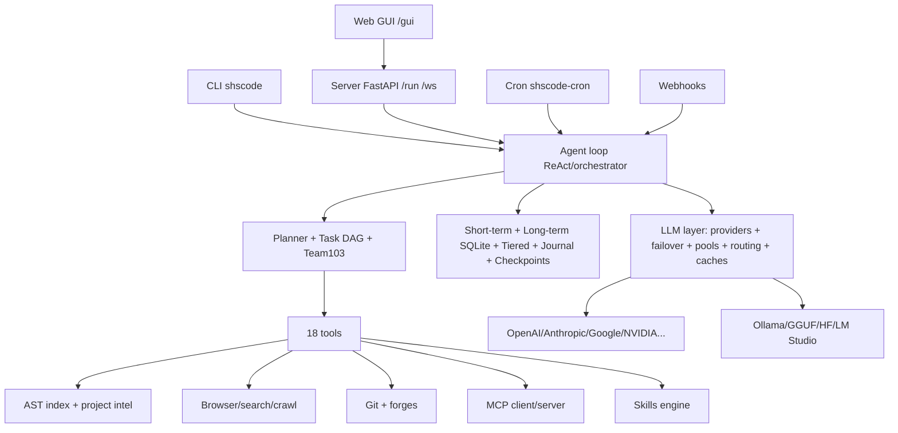
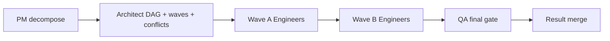

<p align="center">
  
</p>

<h1 align="center">SHS-Code</h1>
<h3 align="center">Persistent Autonomous AI Coding Agent — by SHS Lab</h3>
<p align="center">Plan · Implement · Verify — with memory, tools, skills, MCP, Team103 multi-agent execution, real token streaming, and a first-class Web GUI.</p>

<p align="center">
  <a href="https://github.com/shslab-org/shs-code"></a>
  =3.11" />
  
  
  
  
</p>

> **📚 Full documentation lives in a separate repository.**
>
> The complete guides — full documentation, installation guide, beginner guide, CLI reference, GUI guide, configuration, models, providers, tools, skills, MCP, memory, single agent, autonomous, multi-agent, Team103, architecture, troubleshooting, and more — are maintained at:
>
> **👉 https://github.com/shslab-org/SHS-Code-Docs**
>
> This README is the official product homepage. The Docs repo is the complete manual. Start here, go deep there.

**Code repository:** https://github.com/shslab-org/shs-code · **Version:** `4.4.0` · **Python:** `>=3.11` · **Package:** `shscode` (import package `app`) · **License:** Modified MIT (see `LICENSE`)

---

## Table of Contents

- [1. SHS-Code](#1-shs-code)
- [2. What is SHS-Code?](#2-what-is-shs-code)
- [3. Why SHS-Code?](#3-why-shs-code)
- [4. Core philosophy](#4-core-philosophy)
- [5. What SHS-Code can do](#5-what-shs-code-can-do)
- [6. Feature overview](#6-feature-overview)
- [7. Architecture overview](#7-architecture-overview)
- [8. Web GUI — full-featured, first-class interface](#8-web-gui--full-featured-first-class-interface)
  - [8.1 Design philosophy & runtime model](#81-design-philosophy--runtime-model)
  - [8.2 Navigation, responsive layout & motion](#82-navigation-responsive-layout--motion)
  - [8.3 Dashboard](#83-dashboard)
  - [8.4 Agent workspace (live streaming)](#84-agent-workspace-live-streaming)
  - [8.5 Tasks & Task-DAG visualisation](#85-tasks--task-dag-visualisation)
  - [8.6 Team103 runner](#86-team103-runner)
  - [8.7 Workspace browser & diff viewer](#87-workspace-browser--diff-viewer)
  - [8.8 Terminal panel](#88-terminal-panel)
  - [8.9 Git panel](#89-git-panel)
  - [8.10 GitHub panel & agent identity](#810-github-panel--agent-identity)
  - [8.11 QA panel](#811-qa-panel)
  - [8.12 Sessions panel](#812-sessions-panel)
  - [8.13 Logs panel](#813-logs-panel)
  - [8.14 Memory panel](#814-memory-panel)
  - [8.15 Settings panel](#815-settings-panel)
  - [8.16 Help / Guide panel (onboarding)](#816-help--guide-panel-onboarding)
  - [8.17 Design system — colour, status legend, motion, typography](#817-design-system--colour-status-legend-motion-typography)
  - [8.18 Accessibility & keyboard shortcuts](#818-accessibility--keyboard-shortcuts)
  - [8.19 UX principles in practice](#819-ux-principles-in-practice)
- [9. CLI](#9-cli)
- [10. Execution modes — single, autonomous, multi-agent](#10-execution-modes--single-autonomous-multi-agent)
- [11. Team103](#11-team103)
- [12. PM / Architect / Engineer / QA](#12-pm--architect--engineer--qa)
- [13. Worker pool](#13-worker-pool)
- [14. Task DAG](#14-task-dag)
- [15. Dependency waves](#15-dependency-waves)
- [16. AIMD concurrency](#16-aimd-concurrency)
- [17. Conflict serialisation](#17-conflict-serialisation)
- [18. Work stealing](#18-work-stealing)
- [19. Checkpoints](#19-checkpoints)
- [20. Retry / recovery](#20-retry--recovery)
- [21. Verification](#21-verification)
- [22. Continuous QA](#22-continuous-qa)
- [23. Task lifecycle integrity](#23-task-lifecycle-integrity)
- [24. Memory](#24-memory)
- [25. Context management](#25-context-management)
- [26. Tools](#26-tools)
- [27. Terminal](#27-terminal)
- [28. File operations](#28-file-operations)
- [29. Code intelligence](#29-code-intelligence)
- [30. Project intelligence](#30-project-intelligence)
- [31. Browser](#31-browser)
- [32. Web search](#32-web-search)
- [33. Git](#33-git)
- [34. GitHub and other forges](#34-github-and-other-forges)
- [35. SHS-Agent automation identity](#35-shs-agent-automation-identity)
- [36. Other integrations](#36-other-integrations)
- [37. Skills](#37-skills)
- [38. Built-in skills](#38-built-in-skills)
- [39. Custom skills](#39-custom-skills)
- [40. Skill levels](#40-skill-levels)
- [41. MCP](#41-mcp)
- [42. MCP client](#42-mcp-client)
- [43. MCP server](#43-mcp-server)
- [44. Models](#44-models)
- [45. Providers](#45-providers)
- [46. Model switching](#46-model-switching)
- [47. Provider switching](#47-provider-switching)
- [48. Failover](#48-failover)
- [49. Credential pools](#49-credential-pools)
- [50. Smart routing](#50-smart-routing)
- [51. Local / offline models](#51-local--offline-models)
- [52. Ollama](#52-ollama)
- [53. GGUF](#53-gguf)
- [54. Hugging Face](#54-hugging-face)
- [55. Token streaming](#55-token-streaming)
- [56. Sessions](#56-sessions)
- [57. Resume](#57-resume)
- [58. Detached runs](#58-detached-runs)
- [59. Doctor](#59-doctor)
- [60. Diagnostics](#60-diagnostics)
- [61. Configuration](#61-configuration)
- [62. Environment variables](#62-environment-variables)
- [63. Installation](#63-installation)
- [64. Quickstart](#64-quickstart)
- [65. First coding task](#65-first-coding-task)
- [66. First autonomous task](#66-first-autonomous-task)
- [67. First multi-agent task](#67-first-multi-agent-task)
- [68. Team103 usage](#68-team103-usage)
- [69. Troubleshooting](#69-troubleshooting)
- [70. Security](#70-security)
- [71. Development](#71-development)
- [72. Contributing](#72-contributing)
- [73. Full documentation](#73-full-documentation)
- [74. Contact](#74-contact)

---

## 1. SHS-Code

**SHS-Code** is the persistent autonomous AI coding agent by **SHS Lab (Sazzad Hussain Shobuj)** — https://github.com/shslab-org/shs-code.

> Single product, single version: **`4.4.0`** (source of truth: `app/__init__.py::__version__` and `pyproject.toml`). Python `>=3.11`. Distribution name `shscode`; import package `app`.

SHS-Code plans, implements, and verifies software tasks through tools — and remembers work across sessions. It ships with a **fully-featured Web GUI** *and* an interactive **CLI**, both running on the same Python runtime, the same journal, and the same memory.

---

## 2. What is SHS-Code?

SHS-Code is a **tool-using coding agent** with:

- an interactive CLI (`shscode` / `SHSCode`), a one-shot task mode, and background/detached execution,
- a FastAPI server with REST + WebSocket + webchat/canvas UIs (`shscode-server` / `python -m app.server`, default port `8765`),
- a **full web GUI at `/gui`** with 14 panels — dashboard, agent chat with live token streaming, task DAG visualisation, workspace + diff viewer, terminal, Git/GitHub panels, QA, sessions, memory, logs, settings, and an in-app Help/Guide,
- a provider/model layer supporting cloud APIs and local/offline models, with **real SSE token streaming**,
- persistent memory (short-term, long-term SQLite, tiered cache, journal, checkpoints),
- 18 agent tools, 29 built-in skills, 4 skill levels, MCP client + server,
- code/project intelligence over a persistent incremental index,
- browser + web search + URL extraction,
- Git + GitHub/GitLab/Azure DevOps/Bitbucket/Forgejo integrations with the dedicated **SHS-Agent** automation identity,
- messaging channels, cron scheduling, and webhooks,
- single-agent, autonomous, and multi-agent (Team103) execution.

To start SHS-Code, install the package, configure one provider key, and run `shscode` (CLI) or `shscode-server` and open `/gui` (GUI).

---

## 3. Why SHS-Code?

Most chat assistants answer. SHS-Code **executes**:

| Problem | SHS-Code provides |
|---|---|
| One-shot answers lose context | Persistent sessions, journal, checkpoints, and long-term memory |
| Manual file edits | `str_replace_editor`, `bash`, `python_execute`, verification gates |
| Large-repo blindness | Incremental AST/symbol index, semantic + structural search, project profiles |
| Model outages | Failover chains, credential pools, health tracking, smart routing, local models |
| Solo-agent bottleneck | Team103: PM → Architect → Engineers → QA over a task DAG |
| Opaque black-box agents | A transparent GUI with per-step activity, live streaming, and journal-backed evidence |
| Glue code for automation | Server API, cron, webhooks, messaging channels, MCP |
| Fake "done" claims | Explicit finish reasons, plan gate, `partial` state, verification gates |

---

## 4. Core philosophy

- **Plan → Implement → Verify.** Every task decomposes, executes through tools, and verifies before completion.
- **Persistence first.** Sessions, journal (`~/.shscode/state/journal.db`), checkpoints (`~/.shscode/state/checkpoints/`), and memory (`workspace/.memory/long_term.db`) survive restarts.
- **Evidence over claims.** Project intelligence, doctor checks, and verification read real state — never documentation claims.
- **Safe autonomy.** Security analysers, confirmation thresholds, secret redaction, and sandboxes gate risky actions.
- **Provider freedom.** Universal OpenAI-compatible endpoints plus native OpenAI/Anthropic/Google/Mistral/Bedrock/Ollama/GGUF/Hugging Face, with live switching and failover.
- **Honest UI.** The interface never lies about task state — `partial`, `blocked`, `failed`, and `completed` are distinct and visible, and internal tool chatter is separated from user-facing messages by design.
- **UI parity, not UI compromise.** Anything the CLI can do, the GUI does — on the same runtime, sharing the same state.

---

## 5. What SHS-Code can do

Pick any of these and SHS-Code handles it end-to-end:

- Build, fix, refactor, test, and document code in your repository.
- Research a codebase (`code_search`, `project_intel`) and explain architecture.
- Browse the web, search, and extract clean page text.
- Manage Git branches, diffs, commits, and forge issues/PRs.
- Run scheduled tasks (cron) and react to webhooks.
- Chat from the terminal, the web GUI, the webchat, the canvas, or messaging channels.
- Extend behaviour with custom skills and MCP servers.
- Run solo, autonomously, or as a Team103 multi-agent crew with QA gates.
- Switch models/providers live without losing context.
- Work fully offline with Ollama / LM Studio / GGUF / Hugging Face (with optional deps).
- Launch long-horizon tasks detached from the terminal and attach later.

---

## 6. Feature overview

| Area | What SHS-Code provides |
|---|---|
| **Interfaces** | Web GUI (14 panels), interactive CLI, one-shot mode, REST + WebSocket server, webchat/canvas, messaging channels |
| **Execution** | Single-agent, autonomous, multi-agent, Team103, worker pool, task DAG, detached daemon runs |
| **Reliability** | Checkpoints, retries, recovery, verification, continuous QA, loop detection, tool-history sanitiser, plan gate |
| **Knowledge** | Tiered memory, context condenser, skills (4 levels), MCP |
| **Understanding** | AST index, semantic search, project profiles, environment detection |
| **Action** | 18 tools: shell, Python/Node, editor, browser, search, verify, delegate |
| **Models** | Universal + OpenAI/Anthropic/Google/Mistral/Bedrock/Ollama/GGUF/HF, failover, pools, routing |
| **Ops** | Sessions/resume, detached runs, doctor/diagnostics, cron, webhooks, SSH/sandbox, channels |
| **Attribution** | SHS-Agent identity, git shim, PR author, contributor-graph integrity |

---

## 7. Architecture overview


```mermaid
flowchart TB
  CLI[CLI shscode] --> Agent[Agent loop ReAct/orchestrator]
  GUI[Web GUI /gui] --> Server[Server FastAPI /run /ws]
  Server --> Agent
  Cron[Cron shscode-cron] --> Agent
  Webhook[Webhooks] --> Agent
  Agent --> Planner[Planner + Task DAG + Team103]
  Planner --> Tools[18 tools]
  Tools --> CodeIntel[AST index + project intel]
  Tools --> Browser[Browser/search/crawl]
  Tools --> Git[Git + forges]
  Tools --> MCP[MCP client/server]
  Tools --> Skills[Skills engine]
  Agent --> Memory[Short-term + Long-term SQLite + Tiered + Journal + Checkpoints]
  Agent --> LLM[LLM layer: providers + failover + pools + routing + caches]
  LLM --> Cloud[OpenAI/Anthropic/Google/NVIDIA...]
  LLM --> Local[Ollama/GGUF/HF/LM Studio]
```

Key paths: `app/agent/` (loop), `app/planner.py`, `app/task_dag.py`, `app/team103/`, `app/tool/`, `app/skills/`, `app/mcp/`, `app/memory/`, `app/context/`, `app/intelligence/`, `app/llm/`, `app/v4/`, `app/server/`, `app/config.py`, `app/state.py`, `app/verification.py`, `app/recovery.py`.

---

## 8. Web GUI — full-featured, first-class interface

The GUI is not a wrapper. It is a **first-class surface** that sits directly on the same Python runtime as the CLI — no separate backend, no duplicated business logic, no terminal-scraping.

```
GUI  →  REST + structured WebSocket events  →  SHS-Code runtime
```

Start the server and open `/gui`:

```bash
shscode-server              # default port 8765
# then open http://localhost:8765/gui
# (append ?api_key=… when SHSCODE_API_KEY is set)
```

Single-page app served from `app/server/static/gui.html`. CLI and GUI share the same state: a session started in the CLI can be continued in the GUI (Sessions → Continue), and both read the same journal, session DB, memory, and git state.

### 8.1 Design philosophy & runtime model

- **Same runtime, same data.** Every panel reads or writes the *canonical* state — the journal, session DB, workspace, git repo. There is no GUI-only shadow state.
- **Structured events, not scraped text.** The agent loop emits typed events (`llm_delta`, `tool_call`, `tool_result`, `plan_step`, `task_state`, `tool_failure_diagnostic`, …) that the WebSocket bridges to the browser. The GUI renders them natively — it never parses terminal output.
- **Separation of user channel and activity channel.** The user-facing assistant message contains **only the final answer**. Raw tool output, retry diagnostics, and terminate markers live in the structured activity feed (`agent.last_run_step_outputs`) and never leak into the conversation transcript.
- **Parity with the CLI.** If a feature exists in the CLI, there is a GUI path for it. The GUI is the reference for visualised workflows (DAG, diff, journal), the CLI is the reference for scripted workflows.

### 8.2 Navigation, responsive layout & motion

- **Collapsible sidebar.** The whole navigation slides off-canvas with an animated transition. Toggle three ways: the ☰ top-bar button, the `☰ MENU` edge tab that appears while hidden, or `Ctrl`/`Cmd`+`B`. The preference persists in `localStorage`.
- **Mobile drawer mode.** Below 820px the sidebar becomes a fixed overlay drawer — closed by default, dismissed by `Esc` or by tapping the backdrop, and auto-closes after picking a panel.
- **Content-first layout.** When the sidebar is collapsed, panels expand to full width — no wasted gutter, no fixed-min-width clipping.
- **Motion with purpose.** Transition timing is short and consistent; animations are suppressed under `prefers-reduced-motion`. Hover/focus states are visible and stable.
- **Persistent panel state.** Scroll position, tab selection, and open-file state survive navigation between panels.

### 8.3 Dashboard

The landing panel — a one-glance status board:

- Provider, model, and version at the top.
- **GitHub identity** card — the active SHS-Agent identity and token/App status.
- Local git state — branch, dirty files, recent commits.
- Recent journal tasks with their finish reasons and lifecycle state.
- Active sessions with quick-continue buttons.
- Rate-limit and provider-health indicators.

### 8.4 Agent workspace (live streaming)

The primary interactive panel. Type a goal and watch SHS-Code work.

- **Live token streaming.** Assistant content streams incrementally — the growing line you see is what the model is actually producing, not a post-hoc animation.
- **Structured activity feed.** Tool calls, tool results, plan updates, and diagnostics render as discrete, collapsible events — visually separated from the user/assistant chat bubbles. You can expand a tool call to see exact arguments and output, without that noise polluting the transcript.
- **Run progress.** Step count, tool count, current provider/model, and finish reason are visible throughout the run.
- **Cancellation.** Stop a run cleanly — state is checkpointed, the session closes as `interrupted`, and `--continue` / `/resume` can pick it up.
- **Session continuation.** Attach to an existing session and continue from where it left off, with the same history and memory.
- **Detached-run checkbox.** Spawn the task as a detached process that survives the browser tab and the terminal; the Sessions panel tracks it live.
- **Per-run step budget.** The "Steps" box lets you set `max_steps` for a single run without touching configuration.
- **Empty states that teach.** With no session, the panel shows a short quick-start and a link to the Help/Guide.

### 8.5 Tasks & Task-DAG visualisation

Two complementary views inside the Tasks panel:

- **Journal list.** Every task with its lifecycle status (`completed`, `partial`, `failed`, `blocked`) and finish reason, in real chronological order.
- **Visual task DAG.** Wave-by-wave layout with per-state colouring — pending, active, completed, skipped, failed. Dependencies are drawn as edges; hovering a node shows its files, role, and acceptance criteria.
- **Journal event tail.** The raw event stream, live, for operators who want to see what the orchestrator is doing between steps.

### 8.6 Team103 runner

- A single input for a large goal, posted to `POST /team103`.
- Honest architecture caption: what Team103 actually is (1 PM + 1 Architect + up to 100 lightweight coroutine engineers sharing one LLM engine + 1 QA gate), how it decomposes, and where to look for logs.
- Live wave/role visualisation as tasks move from PM → Architect → Engineers → QA.

### 8.7 Workspace browser & diff viewer

- **Files tab.** An expandable file tree, path-confined to the server workspace, with a viewer for text files. Symlinks that escape the workspace are refused.
- **Changes tab.** Every changed file with a status badge (`M` modified, `A` added, `D` deleted, `N` new/untracked) and per-file `+adds/−dels` counts. The tab badge shows the total number of changed files.
- **Line-numbered, colourised unified diff.** Green for additions, red for removals, blue for hunk headers. Untracked files are synthesised as new-file diffs.
- **Three comparison modes.**
  - *Working tree* — unstaged changes.
  - *Staged* — index vs HEAD.
  - *vs HEAD* — everything since the last commit.
- **Graceful degradation.** Non-repo folders show a clear message instead of an error.
- Served by `GET /workspace/diff`.

### 8.8 Terminal panel

Run commands in the server workspace with the same permissions and context the agent uses. Useful for spot checks (`pytest -q`, `git status`, `ls -la`) without leaving the browser. Output is streamed and preserved for scrollback.

### 8.9 Git panel

Status, branch, commit, push, pull, stash, diff, and log — all through the same **GitHubProvider** the CLI uses. Commits made here carry the SHS-Agent trailer (and, when the shim is active, the SHS-Agent author/committer identity).

### 8.10 GitHub panel & agent identity

- **Agent identity card** — shows which identity will be used for commits and API actions.
- **PR creation** — open a pull request from a branch without leaving the panel.
- **PR/issue lists** — browse open PRs and issues for the configured repository, with quick links to the forge.
- All actions honour the same credential rules as the CLI (App installation token, PAT, or connector).

### 8.11 QA panel

- Runs the **same VerificationEngine** the agent uses, on demand.
- Build/test/lint/typecheck gates with pass/fail per command, extracted errors, and suggested fixes.
- The panel badge reflects the true boolean result — a real comparison, not a Python-vs-JS coercion.
- Useful for re-verifying after manual edits from the Workspace or Terminal panels.

### 8.12 Sessions panel

- Lists every session with metadata (workspace, model, created/last-used).
- **Message browser** with final/interim separation — the final answer is visually distinct from internal activity.
- **One-click continue** to attach to a session and keep going.
- **Detached-run registry** — every detached run appears here with live process liveness (running / finished / crashed) and a link to its `output.log`.

### 8.13 Logs panel

Live tail of the runtime log with auto-refresh. Kept **separate from the conversation** on purpose — logs are for operators, the conversation is for users.

### 8.14 Memory panel

Browse and inspect:

- `MEMORY.md` — the agent's long-term working notes.
- `USER.md` — the user-profile memory.
- Long-term memory entries (SQLite + FTS5) with search.

Useful for auditing what the agent remembers and for manual correction.

### 8.15 Settings panel

- **Effective configuration** with secrets masked.
- **Model/provider switch** — change live without restarting the server or losing the session.
- **Agent Step Budget** — the persisted `max_steps` used by new runs (overridable per run from the Agent panel).

### 8.16 Help / Guide panel (onboarding)

- Plain-language quick-start for first-time users.
- Panel reference — what each of the 14 panels does.
- Status legend — every lifecycle state and colour explained.
- Keyboard shortcuts.
- Troubleshooting checklist that mirrors `docs/GUI_GUIDE.md`.
- Aimed at users with **zero programming knowledge**; the guide assumes no prior context.

### 8.17 Design system — colour, status legend, motion, typography

- **Tokenised colours.** One palette drives the whole app — surface, elevated surface, border, muted text, accent, and semantic status colours. Panels reuse the same tokens instead of inventing local variants.
- **Status legend** (consistent everywhere — DAG nodes, journal list, activity feed):
  - `completed` — green
  - `partial` — amber (work stopped, not verified)
  - `active` — blue (in flight)
  - `pending` — grey
  - `skipped` — slate
  - `failed` / `blocked` — red
  - `🟡 rate-limit` / `🔴 failure` — provider-health markers
- **Diff colours.** Green add / red remove / blue hunk header, with line numbers.
- **Typography.** Monospace for code, diff, logs, and identifiers; a humanist sans for prose and controls. Reading width is capped in long-form areas.
- **Spacing & density.** A tight baseline grid for toolbars and lists, generous padding for prose. Tables and trees stay scannable at high density.
- **Elevation.** Cards and overlays share one shadow scale; focus rings and hover states are visible and consistent.

### 8.18 Accessibility & keyboard shortcuts

- **Keyboard-first navigation.** Every panel reachable by keyboard; focus order follows visual order.
- **Global shortcuts.**
  - `Ctrl`/`Cmd` + `B` — toggle sidebar.
  - `Esc` — close overlay/mobile drawer, cancel an in-flight prompt.
  - `Enter` / `Shift`+`Enter` — send / newline in the agent chat.
- **Motion preference respected.** `prefers-reduced-motion` disables the slide/hide animation.
- **Colour is not the only signal.** Status is conveyed by label + colour, not colour alone.
- **Contrast.** Text and icon colours meet accessible contrast on both light and dark surfaces.

### 8.19 UX principles in practice

- **Progressive disclosure.** The Agent panel shows a calm conversation; the activity feed hides detail behind expandable cards; the DAG reveals node metadata on hover.
- **Truthful status.** `partial` and `blocked` are shown as distinct from `completed`. Nothing pretends a run finished when it did not.
- **Recoverability.** Cancel is graceful; resume is one click; detached runs survive the browser; the diff viewer shows exactly what changed.
- **Persistence of preference.** Sidebar state, per-run step budget, and last-open panel are remembered.
- **Clear separation of concerns.** Logs ≠ conversation; activity ≠ answer; settings ≠ per-run overrides.

---

## 9. CLI

The interactive shell and one-shot modes:

```bash
shscode
shscode "add retry with backoff to app/llm/retry.py and add tests"
python main.py "fix failing tests in tests/test_memory_layers.py"
```

SHS-Code provides a ReAct-style loop: read goal → inspect project (`project_intel`, `code_search`) → plan (`planning`, `task_dag`) → edit (`str_replace_editor`, `bash`, `python_execute`) → verify (`verify`, tests) → record (journal + memory). Slash commands (`/plan`, `/mode`, `/model`, `/doctor`, `/sessions`, `/team103`, `/github`, `/mcp`, `/skills`, `/tools`, `/project`, `/git`, `/verify`, `/compress`, `/resume`, `/tasks`, `/task`, `/pause`, `/stop`, `/continue`, `/bg`, `/new`, `/search`, `/status`, `/usage`, `/log`, `/debug`, `/env`, `/providers`, `/models`, `/profile`, `/config`, `/runs`, `/attach`) steer the run without restarting.

---

## 10. Execution modes — single, autonomous, multi-agent

**Single-agent.** The default. Interactive shell or one-shot prompt. A ReAct-style loop against a small, focused goal — ideal for bug fixes, single-file edits, and quick research.

**Autonomous.** Select the `autonomous` mode (`/mode autonomous`) for long-horizon work: high step budget, planning on, thorough verification, minimal pauses. It continues through many steps, detects stuck loops, asks via `ask_human` only when truly blocked, and checkpoints so `/pause`, `/bg`, `--detach`, and resume always work. Use it for migrations, large refactors, and multi-file features.

```bash
shscode "migrate the auth module to async with full test coverage"
```

**Multi-agent.** Two paths:

```bash
python run_multi_agent.py --mode build "implement user profiles API with tests"
python run_multi_agent.py --mode plan "design sharding for the journal"
shscode-multi --help
```

(1) the `run_multi_agent.py` build/plan pipeline (`app/multi_agent.py:run_cli`), and (2) in-task `delegate` subagents plus `task_dag` parallel execution. For full PM/Architect/Engineer/QA orchestration, use Team103.

---

## 11. Team103

Team103 is the multi-agent crew in `app/team103/scheduler.py`. Give SHS-Code a large goal — the PM decomposes it, the Architect plans waves, Engineers implement in parallel, and QA gates the merge.

**Entry points:** CLI `/team103 <goal>` and server `POST /team103 {"goal": …}` — plus the documented `run_team103` API for programmatic use.

> **Honest architecture note:** Team103 is 1 PM + 1 Architect + up to 100 **lightweight coroutine engineer workers sharing one LLM engine** + 1 QA gate — NOT 103 independent LLM instances. PM/Architect decomposition is heuristic (regex-based planning plus role specialisation); the engineers are real journaled `SHSCode` agent runs.


```mermaid
flowchart LR
  PM[PM decompose] --> Arch[Architect DAG + waves + conflicts]
  Arch --> W1[Wave A Engineers]
  W1 --> W2[Wave B Engineers]
  W2 --> QA[QA final gate]
  QA --> Merge[Result merge]
```

SHS-Code provides dynamic concurrency (AIMD), file-conflict serialisation, work-stealing within waves, checkpoints, retries, and a final QA gate that fails on empty changed files, missing files, and low aggregate confidence — worker confidence is keyed off each worker's actual finish reason, not a hardcoded value. Designed for multi-file features where solo execution would bottleneck.

---

## 12. PM / Architect / Engineer / QA

Roles are defined in `app/v4/roles.py`:

- **PM** — objective, acceptance criteria, decomposition, priority. `decompose_goal(goal, max_tasks=12)` produces `TaskSpec` items with title, files, priority, risk, subsystem, complexity, role hint, dependencies, and acceptance.
- **Architect** — architecture, dependency graph, DAG, assignment, conflicts. Builds topological waves and a conflict plan.
- **Engineer** — implementation, investigation, testing, local verification. Specialisations: `backend`, `frontend`, `testing`, `documentation`, `devops`, `security`, `performance`, `database`.
- **QA** — integration, regression, correctness, completion gate. `qa.final_gate(confidence, conflicts, failed)` decides pass/fail.

Run a Team103 or multi-agent task and SHS-Code assigns each `TaskSpec` a role hint and a task-specific context slice automatically.

---

## 13. Worker pool

SHS-Code provides two pools:

- **Parallel executor** (`[parallel_executor]` in `config.toml`): `max_workers = 4`, `timeout_s = 300` per task. Used for parallel tool/DAG work.
- **Team103 scheduler pool**: starts at `start_concurrency`, capped by `max_workers` and `max_concurrency`, adjusted live by AIMD.

```toml
[parallel_executor]
max_workers = 4
timeout_s   = 300
```

---

## 14. Task DAG

The task DAG (`app/task_dag.py`, `task_dag` tool) models work as nodes with dependencies. Ask SHS-Code to plan:

```text
/plan implement auth refresh tokens with tests
```

SHS-Code creates nodes, links `depends_on` edges, schedules dependency waves, tracks state in the journal, and merges results. The `task_dag` tool exposes the graph to the agent; `app/v4/async_dag.py` provides async execution with observability. A DAG node can only be marked completed when every dependency reached `completed` or was **explicitly skipped** — silent auto-completion of active dependencies is not possible.

---

## 15. Dependency waves

Waves are computed by `_waves()` in `app/team103/scheduler.py`: topological grouping by `depends_on` titles, fallback to priority order. Within a wave tasks run in parallel; across waves they run serially (A → D). Example: Wave A (schema + API contract) → Wave B (endpoints + UI) → Wave C (tests + docs). Run a Team103 task and SHS-Code logs `N waves` with role assignments.

---

## 16. AIMD concurrency

AIMD (Additive Increase / Multiplicative Decrease) lives in `app/team103/scheduler.py::_AIMD`. The scheduler waits until active tasks drop below the current AIMD limit, increases the limit additively on success, and decreases it multiplicatively on failure/timeout. Bounds: `start_concurrency` → `min(max_concurrency, max_workers)`. Large Team103 batches benefit automatically — SHS-Code throttles under errors and ramps back up when healthy.

---

## 17. Conflict serialisation

When two tasks touch the same files, the Architect emits a conflict plan (`conflicts: Dict[str, List[str]]`). SHS-Code serialises file-conflicting tasks instead of running them concurrently, preventing clobbered edits. Non-conflicting tasks still run in parallel. The final merge reports `merged_files` and remaining `conflicts` for QA review.

---

## 18. Work stealing

Within a wave, Engineers execute via `asyncio.gather` — idle workers pick up pending tasks in the same wave (work-stealing via gather). If a worker fails, its siblings continue; retries and QA catch gaps. No configuration needed.

---

## 19. Checkpoints

Checkpoints persist memory snapshots so work survives crashes:

- Location: `~/.shscode/state/checkpoints/<task_id>.json`
- Writes: temp file + atomic `os.replace` — a crash cannot corrupt the previous checkpoint.
- Journal: `~/.shscode/state/journal.db` (SQLite, WAL) stores tasks + event log.

Resume after interruption with `--continue`, `--session ID`, or `/resume` — SHS-Code restores from the latest checkpoint and journal.

---

## 20. Retry / recovery

Layered recovery (`app/recovery.py`, `app/llm/retry.py`, `app/v4/recovery.py`):

- **LLM retries**: `max_retries` (built-in default `15` in `app/config.py`; shipped `config.toml` sample sets `6`), backoff with rate-limit waits that leave state untouched.
- **Tool/task retries**: timeout → retry → checkpoint → resume.
- **Journal recovery**: `tests/test_journal_recovery.py` verifies task state survives restarts.
- **Team103**: per-task timeout/retry/checkpoint with QA final gate.
- **Tool-failure diagnostics**: structured records (tool, exception class, args, `tool_call_id`) plus a `tool_failure_diagnostic` activity event — failures are diagnosable and recoverable, never silently swallowed.
- **Tool-history sanitisation**: `sanitize_tool_history()` enforces the assistant-`tool_calls` ↔ matching-`tool`-results invariant at the LLM request boundary, so a resumed session can never be rejected by a strict OpenAI-compatible provider.

Configure LLM retries under `[llm]` in `config.toml` or `~/.shscode/config.yaml` (shipped sample: `max_tokens = 8192`, `max_retries = 6`, `timeout = 1800`).

---

## 21. Verification

Verification (`app/verification.py`, `verify` tool) runs project-aware checks before SHS-Code claims completion: `python -m compileall`, `pytest`, plus risk-aware gates.

```text
/verify
```

Or via tool: `verify` with build/test/lint/typecheck kinds. SHS-Code records pass/fail per command with extracted errors and suggested fixes. "Code generated" never equals "task completed" — verification must pass.

---

## 22. Continuous QA

Continuous QA (`app/v4/cont_qa.py`) checks quality during execution — not just at the end. Combined with `risk_verify.py` (risk-aware verification), it escalates high-risk changes (auth, secrets, migrations, deletions) to stricter gates while letting low-risk edits flow. The Team103 QA final gate (`qa.final_gate`) blocks merges with low confidence, unresolved conflicts, or failed tasks.

---

## 23. Task lifecycle integrity

SHS-Code never claims a task completed when it was skipped, abandoned, or unverified. Every run tracks an explicit **finish reason**:

| Reason | Meaning | Journal status |
|---|---|---|
| `final_answer` | text answer stood (plan finished / no plan) | `completed` |
| `terminate` | terminate tool accepted (plan gate passed) | `completed` |
| `done_pattern` | keyword "done" match (gated: only when the persisted plan has NO unfinished steps) | `completed` |
| `max_steps` | step budget exhausted mid-work | **`partial`** |
| `token_budget` | token budget + grace exhausted | **`partial`** |
| `error` / `permission_denied` | run failed | `failed` / `blocked` |

The `partial` state is the honest middle ground: work stopped without a verified final answer — the task is explicitly **not** completed, `/resume` can continue it from the checkpoint, and the user-facing response says so plainly.

Dependency handling is strict: a DAG node can only be marked completed when every dependency reached `completed` or was **explicitly skipped**. The plan gate nudges the model to finish or explicitly skip remaining steps before a final answer is accepted; keyword "done" claims with unfinished plan steps no longer end runs.

The user-facing response channel carries **only the final answer** — raw tool outputs, retry diagnostics, and terminate markers stay in `agent.last_run_step_outputs` for GUI/debug consumers, never in the assistant message.

---

## 24. Memory

SHS-Code provides four memory layers:

| Layer | What it is | Where it lives | How to use |
|---|---|---|---|
| **Short-term** | In-loop message history, snapshots, context refresh | In process (`app/memory/short_term.py`) | Automatic; `/compress` condenses |
| **Long-term** | SQLite + FTS5 full-text search, embeddings placeholder | `workspace/.memory/long_term.db` (honours `SHSCODE_WORKSPACE`) | `memory` tool; `cross_session_search` |
| **Tiered** | LRU cache (cap 512) over DB + markdown | `app/v4/memory_tiers.py`, `intel_memory.py` | Automatic acceleration |
| **Journal/worklog** | Tasks + event log, checkpoints | `~/.shscode/state/journal.db`, `checkpoints/` | `/tasks`, `/resume`, sessions |

Store a fact: `memory` tool. Recall across sessions: `cross_session_search`. Limitations: long-term search is FTS5 + LIKE (no vector DB by default); embeddings are placeholder bytes.

---

## 25. Context management

Context is managed by `app/context/` + `app/compaction.py` + `app/v4/context_mgmt.py`:

- **Condenser**: `condenser_type = "rolling"` (also `noop`, `llm_summarizing`), triggers at `max_events = 200`, budget `max_tokens = 80000`.
- **Compaction**: `/compress` summarises history into a snapshot; `ShortTermMemory.snapshot()/restore()` preserves continuity.
- **View properties**: deduplication, observation uniqueness, tool-call matching, loop atomicity.

Configure `[context]` in `config.toml`. Compress manually with `/compress` or `/clear` + `/new`.

---

## 26. Tools

SHS-Code provides **18 agent tools** (`app/tool/`):

| Tool | Purpose |
|---|---|
| `bash` | Shell execution |
| `python_execute` | Isolated Python subprocess |
| `node_execute` | Isolated Node.js subprocess |
| `str_replace_editor` | View/create/edit files |
| `code_search` | Indexed code search (8 modes) |
| `project_intel` | Project summary/architecture/entry/env/git |
| `browser_use` | Playwright browser control |
| `web_search` | DuckDuckGo → Bing fallback search |
| `crawl` | Clean text extraction from URLs |
| `memory` | Persistent memory read/write |
| `cross_session_search` | Full-text search across past sessions |
| `task_dag` | Persisted task graph |
| `delegate` | Spawn isolated subagent |
| `skill_manager` | Create/patch/delete/list skills |
| `verify` | Build/test verification |
| `ask_human` | Request user clarification |
| `terminate` | Signal task completion |
| `image_generate` | Generate images (FAL.ai or mock) |

`planning.py`, `data_viz.py`, and `platform_control.py` exist as tool modules in `app/tool/` but are not exposed in the default agent tool collection.

List tools in the shell: `/tools`. Every tool emits an OpenAI-compatible schema for the model.

---

## 27. Terminal

Shell commands through the `bash` tool plus isolated runners:

- **`bash`** — persistent shell, full system access. Used for git, pytest, builds, file ops.
- **`python_execute`** — isolated Python subprocess (any imports, filesystem, network permitted). Use `print()` for output.
- **`node_execute`** — isolated Node.js subprocess.

All three run until completion with optional timeouts. Ask naturally — SHS-Code selects the right runner. Example: `python_execute` for data scripts, `bash` for `pytest tests/ -q`.

---

## 28. File operations

Read, create, and edit files with `str_replace_editor` (view / create / str_replace / insert / undo_edit). The primary editing tool — precise string replacement with undo support. Complementary tools: `bash` (moves/copies), `project_intel` (locate files), `code_search` filename mode. Tell SHS-Code the file and change — it views first, edits, then verifies.

---

## 29. Code intelligence

Code intelligence (`app/intelligence/`, `code_search` tool) indexes the project once into a persistent incremental index — no repeated full scans.

| Mode | What it answers |
|---|---|
| `semantic` | Concept search, e.g. "where is authentication handled" — expands to related symbols, ranks files |
| `symbol` | Find class/function/method by name (`class Journal`) |
| `text` | Substring search |
| `regex` | Line regex |
| `filename` | Find files by name |
| `import` | Who imports module X |
| `usages` | Where symbol S is referenced |
| `callers` | Files importing from a given file |

Ask SHS-Code to find code — it prefers `code_search` over `bash grep`. Results are context-aware cached (`app/v4/semantic_cache.py`). Force reindex: `project_intel` action `refresh`.

---

## 30. Project intelligence

Project intelligence (`project_intel` tool, `app/intelligence/`) inspects real state:

- **`summary`** — project type, languages, frameworks, build/test/run commands.
- **`architecture`** — symbol weight by directory + most-imported modules.
- **`entry`** — entry points + important files + test frameworks + commands.
- **`env`** — tools, runtimes, versions available.
- **`git`** — branch, dirty files, conflicts, recent commits.
- **`refresh`** — incremental reindex.

Use `/project` in the shell, or ask "summarise this project". All output comes from real inspection — never from documentation claims.

---

## 31. Browser

Browse the web with `browser_use` (Playwright) + `crawl` (clean extraction) + `app/v4/browser_pool.py`:

```toml
[browser]
headless           = true
disable_security   = false
max_content_length = 10000
```

Ask "fetch that URL" or "click through the docs". SHS-Code navigates, clicks, types, screenshots, extracts text, and executes page JS. Browser features require the optional `browser` extra (`playwright`, `crawl4ai`). Headless by default; pooling reuses contexts for speed.

---

## 32. Web search

Search the web with `web_search` (DuckDuckGo → Bing fallback) + `crawl` (aiohttp + HTML stripping fallback when `crawl4ai` is absent):

```toml
[search]
engines     = ["duckduckgo", "bing"]
max_results = 10
```

Use `/search <query>` or "research X". Search requires the optional `search` extra (`duckduckgo-search`). Results return titles, URLs, and snippets; `crawl` then extracts clean readable text (up to `max_length`, default 8000 chars).

---

## 33. Git

Local git intelligence (`app/git_intel.py`, `project_intel` action `git`) plus the `bash` tool:

- Branch, dirty files, conflicts, recent commits, diffs, snapshots.
- `/git` in the shell for a status snapshot.
- Commits, branches, merges, and conflict inspection via shell.

SHS-Code reads real repo state before every change and verifies after. It never rewrites history unless explicitly asked.

---

## 34. GitHub and other forges

`app/git_providers/` supports:

| Forge | Module | Token env var |
|---|---|---|
| GitHub | `github/` | `SHSCODE_GITHUB_TOKEN` or `GITHUB_TOKEN` |
| GitLab | `gitlab/` | `GITLAB_TOKEN` (+ `GITLAB_URL`) |
| Azure DevOps | `azure_devops/` | `AZURE_DEVOPS_TOKEN` (+ org) |
| Bitbucket | `bitbucket/` | username + app password |
| Forgejo | `forgejo/` | `FORGEJO_TOKEN` (+ URL) |

Base features (`base.py`): repos, single repo, issues, PRs, rate-limit handling, retry with backoff, sync + async APIs. `suggested_tasks.py` proposes work from forge state. Tokens come from env vars or `~/.shscode/connectors` — never hardcoded. Requires optional `github`/`gitlab` extras (`PyGithub`, `python-gitlab`).

**GitHubProvider** — the centralised facade `app/git_providers/github_provider.py` adds local git operations (clone / branch / commit / push / pull / stash / diff / log) alongside the API operations, with agent-attributed commits and one-shot authenticated push URLs (tokens are never stored in remote URLs). Reachable from the CLI (`/github status|commit|branch|push|pull|stash|diff|log|prs|issues|pr`) and the GUI GitHub panel.

---

## 35. SHS-Agent automation identity

GitHub work performed by SHS-Code is attributed to the dedicated automation identity **[SHS-Agent](https://github.com/SHS-Agent)** — a personal user account created specifically for SHS Code — rather than pretending the human user did everything.

Identity:

```
SHS-Agent <337454460+SHS-Agent@users.noreply.github.com>
```

The email is GitHub's reserved, unspoofable `<id>+<login>` noreply form for that exact account, so every commit SHS Code creates resolves to the profile — and because **SHS-Agent is a user account**, it is credited in the repository's **Contributors** section once the commits land on the default branch.

**Mechanisms (priority order):**

1. **GitHub App installation token** (official bot identity): set `SHSCODE_GITHUB_APP_ID`, `SHSCODE_GITHUB_APP_PRIVATE_KEY_PATH` (or `…_PRIVATE_KEY`), `SHSCODE_GITHUB_APP_INSTALLATION_ID` — SHS-Code mints the RS256 JWT and exchanges it for short-lived installation tokens (cached, auto-refreshed). Requires the `github-app` extra (`pip install 'shscode[github-app]'`).
2. **Personal access token**: `SHSCODE_GITHUB_TOKEN` (preferred) or `GITHUB_TOKEN`, or a token in `~/.shscode/connectors`.

**Attribution is mandatory and mechanically enforced.** Every commit created inside SHS Code — agent bash sessions, the GUI terminal, the GitHub panel, runtime paths — is attributed to SHS-Agent as **author, committer, and co-author**, with the `Generated with SHS-Code` footer:

```
Generated with SHS-Code

Co-Authored-By: SHS-Agent <337454460+SHS-Agent@users.noreply.github.com>
```

A **git shim** (`~/.shscode/shims/git`, first on the PATH of every SHS-Code child process) strips `--author`/`--reset-author` from `git commit` and forces the identity env vars, so prompt-level, flag-level, and env-level bypass attempts are all defeated. `GitHubProvider.commit()` forces the identity via per-command `-c` overrides, and CLI/server startup export `GIT_AUTHOR_*`/`GIT_COMMITTER_*` so child-process git operations inherit the same attribution. **Your own shells outside SHS-Code and your global git configuration are never touched.** Human work keeps the human's identity; work performed by SHS-Code is attributed to SHS-Agent as author, committer, pusher-of-record for its changes, branch creator, and PR author, on every surface (CLI, GUI, terminal panel, autonomous agent sessions, cron).

---

## 36. Other integrations

Additional integrations — most are **optional** (require extras or external services):

- **Messaging channels** (`shscode-channels`, `app/messaging/`): `discord`, `telegram`, `slack`, `email`, `webchat`, `whatsapp`, `teams`, `google_chat`, `irc`, `matrix`, `signal`, `twitch`. Deliver cron/webhook output to `platform:channel`. Notable implementations:
  - **Discord** — real Gateway websocket protocol (HELLO → heartbeat → IDENTIFY → MESSAGE_CREATE, RESUME across reconnects).
  - **Slack** — real Socket Mode (`apps.connections.open`, envelope ACKs, bot/subtype filtering).
  - **Teams** — Bot Framework OAuth2 client-credentials flow with a cached access token and activity send.
  - **Google Chat** — RS256 service-account JWT via `cryptography`, with correct space interpolation in the send URL.
  - **Email** — IMAP polling for unread messages (UNSEEN → RFC822 → parse → dispatch → mark seen).
  - **Inbound webhook routes** — `/messaging/webhooks/{whatsapp,teams,google-chat}` plus `GET /messaging/channels` for configuration status.
- **Project tools** (`app/integrations/`): `jira.py`, `linear.py`, `slack.py`, `templates.py` (Jinja2), `webhook_handler.py`, `resolver.py`.
- **Connectors** (`app/connectors.py`): token registry at `~/.shscode/connectors` with masking; `apply_to_git_providers` wires tokens automatically.
- **Cron** (`shscode-cron`): standard 5-field expressions, `--add/--list/--remove/--trigger/--run`, webhook + channel delivery.
- **Webhooks** (`shscode-webhook`): HMAC-verified inbound hooks that trigger prompts; `webhook_router.py` + `webhooks.py`.
- **SSH** (`app/ssh_server.py`, `app/ssh/`): remote gateway control — **disabled by default** (`[ssh] enabled = false`, port 2222). Requires `asyncssh` extra. Label: optional / operator-managed.
- **Sandbox** (`app/sandbox/`): `docker` (default), `ssh`, `openshell` backends via `SANDBOX_BACKEND` (no `local` backend). **Disabled by default** (`[sandbox] enabled = false`). Docker requires a working Docker daemon — label: environment-dependent.
- **Voice** (`app/voice/`): wake word (requires `PICOVOICE_API_KEY`), TTS via OpenAI (`OPENAI_API_KEY`) or ElevenLabs (`ELEVENLABS_API_KEY`). Requires `voice` extra. Label: optional.
- **Gmail** (`docs/features/gmail.md`): Google OAuth (`GOOGLE_CLIENT_ID/SECRET`, token at `~/.shscode/gmail_token.json`). Requires `gmail` extra. Label: optional.
- **File store** (`[file_store]`): `local`, `s3`, `gcs`, `memory`. S3/GCS require `s3`/`gcs` extras + `S3_BUCKET`/`GCS_BUCKET`. Label: optional.
- **Canvas/nodes** (`app/canvas/`, `app/nodes/`), **webchat**, **companion apps** (`companion` extra: `pystray`, `rumps`). Labels: companion apps are platform-dependent.
- **Docker** (`Dockerfile`, `docker-compose.yml`): CLI agent + server profiles, healthchecks. Requires Docker.

---

## 37. Skills

Skills are reusable Markdown workflows (`app/skills/skill_engine.py`). SHS-Code loads relevant skills automatically (`get_relevant(goal, max_skills=3)`) and suggests new ones after repeated tool calls (`should_suggest_skill`).

Manage skills in the shell: `/skills`, `/skill <name>`. Via tool: `skill_manager` (create / patch / delete / list). Skill files use frontmatter (`name`, `description`) + Markdown body. Disabled skills persist in `~/.shscode/skills_state.json`. Built-in skills are immutable — `remove`/`delete` only apply to user/project/installed skills.

---

## 38. Built-in skills

SHS-Code ships **29 built-in skills** (verified via `SkillEngine.list_skills()`; doctor reports `29 skill(s) loaded`):

`android-development`, `api-development`, `automation`, `browser-automation`, `c`, `code_review`, `cpp`, `csharp`, `data_analysis`, `database-engineering`, `debugging`, `deep_research`, `devops_deploy`, `documentation`, `git`, `github_workflow`, `java`, `javascript`, `kotlin`, `linux`, `mlops_training`, `php`, `python`, `security-engineering`, `sql`, `testing`, `typescript`, `ui-ux`, `web-development`

Source files live in `app/skills/builtin/*.md` (29 files on disk, 29 loaded). Coverage: languages (Python, JavaScript, TypeScript, Java, Kotlin, C, C++, C#, PHP, SQL), engineering (web, API, database, security, DevOps, MLOps, testing, debugging, documentation, automation, data analysis, research, browser automation, Git, GitHub, Linux, UI/UX, Android).

---

## 39. Custom skills

Create a custom skill in any of these ways:

```bash
# Inside SHS-Code (agent tool)
/skill create <name> <description>
```

```python
from app.skills.skill_engine import get_skill_engine
e = get_skill_engine()
e.create(name="my-workflow", description="How I deploy", content="# steps...")
e.patch(name="my-workflow", content="updated body")
e.install(source="./my-skill.md")   # installs to ~/.shscode/skills/installed/
e.remove(name="my-workflow")
```

Skill file format:

```markdown
---
name: my-workflow
description: How I deploy
---
# steps...
```

Created skills default to `level="user"`. Project skills live in `<repo>/.shscode/skills/*.md` and travel with the repo.

---

## 40. Skill levels

| Level | Location | Purpose |
|---|---|---|
| `builtin` | `app/skills/builtin/` | Shipped with SHS-Code, immutable |
| `user` | Skills dir (`~/.shscode/skills/`, honours `SHSCODE_HOME`, override via `SKILLS_DIR`) | Personal reusable workflows |
| `project` | `<cwd>/.shscode/skills/` | Repo-specific workflows, shared via git |
| `installed` | `<skills_dir>/installed/` | Third-party skills added via `install()` |

Inspect levels: `skill_manager list`. SHS-Code loads builtin → user/installed → project, so project skills override for the current repo.

---

## 41. MCP

MCP (Model Context Protocol) connects SHS-Code to external tool servers over JSON-RPC (`app/mcp/`). SHS-Code provides **both sides**:

- **MCP client** — SHS-Code calls tools on external MCP servers.
- **MCP server** — external clients call SHS-Code's tools.

Architecture: `app/mcp/client.py` (stdio/SSE transports, `initialize` handshake, `tools/list`, `tools/call`) ↔ external servers; `app/mcp/server.py` (FastAPI + CORS via `SHSCODE_ALLOWED_ORIGINS`) ↔ external clients; `app/agent/mcp.py` bridges MCP tools into the agent loop. Inspect: `/mcp` in the shell. With no servers configured, doctor reports `mcp: no MCP servers configured` — that is the normal default.

---

## 42. MCP client

Call external MCP servers via the MCP agent entry:

```bash
python run_mcp.py --connection stdio --interactive
python run_mcp.py --connection sse --server-url http://localhost:8001 --prompt "list files"
python run_mcp.py --help
```

The client performs the `initialize` handshake (non-fatal on homemade servers), lists tools, and routes agent tool calls to the server over stdio pipes or SSE. Timeouts and pipe-buffer guards prevent deadlocks. Add a server per the Docs repo MCP guide — SHS-Code discovers tools automatically.

---

## 43. MCP server

Expose SHS-Code's tools to external clients:

```bash
python run_mcp_server.py --host 0.0.0.0 --port 8001
python run_mcp_server.py --help
```

External MCP clients connect, handshake, list SHS-Code tools, and invoke them. CORS is configurable via env (`SHSCODE_ALLOWED_ORIGINS`); without `SHSCODE_API_KEY` the server warns that endpoints are unauthenticated — set `SHSCODE_API_KEY` in production.

---

## 44. Models

Configure the reasoning model via `model` under `[llm]` or `LLM_MODEL`:

```toml
[llm]
provider = "universal"
model    = "openai/gpt-oss-20b"
base_url = "https://integrate.api.nvidia.com/v1"
```

```bash
export LLM_MODEL="openai/gpt-oss-20b"
shscode --model "openai/gpt-oss-20b" "explain this repo"
```

Built-in defaults are `provider = "mock"`, `model = "gpt-4o"` (safe for immediate use without keys). The shipped `config.toml` points at NVIDIA NIM (`openai/gpt-oss-20b`). Registry defaults per provider (`app/providers.py`): OpenAI (`gpt-4o`, `gpt-4o-mini`, `gpt-4-turbo`, `o3-mini`, `o1`), Anthropic (`claude-sonnet-4-20250514`, ...), Ollama (`llama3.2:3b`, `qwen2.5-coder:7b`, `deepseek-r1:8b`). List live: `/models` in the shell.

---

## 45. Providers

Supported providers (verified in `app/config.py`, `app/llm/`, `app/providers.py`, `config.toml`):

| Provider value | Backend | Key env var |
|---|---|---|
| `mock` | Built-in safe default, no network | none |
| `openai` | OpenAI API | `OPENAI_API_KEY` |
| `anthropic` | Anthropic API | `ANTHROPIC_API_KEY` |
| `google` / `gemini` | Google Generative AI | `GOOGLE_API_KEY` |
| `mistral` | Mistral (`mistral` extra) | `MISTRAL_API_KEY` |
| `bedrock` | AWS Bedrock (`bedrock` extra) | `AWS_ACCESS_KEY_ID` + `AWS_SECRET_ACCESS_KEY` |
| `ollama` | Local Ollama (`ollama` extra) | none (local endpoint) |
| `lmstudio` | Local LM Studio (OpenAI-compatible) | none |
| `openai-compat` / `universal` | Any OpenAI-compatible endpoint (NVIDIA NIM, vLLM, Together, Groq...) | `LLM_API_KEY` (+ `LLM_BASE_URL`) |
| `gguf` | Direct GGUF via `llama-cpp-python` (fully offline) | none |
| `huggingface` / `hf` | Hugging Face Inference API/Spaces | `HF_TOKEN` (where required) |

Provider files in `providers/` (`7llm.toml`, `ollama.toml`, `ollama-cloud.toml`, `openrouter.toml`, `opencode.toml`, `pollinations.toml`) are registry samples. List live: `/providers`. Unknown/empty providers without keys coerce to `mock` — valid providers are never silently downgraded.

---

## 46. Model switching

Switch models **live** without losing context, memory, files, or task progress:

```text
/model openai/gpt-oss-20b
/models
```

Or via CLI/env: `shscode --model <name>`, `LLM_MODEL=<name>`, `LLM_MODEL_OVERRIDE=<name>`. The LLM layer (`app/llm/llm.py:switch`) updates the model, resets per-provider rate limiters correctly, and keeps the session intact. Auto-detection also applies: `OPENAI_API_KEY` → `openai`, `ANTHROPIC_API_KEY` → `anthropic`, `LLM_BASE_URL` → universal endpoint.

---

## 47. Provider switching

Switch providers live:

```text
/provider anthropic
/providers
```

Switching updates the backend, re-resolves keys (`OPENAI_API_KEY`, `ANTHROPIC_API_KEY`, `MISTRAL_API_KEY`, `GOOGLE_API_KEY`, `LLM_API_KEY`, `NVIDIA_API_KEY`), and records health/telemetry per provider. CLI flag `--model` and env `LLM_MODEL` win over config file. If `LLM_BASE_URL` points at a non-OpenAI endpoint without a model set, SHS-Code errors with a clear hint instead of guessing.

---

## 48. Failover

Failover (`app/llm/fallback.py`, `[llm.fallback]` in `config.toml`) retries failed requests on backup models:

```toml
[llm.fallback]
enabled             = false
chain               = ["gpt-4o", "claude-3-5-sonnet"]
cooldown_s          = 60.0
cooldown_multiplier = 2.0
max_cooldown_s      = 600.0
```

Triggers: `rate_limit`, `service_unavailable`, `context_window`, `quota`. Cooldowns back off exponentially per failure. `app/llm/profile_rotation.py` adds cross-provider failover (e.g. OpenAI → Anthropic → Ollama) with priority ordering. **Disabled by default** — enable by setting `enabled = true` and defining `chain`.

---

## 49. Credential pools

Credential pools (`app/llm/credential_pool.py`) rotate multiple keys for one provider:

- `Credential`: availability flag, `mark_exhausted(cooldown_s)`, `mark_success()`.
- `CredentialPool`: `from_env(env_keys)`, `get()`, `mark_exhausted()`, `mark_success()`, `size()`, `available_count()`.
- `LLMConfig.extra_api_keys: list[str]` holds the pool; per-request failover draws the next healthy key.

Populate `extra_api_keys` (config or env). Exhausted keys cool down automatically; successes restore them. Combined with health tracking, pools survive single-key rate limits without failing the task.

---

## 50. Smart routing

Smart routing (`app/v4/model_router.py`, `app/llm/offline_router.py`, `app/provider_health.py`) picks the best backend per request:

- **Health tracking**: per-provider/model call counts, errors, rate-limit events (🟡), failures (🔴).
- **Rate limiter**: rolling-window pacing (`[llm.rate_limit]`, `rpm = 0` = provider default; NVIDIA NIM auto-detects 40 RPM; otherwise unlimited — no artificial throttling).
- **Offline router**: local-first routing to Ollama / LM Studio / text-gen-webui / GGUF / Hugging Face when cloud is unavailable or configured.
- **Streaming**: backpressure buffer (`buffer_size = 4096`, `chunk_timeout = 30`).

Inspect: `/status`, `/usage`, `/providers`. Routing is automatic — configure providers once and SHS-Code adapts.

---

## 51. Local / offline models

To work fully offline, SHS-Code routes to local backends (`app/llm/offline_router.py`). No API key needed; fully private. Supported: Ollama, LM Studio, text-generation-webui (OpenAI-compatible), Hugging Face Inference/Spaces, direct GGUF. Set `provider` to the local backend and `model`/`base_url` to the local endpoint. Local backends need their own runtimes installed (Ollama daemon, `llama-cpp-python`, etc.) — SHS-Code does not bundle model weights.

---

## 52. Ollama

Use Ollama (local daemon, default `http://localhost:11434`):

```toml
[llm]
provider = "ollama"
model    = "qwen2.5-coder:7b"
```

Registry defaults: `llama3.2:3b`, `qwen2.5-coder:7b`, `deepseek-r1:8b`. Requires the `ollama` extra (`ollama>=0.2.0`) and a running `ollama serve` with pulled models (`ollama pull qwen2.5-coder:7b`). Sample: `providers/ollama.toml`, `providers/ollama-cloud.toml`. Label: local — speed and quality depend on the machine.

---

## 53. GGUF

Run GGUF weights directly (fully offline, no internet) via `llama-cpp-python` (`GGUFRouter` in `app/llm/offline_router.py`):

- Config: `provider = "gguf"`, `model` = path to the `.gguf` file.
- Native tool calling is unavailable — SHS-Code parses tool calls from text (`_parse_tool_calls_from_text`).
- Install: `pip install llama-cpp-python` (not bundled; build can require a compiler).

Label: advanced / optional — for air-gapped or GPU-less inference where Ollama is unsuitable.

---

## 54. Hugging Face

Use Hugging Face (Inference API / Spaces):

```toml
[llm]
provider = "huggingface"
model    = "<org>/<model>"
```

SHS-Code routes through the offline router to HF endpoints. Set `HF_TOKEN` where the endpoint requires auth. Requires network (unless using a local Spaces runtime) and the relevant client libs. Label: optional — endpoint availability and quotas follow Hugging Face's terms.

---

## 55. Token streaming

The universal OpenAI-compatible client streams real SSE token deltas:

- `UniversalClient.chat(..., on_delta=…)` — `stream: true` request, incremental content callbacks, tool-call fragments accumulated across chunks (id/name/arguments, indexed), final response identical in shape to the non-streaming call (retries/token accounting unchanged). Backends that reject streaming fall back transparently.
- The agent loop forwards content deltas to the ActivityBus (`llm_delta`); the CLI renders them as a growing live line (without duplicating the final answer), and the server bridges them to WebSocket clients as structured `{event: "llm_delta", text}` frames for the GUI.
- Tool-call argument fragments are never streamed — only conversational content reaches the user channel.

---

## 56. Sessions

Sessions persist conversation history, tool calls, and task state. Manage them:

```bash
shscode --session <ID> "continue prior work"
shscode --continue
shscode-sessions list
shscode-sessions history <ID>
shscode-sessions send <ID> -m "message"
shscode-sessions spawn -p "new task goal"
shscode-sessions export <ID>
shscode-sessions delete <ID>
```

In-shell: `/sessions`, `/new`, `/bg` (background + resume). Storage: session DB + journal (`~/.shscode/state/journal.db`). `send` injects a message into a live session; `spawn` creates a session and runs a task. Continue the most recent session in the workspace with `--continue`.

---

## 57. Resume

Resume interrupted work — sessions, journal tasks, checkpoints, and memory are all restored:

```bash
shscode --continue
shscode --session <ID>
```

```text
/resume <task-id>
/tasks
/task <task-id>
/pause
/stop
/continue
```

Checkpoints (`~/.shscode/state/checkpoints/<task_id>.json`, atomic writes) plus the journal make pre-interruption state resumable. Rate-limit waits leave state untouched by design. Pause with `/pause` then resume with `/resume` or `--continue`.

---

## 58. Detached runs

Long-running tasks no longer die with the session that started them.

- **CLI:** `SHSCode --detach "<task>"` runs the task as a double-forked, `setsid`-detached daemon that survives the terminal, SSH disconnects, and process-tree cleanup.
- **Registry:** every detached run writes `~/.shscode/runs/<id>/run.json` + `output.log`; listed by `SHSCode --runs` and streamed live by `SHSCode --attach <id>`.
- **GUI:** the Agent panel's "detached" checkbox and `POST /run {"detach": true}` spawn the detached process; the Sessions panel shows the detached-run registry with live process liveness.
- **Graceful cancellation:** `SIGTERM`/`SIGHUP` cancel runs gracefully — state is checkpointed, the session closes as `interrupted`, and `SHSCode --continue` (or `/resume`) picks it up cleanly.

---

## 59. Doctor

Doctor (`/doctor`, `app/doctor.py`) checks the installation and reports pass/fail per area:

```text
/doctor
```

Checks: Python version, core dependencies, provider/model resolution, state files + journal, skills loaded (29), MCP servers, git, filesystem writability (`~/.shscode`), connectors, rate limiter. Example healthy output:

```text
[PASS] python: 3.12.14
[PASS] dependencies: all core deps present
[PASS] provider: provider=universal model=bailu-2.8-free
[PASS] journal: journal OK
[PASS] skills: 29 skill(s) loaded
All systems healthy. SHS Code is ready.
```

Run `/doctor` first whenever something looks wrong — it pinpoints the layer.

---

## 60. Diagnostics

Beyond doctor:

- `/status` — active session, model/provider, step count.
- `/log`, `/debug` — log detail; file log via `[logging]`, terminal via `console_level = "WARNING"` (set `INFO`/`DEBUG` for more).
- `/usage` — token/call telemetry (`app/llm/metrics.py`, `token_tracker.py`).
- `/env`, `/project`, `/git` — environment, project profile, git snapshot.
- `SHSCODE_REDACT=true` — redact API keys from all log output (recommended for production).
- Secret redaction (`app/llm/secret_redaction.py`) masks keys automatically.

Diagnose with `/doctor` → `/status` → `/log`. Logs live under `logs/` in the repo and `~/.shscode/`.

---

## 61. Configuration

Configuration loads in priority order (highest first) — verified in `app/config.py`:

1. Environment variables
2. `~/.shscode/profiles/<SHSCODE_PROFILE>/.env`
3. `~/.shscode/profiles/<SHSCODE_PROFILE>/config.yaml`
4. `~/.shscode/.env`
5. `~/.shscode/config.yaml`
6. `./config.toml` (legacy; the shipped sample/reference)
7. Built-in defaults (MockLLM — safe for immediate use)

Copy the sample and edit:

```bash
cp config.toml ~/.shscode/config.yaml   # then edit (YAML syntax)
```

Or edit `config.toml` in the repo for project-local defaults. Key sections: `[llm]`, `[llm.rate_limit]`, `[llm.streaming]`, `[llm.fallback]`, `[browser]`, `[search]`, `[sandbox]`, `[runflow]`, `[logging]`, `workspace_dir`, `max_steps`, `[ssh]`, `[security]`, `[hooks]`, `[context]`, `[conversation]`, `[observability]`, `[secrets]`, `[file_store]`, `[git_providers]`, `[integrations]`, `[parallel_executor]`, `[migrations]`. Profiles: `SHSCODE_PROFILE=<name>` loads `~/.shscode/profiles/<name>/`; `/profile` and `--profile` select it. Full key reference: Docs repo configuration guide + `CONFIG.md`.

**Strict schema-placement validation.** A top-level setting found inside any section is a hard `ConfigError` telling you exactly where to move it (for example, `max_steps` must be top-level, not under `[logging]`). Unknown keys only warn; `SHSCODE_CONFIG_PERMISSIVE=1` downgrades for legacy files. `max_steps` is user-controlled on every surface — CLI (`--max-steps 150`), GUI Agent panel ("Steps" per run), GUI Settings panel ("Agent Step Budget", persisted), `SHSCODE_MAX_STEPS` env var, or top-level `max_steps` in any config layer — and the effective value **and its source** are always shown (`/config`, run-start log line, `GET /config`), so the runtime can never silently disagree with what you configured.

---

## 62. Environment variables

Exact names verified in `app/config.py` / `app/env.py` / `app/server/main.py` / `.env.example`. Canonical prefix: `SHSCODE_*` (legacy `MANUSCLAW_*` mapped automatically).

| Variable | Purpose |
|---|---|
| `LLM_API_KEY` | API key for universal/OpenAI-compatible endpoints |
| `LLM_MODEL` / `LLM_MODEL_OVERRIDE` | Model override (CLI `--model` wins) |
| `LLM_BASE_URL` | Custom endpoint URL (NVIDIA NIM, vLLM, Together, Groq...) |
| `OPENAI_API_KEY` | OpenAI key (also auto-selects `openai` provider) |
| `ANTHROPIC_API_KEY` | Anthropic key (auto-selects `anthropic`) |
| `MISTRAL_API_KEY` | Mistral key (auto-selects `mistral`) |
| `GOOGLE_API_KEY` | Google/Gemini key (auto-selects `google`) |
| `NVIDIA_API_KEY` | NVIDIA NIM key (with `LLM_BASE_URL`) |
| `AWS_ACCESS_KEY_ID` / `AWS_SECRET_ACCESS_KEY` | Bedrock (auto-selects `bedrock`) |
| `GITHUB_TOKEN` / `SHSCODE_GITHUB_TOKEN` / `GITLAB_TOKEN` / `GITLAB_URL` / `AZURE_DEVOPS_TOKEN` / `FORGEJO_TOKEN` | Forge tokens |
| `SHSCODE_GITHUB_APP_ID` / `SHSCODE_GITHUB_APP_PRIVATE_KEY_PATH` / `SHSCODE_GITHUB_APP_INSTALLATION_ID` | GitHub App installation-token flow |
| `SHSCODE_PROFILE` / `PROFILE` | Config profile name |
| `SHSCODE_HOME` / `SHSCODE_WORKSPACE` / `SHSCODE_API_KEY` | Home dir / workspace / server auth |
| `SHSCODE_MAX_STEPS` | Effective agent step budget |
| `SHSCODE_REDACT` | Redact keys from logs (`true` recommended) |
| `SHSCODE_SSH_ENABLED/PORT/HOST` | SSH gateway (default off) |
| `SANDBOX_BACKEND` | `docker` / `ssh` / `openshell` (default `docker`) |
| `DATABASE_URL` / `S3_BUCKET` / `GCS_BUCKET` | Migrations / file stores |
| `APP_ENV` | `dev` / `prod` / `test` |
| `FAL_KEY` | Image generation |
| `OPENAI_API_KEY` (TTS) / `ELEVENLABS_API_KEY` / `PICOVOICE_API_KEY` | Voice features |

Provider examples use placeholder keys only (`sk-...`, `...`). Never commit real keys — use `~/.shscode/.env` (untracked) or env vars.

---

## 63. Installation

**Requirements:** Python `>=3.11`, git. pip / venv. Optional: Docker (sandbox/server), Node.js (node tools), Ollama (local models).

```bash
# one-shot installer (venv + deps + shscode command)
bash install.sh

# or from source
git clone https://github.com/shslab-org/shs-code
cd shs-code
python3 -m venv .venv && source .venv/bin/activate
pip install -e .
# extras as needed:
pip install -e ".[server]"     # FastAPI + uvicorn
pip install -e ".[browser]"    # playwright + crawl4ai
pip install -e ".[search]"     # duckduckgo-search
pip install -e ".[ollama]"     # local Ollama client
pip install -e ".[cron]"       # croniter
pip install -e ".[github-app]" # GitHub App installation-token flow
pip install -e ".[all]"        # everything standard
```

Console scripts (installed with the package): `shscode` / `SHSCode` (CLI), `shscode-server`, `shscode-cron`, `shscode-multi`, `shscode-sessions`, `shscode-channels`, `shscode-webhook`. Module entries: `python -m app` and `python -m app.server` work; `python -m shscode` intentionally does not (no such import package — distribution `shscode`, import package `app`).

Platform extras: `pip install -e ".[voice]"`, `".[ssh]"`, `".[gmail]"`, `".[matrix]"`, `".[companion]"`, `".[s3]"`, `".[gcs]"`, or `".[all-plus]"`. Windows: `install.ps1`. Termux/Android: `setup-termux.sh` — **community-supported, label: experimental** (verify on-device; some native deps may not build). Docker: `Dockerfile` + `docker-compose.yml` (CLI + server profiles).

---

## 64. Quickstart

Start SHS-Code in under two minutes:

```bash
shscode
```

Or use the GUI:

```bash
shscode-server              # default port 8765
# then open http://localhost:8765/gui
```

With a universal/OpenAI-compatible endpoint:

```bash
export LLM_API_KEY="sk-..."
export LLM_MODEL="openai/gpt-oss-20b"
export LLM_BASE_URL="https://integrate.api.nvidia.com/v1"
shscode "summarize this project and suggest three improvements"
```

Or with OpenAI:

```bash
export OPENAI_API_KEY="sk-..."
shscode "add tests for app/task_dag.py"
```

Check health first: `/doctor`. Pick a model live: `/models`, `/model <name>`. Full walkthrough: Docs repo beginner + installation guides.

---

## 65. First coding task

```bash
shscode "add a --dry-run flag to run_server.py with tests"
```

SHS-Code will: inspect the project (`project_intel`), locate the file (`code_search`), plan (`planning`), edit (`str_replace_editor`), run tests (`verify` / `pytest`), and report. Review with `git diff` / `git status`. Verify manually:

```bash
python3 -m pytest tests/ -q -o addopts="" -p no:cacheprovider
```

Keep tasks small first; grow to multi-file features once comfortable. Watch the run in the GUI Agent panel to see exactly what the agent is doing.

---

## 66. First autonomous task

```bash
shscode "refactor app/messaging/ adapters to share retry logic; keep all tests green"
```

```text
/mode autonomous
```

SHS-Code plans the full refactor, works through files with checkpoints, runs verification, and pauses only for genuine blocks (`ask_human`). Monitor with `/status`, `/tasks`, or the GUI Tasks panel. Pause/resume with `/pause`, `/bg`, `--continue`, or `--detach` for long-horizon work. Use autonomous mode for migrations and large refactors — not for one-line fixes.

---

## 67. First multi-agent task

```bash
python run_multi_agent.py --mode build "implement session export to Markdown with tests"
```

SHS-Code decomposes the goal, assigns role-specialised workers, executes dependency waves in parallel, serialises file conflicts, and QA-gates the merge. Plan without building: `--mode plan`. Continue a session: `--session <ID>`. For the full crew experience, use a Team103-scale goal.

---

## 68. Team103 usage

Give SHS-Code a large multi-file goal — scheduling is automatic (`app/team103/scheduler.py`):

```bash
shscode "build user notification preferences: API + DB migration + UI + tests + docs"
```

What happens:

1. **PM decomposes** (≤12 `TaskSpec`s).
2. **Architect** builds DAG waves + conflict plan + role assignments + context slices.
3. **Engineers** implement wave-by-wave with AIMD concurrency and work-stealing.
4. **QA final-gates** — fails on empty changed files, missing files, and low aggregate confidence.
5. Results merge (`merged_files`, `conflicts`, confidence).

Tune via `[parallel_executor]` (`max_workers`, `timeout_s`). Team103 shines on 5+ file features; for single-file edits the solo agent is faster. Run it from the CLI (`/team103`) or the GUI Team103 panel.

---

## 69. Troubleshooting

Start with doctor, then narrow:

| Symptom | What to do |
|---|---|
| Model errors / no key | `/doctor`; check `OPENAI_API_KEY` / `LLM_API_KEY` / `LLM_BASE_URL`; `/providers`, `/models` |
| Wrong provider selected | `/status`; `/provider <name>`; check `LLM_MODEL`, `LLM_BASE_URL` without model |
| Empty tool results | `project_intel refresh`; check `workspace_dir`; verify index |
| Session lost | `shscode-sessions list`; `shscode --continue`; check `~/.shscode/state/journal.db` |
| Skills missing | `/skills`; check `SKILLS_DIR`, `~/.shscode/skills_state.json` |
| MCP empty | Normal default — `/mcp`; configure servers per Docs MCP guide |
| Rate limits | `/usage`; lower RPM in `[llm.rate_limit]`; enable `[llm.fallback]`; add `extra_api_keys` |
| Server unauthenticated warning | Set `SHSCODE_API_KEY` in production |
| Sandbox failures | Check Docker daemon / `SANDBOX_BACKEND`; sandbox is disabled by default |
| Noisy logs | Set `console_level = "WARNING"`; `SHSCODE_REDACT=true` |
| GUI sidebar hidden by mistake | `Ctrl`/`Cmd`+`B` or the `☰ MENU` edge tab to bring it back |
| Detached run appears stuck | `SHSCode --runs` to list, `SHSCode --attach <id>` to stream output, `~/.shscode/runs/<id>/output.log` for the raw log |
| Config key ignored | Run `/config` — SHS-Code shows the effective value and its source; check strict schema-placement errors |

If doctor passes but a task fails, run `/status` → `/log` → `/verify` and re-ask with the error output. Full guide: Docs repo troubleshooting.

---

## 70. Security

Defense in depth (`app/security/`, `[security]`, secrets store):

```toml
[security]
enabled = true
analyzers = ["pattern", "rails"]
confirmation_threshold = "medium"   # "never" | "low" | "medium" | "high"
```

- **Analysers**: `pattern`, `rails`, `llm`, `ensemble` — scan risky actions before execution.
- **Confirmation**: `confirm_risky` (default) vs `never_confirm` in `[conversation] confirmation_mode`. High-risk ops pause for approval.
- **Secrets**: `[secrets] backend = "file"`, `encryption_enabled = true`; keys via env vars, never in the repo. `SHSCODE_REDACT=true` redacts keys from logs; `secret_redaction.py` masks automatically.
- **Server auth**: optional `SHSCODE_API_KEY`; webhooks HMAC-verified; CORS via `SHSCODE_ALLOWED_ORIGINS`.
- **Sandbox**: untrusted code runs in Docker/SSH/openshell backends when enabled (default off).
- **SSH gateway**: disabled by default; enable only operator-managed with keys.
- **Attribution enforced, credentials untouched**: the SHS-Agent git shim rewrites *its own* commits' identity, but never touches user shell git config or credentials.
- **Path confinement**: the GUI workspace browser and file APIs refuse paths outside the server workspace.

Report a vulnerability — see `SECURITY.md`. Do not open public issues for sensitive reports.

---

## 71. Development

Use Python `>=3.11` and pytest:

```bash
git clone https://github.com/shslab-org/shs-code
cd shs-code
python3 -m venv .venv && source .venv/bin/activate
pip install -e ".[all]"
python3 -m pytest tests/ -q -o addopts="" -p no:cacheprovider
python3 -m pytest tests/v4/ -q -o addopts="" -p no:cacheprovider
```

Layout: `app/` (product), `app/agent/`, `app/tool/`, `app/skills/`, `app/mcp/`, `app/memory/`, `app/llm/`, `app/v4/`, `app/server/`, `app/team103/`, `tests/` + `tests/v4/`, `docs/`, `providers/`, `scripts/`, `demo/`, `workspace/`. Entry points: `main.py`, `run_server.py`, `run_multi_agent.py`, `run_flow.py`, `run_mcp.py`, `run_mcp_server.py`. Version source of truth: `app/__init__.py::__version__`. Notes: `IMPLEMENTATION_NOTES.md`, `SHS_CODE_IMPLEMENTATION_STATE.md`, `docs/ARCHITECTURE.md`, `docs/CONFIG.md`, `docs/GUI_GUIDE.md`.

**CI.** `.github/workflows/tests.yml` runs the full pytest suite on Python 3.11 + 3.12 for every push/PR to `main`. The Pylint workflow matrix tracks the same Python range.

---

## 72. Contributing

See `CONTRIBUTING.md` and `CODE_OF_CONDUCT.md`:

1. Fork https://github.com/shslab-org/shs-code and create a feature branch.
2. Keep the version at its current value — do not bump without maintainer approval.
3. Add/extend tests under `tests/`; run pytest before pushing.
4. Update docs (`docs/`) for user-facing changes.
5. Open a PR with evidence: commands run, tests, doctor output.

By contributing you agree to the Modified MIT License terms (see `LICENSE`).

---

## 73. Full documentation

The complete manual lives in the separate documentation repository:

**👉 https://github.com/shslab-org/SHS-Code-Docs**

Covers: full documentation, installation guide, beginner guide, CLI reference, GUI guide, configuration, models, providers, tools, skills, MCP, memory, single agent, autonomous, multi-agent, Team103, architecture, troubleshooting, and more. In-repo references: `docs/` (`ARCHITECTURE.md`, `CONFIG.md`, `FEATURES.md`, `PROVIDERS.md`, `GUI_GUIDE.md`, `features/`, `v4/`), `providers/README.md`, `docs/skills/`, `IMPLEMENTATION_NOTES.md`.

---

## 74. Contact

- **Author**: SHS Lab — Sazzad Hussain Shobuj
- **Code**: https://github.com/shslab-org/shs-code
- **Docs**: https://github.com/shslab-org/SHS-Code-Docs
- **Agent identity**: https://github.com/SHS-Agent
- **Issues / PRs**: use the code repository issue tracker
- **Security reports**: see `SECURITY.md` (private channel, no public issues)
- **Community**: see `docs/` and the Docs repo for channels and guides

---

<p align="center"><b>SHS-Code 4.4.0 — Persistent Autonomous AI Coding Agent · SHS Lab</b><br/>Plan · Implement · Verify — with a first-class Web GUI, memory, tools, skills, MCP, Team103, real token streaming, and the SHS-Agent identity.</p>
